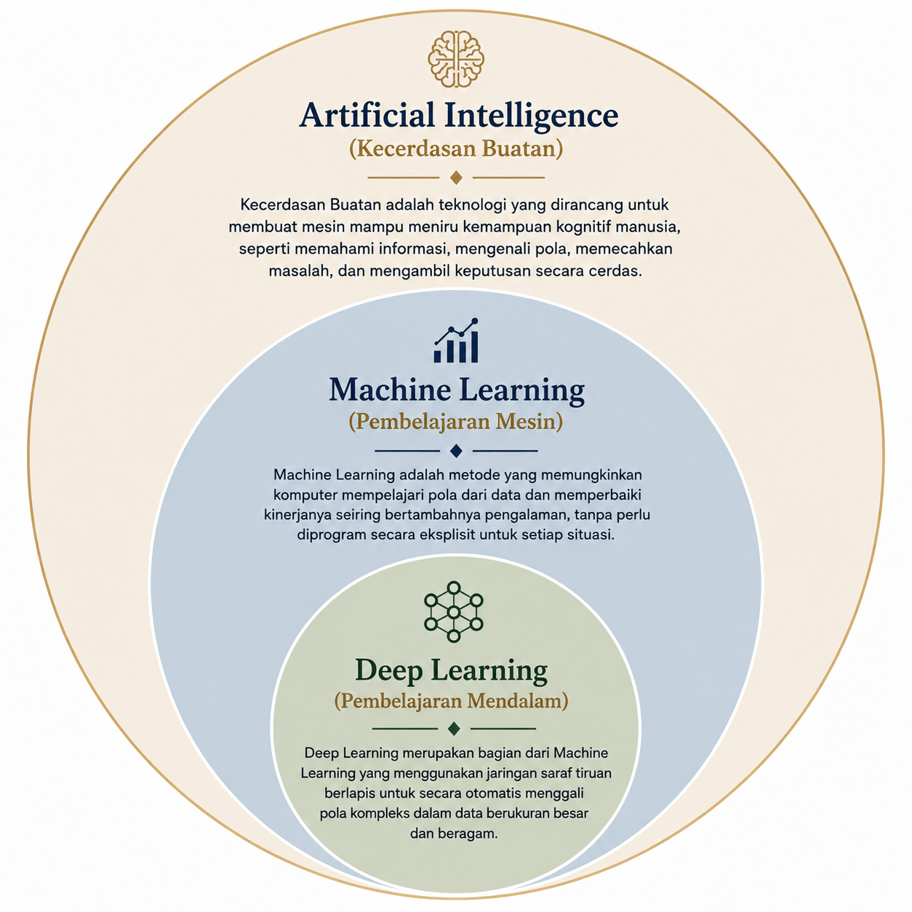

Buku ini ditujukan sebagai **materi pengenalan**, bukan hasil riset baru. Seluruh isi
merupakan ringkasan dan penyusunan ulang dari literatur klasik *machine learning*, dengan
contoh-contoh yang dekat dengan dunia meteorologi Indonesia.

> **Prasyarat bab ini:** tidak ada, ini titik awal. Bab berikutnya mengasumsikan
> Bab 1 dikuasai. Jika Anda sudah terbiasa dengan dasar TensorFlow, Anda boleh
> melompat ke Bab 2, tetapi baca Bagian 1.6–1.8 untuk memahami notasi yang dipakai buku ini.

## 1.0 Mengapa Buku Ini, dan Mengapa Sekarang untuk Pembaca Indonesia

Sebelum masuk ke definisi, ada baiknya kita berhenti sejenak: **mengapa sebuah buku
*deep learning* berbahasa Indonesia, dengan konteks meteorologi lokal, layak dibaca di
tengah membanjirnya kursus dan tutorial daring?**

Ada dua alasan praktis yang akan sering kita temui sepanjang buku ini.

**1. Materi DL berbahasa Indonesia masih jarang, dan yang ada jarang yang kontekstual.**
Sebagian besar referensi fundamental *deep learning* (kursus daring, buku teks, makalah)
ditulis dalam bahasa Inggris dan dengan contoh dari belahan dunia lain [4]. Mahasiswa
S1 kebumian di Indonesia yang ingin belajar DL biasanya harus menerjemahkan dua hal
sekaligus: bahasa dan konteks. Buku ini mencoba menurunkan salah satu dari dua hambatan
itu. Kami tidak menggantikan sumber primer; kami menyediakan **jembatan** ke sumber
tersebut.

**2. Data lokal dan notebook yang dapat dijalankan.** Kami sengaja tidak menulis bab
ini sebagai esai filosofis. Tiap bab membawa notebook Colab, dataset kecil (data sintetis
atau data publik BMKG/ERA5/pasang surut yang kami cantumkan sumbernya), dan target
evaluasi yang terukur. Anda tidak hanya membaca; Anda menjalankan ulang.

Ringkasnya: buku ini bukan satu-satunya sumber yang Anda butuhkan, melainkan **teman
belajar yang membawa Anda dari nol hingga mampu membangun model DL pertama untuk data
meteorologi Indonesia**, dengan referensi ke literatur primer kapan pun Anda ingin
mendalam.

## Tujuan Pembelajaran

Setelah menyelesaikan bab ini, Anda diharapkan mampu:

1. **Membedakan** *artificial intelligence*, *machine learning*, dan *deep learning* beserta
   contoh aplikasinya di meteorologi.
2. **Memetakan** aplikasi *deep learning* meteorologi ke bab yang relevan dan membedakan
   mana yang dibahas buku ini vs literatur lanjut.
3. **Menilai** secara kritis kapan deep learning layak dipakai dibanding *baseline* statistik
   (ukuran data, non-linearitas, konteks operasional).
4. **Menyiapkan** lingkungan kerja Google Colab + TensorFlow/Keras dan membuat tensor
   pertama dari contoh data cuaca mini.

## 1.1 Artificial Intelligence, Machine Learning, dan Deep Learning

*Artificial intelligence* (AI, kecerdasan buatan) adalah bidang yang mempelajari cara
membuat mesin meniru kemampuan kognitif manusia, seperti memahami bahasa, mengenali pola,
dan mengambil keputusan [1]. Istilah ini sudah ada sejak 1956 ketika para ilmuwan mulai
menyelidiki apakah mesin dapat "berpikir". Seiring waktu, AI berkembang menjadi banyak
sub-bidang: sistem berbasis aturan, pengenalan pola, robotika, pemrosesan bahasa alami,
dan *machine learning* (pembelajaran mesin).

*Machine learning* (ML) adalah cabang AI yang membuat komputer belajar pola dari data
tanpa diprogram secara eksplisit untuk setiap aturan [2]. Alih-alih menulis aturan manual
seperti "jika hari ini hujan dan kelembapan tinggi, maka besok akan hujan", kita memberi model ribuan contoh dan membiarkannya **menemukan sendiri** pola yang berguna, misalnya,
variabel mana yang paling berpengaruh terhadap hujan. Contoh sederhana: jika kita memberi
model data riwayat hujan, suhu, dan kelembapan selama bertahun-tahun, model dapat
menemukan kombinasi yang paling menjelaskan kapan hujan turun dan kapan tidak. Proses
belajar itu akan dijelaskan di Bab 4.

*Deep learning* (DL) adalah salah satu cabang machine learning yang menggunakan **jaringan
saraf berlapis (*neural network*)**, model matematis yang terinspirasi dari susunan
neuron biologis [3]. "Dalam" (*deep*) merujuk pada banyaknya lapisan: model tersusun dari
banyak lapisan unit sederhana, dan semakin banyak lapisannya, model mampu menangkap pola
yang semakin rumit, seperti hubungan rumit antara banyak variabel meteorologi [3].
Kekuatan DL justru datang dari *kedalaman* ini: lapisan-lapisan awal mempelajari pola
sederhana, lalu lapisan-lapisan berikutnya menggabungkannya menjadi representasi yang
semakin abstrak [4].



**Gambar 1.1**: Keterkaitan artificial intelligence, machine learning, dan deep learning.

Sebagaimana dilihat pada Gambar 1.1, *artificial intelligence* adalah payung terluas,
*machine learning* adalah cabangnya yang belajar dari data, dan *deep learning* adalah
bagian dari *machine learning* yang menggunakan jaringan saraf berlapis. Model *generatif*
(*generative*) modern seperti *chatbot* juga termasuk *deep learning*: model tidak hanya
mengklasifikasikan data, tetapi belajar pola dari data lalu **menghasilkan konten baru**
(teks, gambar) yang mengikuti pola itu. Definisi dan keterbatasannya dibahas lebih lanjut
di Bab 10.

Perbedaan praktisnya: model *machine learning* klasik (seperti regresi linear, pohon
keputusan, atau SVM) umumnya butuh fitur, variabel masukan yang dipilih manual oleh
manusia. *Deep learning* berbeda: model itu sendiri belajar representasi yang berguna
langsung dari data mentah, jadi manusia tidak perlu selalu memilih fitur dulu, asalkan
data cukup banyak. Bab 2 akan membahas komponen dasar jaringan ini: **neuron, perceptron,
dan fungsi aktivasi**.

Kapan Anda memakai yang mana? Aturan praktisnya:

- Jika data Anda sedikit (ratusan hingga beberapa ribu sampel), model ML klasik sering
  lebih stabil dan lebih mudah dijelaskan.
- Jika data Anda sangat banyak (jutaan sampel) atau polanya sangat kompleks dan
  non-linear, *deep learning* biasanya unggul, tetapi butuh komputasi.

Perbandingan ini bukan hitam-putih. Banyak sistem produksi menggabungkan keduanya; yang
penting adalah memahami *trade-off* (kita bahas dalam Bagian 1.4).

## 1.2 Mengapa Deep Learning Relevan Sekarang

*Deep learning* bukan teknologi baru dalam konsep (perceptron pertama lahir 1958 [5]),
tetapi baru praktis digunakan secara luas dalam dekade terakhir karena tiga hal bertemu
sekaligus:

1. **Data besar**, sensor otomatis, *reanalysis* seperti ERA5 (data cuaca historis dari
   gabungan model dan observasi), dan arsip klimatologi menyediakan data meteorologi
   dalam jumlah besar (Bab 6 membahas sumber datanya). Model DL baru bersinar saat
   volume datanya besar.
2. **Komputasi murah**, GPU (kartu grafis untuk komputasi paralel) dan *cloud notebook*
   gratis seperti **Google Colab** membuat pelatihan jaringan saraf dapat dilakukan tanpa
   server mahal. Sebuah GPU modern bisa berisi ribuan inti yang memproses data secara
   paralel, mempercepat matematika jaringan saraf puluhan hingga ratusan kali.
3. **Tooling matang**, TensorFlow/Keras dan PyTorch menyediakan API yang relatif mudah
   dipelajari [6]. Tidak perlu lagi menulis kode matematika dari nol untuk tiap proyek;
   Anda merakit blok yang sudah tersedia.

Kombinasi ini membuat *deep learning* dapat diadopsi oleh mahasiswa dan praktisi kebumian,
bukan hanya peneliti ilmu komputer [7]. Ini kunci filosofi buku ini: Anda tidak butuh gelar
di bidang komputer untuk mulai menggunakan DL, asalkan punya data, komputer yang
memadai (bisa pakai cloud gratis), dan kemauan belajar.

### Sejarah singkat (agar konteksnya jelas)

- 1958, **Perceptron** oleh Frank Rosenblatt: jaringan satu lapis yang bisa belajar [5].
- 1986, **Backpropagation** dipopulerkan: cara melatih jaringan bertingkat banyak.
- 2012, **AlexNet** memenangkan kompetisi ImageNet dengan CNN; titik balik modern.
- 2015, Ulasan "Deep learning" di *Nature* menempatkan DL sebagai teknik inti AI [3].
- 2019, Ulasan Reichstein et al. menegaskan peluang besar DL dalam sains kebumian [7].

Anda tidak perlu hafal tahun-tahun ini, tetapi memahami bahwa DL bukan "ajaib" yang
baru lahir kemarin membantu Anda menilai klaim-klaim besar di berita.

## 1.3 Peta Aplikasi Deep Learning dalam Meteorologi

*Deep learning* telah diterapkan di berbagai permasalahan meteorologi. Agar pembaca tidak
tersesat, buku ini memetakan aplikasi tersebut dan menandai mana yang **dibahas di sini**
secara mendalam dan mana yang hanya diarahkan ke literatur lanjut:

**Tabel 1.1**, Peta aplikasi *deep learning* dalam meteorologi dan lokasinya di buku ini.

| Aplikasi | Contoh pertanyaan | Dibahas di buku ini |
|---|---|---|
| Prediksi deret waktu (*time series*) | Berapa tinggi pasang surut besok? Berapa hujan minggu depan? | **Bab 6–9** |
| Klasifikasi kejadian | Hujan lebat atau tidak? Level bahaya apa? | **Bab 3, 5, 9** |
| Imputasi (pengisian) data hilang | Bagaimana mengisi gap data stasiun? | Bab 6 (dasar), Bab 10 (generatif) |
| *Nowcasting* (prakiraan kini–6 jam) | Apa yang terjadi kini hingga 6 jam ke depan (radar/satelit)? | Bab 10 (arah riset) |
| *Downscaling* / data spasial | Dari skala reanalysis ke skala lokal | Bab 10 (arah riset) |
| Model generatif (*generative*) | Membuat skenario iklim, imputasi realistis, super-resolusi | Bab 10 (arah riset) |
| Verifikasi & post-processing | Mengoreksi bias model cuaca, kalibrasi probabilistik | Bab 10 (singkat) |

Fokus buku ini sengaja dibatasi pada **dua aplikasi inti** (lihat baris pertama dan kedua
Tabel 1.1): prediksi besaran (regresi) dan klasifikasi kejadian, pada data deret waktu
meteorologi Indonesia. Ada tiga alasan pembatasan ini:

1. **Kedalaman > keluasan.** Daripada membahas sepuluh topik secara setengah-setengah,
   buku ini mengupas dua topik sampai tuntas, dari data hingga evaluasi operasional.
2. **Aplikasi paling dekat dengan praktisi.** Regresi dan klasifikasi adalah dua hal
   pertama yang Anda butuhkan untuk tugas peramalan dan pengambilan keputusan harian
   di stasiun meteo.
3. **Bekal yang portabel.** Begitu Anda menguasai alur regresi → klasifikasi → deret
   waktu dengan TensorFlow, mempelajari arsitektur lain (CNN untuk citra radar,
   diffusion untuk imputasi) menjadi lompatan yang jauh lebih pendek.

Tiga baris terakhir Tabel 1.1: *nowcasting*, *downscaling*, model generatif, adalah
arah yang kami promosikan di Bab 10 sebagai peta jalan riset. Buku ini tidak mengupas
mereka secara mendalam karena (a) membutuhkan data spasial/grid yang volumenya berbeda
dan (b) arsitekturnya (U-Net, Transformer, difusi) berada di luar tujuan satu bab
pengantar. Pembaca yang ingin melompat ke topik tersebut dapat langsung ke Bab 10 untuk
peta jalan dan referensi.

### Apa yang TIDAK dibahas buku ini (secara sengaja)

Untuk kejelasan, kami juga mendaftar yang **tidak** akan Anda temui di sini, agar Anda
tidak salah berharap:

- **Bahasa pemrograman lain selain Python.** TensorFlow dan ekosistemnya (Pandas, NumPy,
  xarray) sudah merupakan pilihan dominan untuk DL saintifik.
- **Arsitektur di luar MLP, LSTM/GRU.** CNN, Transformer, dan model generatif disentuh
  hanya di Bab 10 sebagai peta jalan.
- **Pengembangan model untuk skala *big data* miliaran catatan.** Buku ini fokus pada
  kasus yang dapat dieksekusi di Colab gratis dengan data ukuran MB–ratusan MB.
- **Topik ML klasik murni** (regresi linear, ARIMA, SVM) hanya dibahas singkat sebagai
  *baseline*, bukan sebagai topik utama.

## 1.4 Kapan Deep Learning Layak, Kapan Tidak

*Deep learning* bukan solusi untuk semua masalah. Aturan praktis yang akan dipakai di
seluruh buku:

- **Gunakan model statistik klasik dulu sebagai pembanding (*baseline*).** Regresi linear,
  ARIMA (model statistik untuk deret waktu), atau *persistence* ("keadaan besok = keadaan
  hari ini") sering kali lebih dari cukup untuk data pendek atau pola sederhana. Deep
   learning hanya layak jika **mengalahkan *baseline*** dengan data yang cukup, prinsip ini
  menjadi tulang punggung Bab 7–9. Jika model sederhana sudah melebihi kebutuhan, tidak
  ada alasan memperkenalkan kompleksitas.
- **Perhatikan ukuran data.** Jaringan saraf besar membutuhkan banyak data untuk belajar.
  Untuk deret waktu stasiun dengan puluhan ribu pengamatan, model sekuensial (*sequence*)
  seperti LSTM (Bab 7) adalah pilihan yang masuk akal, tetapi jangan langsung melompat
  ke arsitektur masif yang dirancang untuk miliaran parameter (butuh data jauh lebih
  besar).
- **Utamakan keterbacaan dan kepercayaan di konteks operasional.** Di lingkungan seperti
  BMKG, model yang sederhana dan dapat dijelaskan kadang lebih diterima daripada model
  "kotak hitam" (hasilnya sulit dijelaskan), Bab 10 membahas interpretasi dan keterbatasan.
  Tidak semua pengguna akhir (kepala stasiun, peramal, pengambil keputusan) nyaman dengan
  hasil tanpa alasan yang bisa dijelaskan.
- **Perhatikan biaya dan pemeliharaan.** Model DL perlu dijalankan, dimonitor, dan
  dilatih ulang secara berkala. Jika model klasik yang sederhana bisa bertahan lama tanpa
  perawatan, itu bisa jadi pilihan yang lebih cerdas di lingkungan dengan sumber daya
  terbatas.

Kesimpulannya: anggap *deep learning* sebagai **satu alat di dalam kotak peralatan**, bukan
pengganti semua metode. Cara pandang ini menjaga pembaca dari *overhype*, kecenderungan
percaya bahwa model bisa menyelesaikan semua masalah.

Tiga tanda bahaya (jika semuanya Anda alami, DL mungkin bukan jawaban):

1. Data Anda sangat sedikit dan sangat berisik.
2. Anda butuh hasil yang dapat dijelaskan kepada pengguna non-teknis.
3. Hubungan yang perlu dimodelkan sebenarnya cukup sederhana.

### Karakteristik Data Meteorologi Indonesia (dan Mengapa Ini Penting untuk DL)

Sebelum kita masuk ke kode, ada baiknya memahami **ciri khas data meteorologi tropis**
yang akan Anda temui di sepanjang buku. Ciri-ciri ini bukan sekadar latar belakang;
mereka menentukan kapan *deep learning* benar-benar dibutuhkan dan kapan model sederhana
sudah cukup.

**1. Variabilitas tinggi dan rezim ganda.** Curah hujan di Indonesia dipengaruhi
monselensi Australia–Asia, *Madden–Julian Oscillation* (MJO) [8], *El Niño–Southern
Oscillation* (ENSO), dan siklus diurnal laut–darat. Pola yang sama bisa muncul dengan
amplitudo sangat berbeda antara musim kemarau dan musim hujan. Model yang belajar dari
satu rezim saja akan gagal saat rezim berganti, Bab 6 membahas bagaimana membagi dan
menyeimbangkan data sehingga model tidak "lupa" pada satu musim.

**2. Ekor kanan (*right tail*) yang berat pada curah hujan.** Distribusi hujan harian
di sebagian besar wilayah Indonesia memiliki banyak hari tanpa hujan (nol) dan sedikit
hari dengan hujan ekstrem (>50 mm/hari), dengan ekor distribusi yang lebih berat
daripada distribusi Gaussian [9]. Ini membuat metrik rata-rata seperti RMSE tidak
cukup; Bab 5 memperkenalkan metrik kejadian (CSI, FAR, POD) untuk menilai performa
pada hari ekstrem.

**3. Data hilang, outlier, dan inhomogenitas.** Jaringan pengamatan meteorologi
berkembang bertahap: beberapa stasiun memiliki catatan puluhan tahun, sebagian lain
baru beberapa dekade. Sensor dapat diganti, kalibrasi ulang dilakukan, atau catatan
digital dihitung ulang; inhomogenitas seperti ini adalah salah satu tantangan utama
yang disoroti dalam literatur pembelajaran mesin untuk sains kebumian [7]. Bab 6
membahas imputasi dasar dan eksplorasi data yang hati-hati.

**4. Sinyal pasang surut yang kuat tetapi nonstationer.** Di Pontianak (Bab 8), sinyal
pasang surut Kapuas memiliki komponen harmonik yang kuat (semi-diurnal, diurnal, dan
campuran) tetapi amplitudo dan fase dipengaruhi debit sungai, perubahan morfologi
alur, dan pasang surut laut jauh. Ini menjadikannya kasus menarik untuk model sekuensial:
pola periodik yang bisa dipelajari, dengan komponen residual yang menantang.

**5. Keterbatasan data latih untuk kejadian ekstrem.** Hujan ekstrem (peringatan dini
BMKG) dan pasang surut rob adalah **ekor distribusi**, persis bagian yang paling ingin
kita prediksi dengan baik, tetapi paling jarang ada datanya [7], [9]. Bab 3, 5, dan 9
membahas cara menghadapi *class imbalance* dan verifikasi operasional untuk kejadian
langka.

Implikasi untuk *deep learning*:

- **Ukuran data meteorologi Indonesia cukup untuk LSTM/GRU ukuran kecil–menengah** (Bab 7),
  tetapi jarang cukup untuk melatih arsitektur masif dari nol. Kita akan selalu
   membandingkan dengan *baseline* sederhana, *persistence*, rata-rata klimatologis, atau
  ARIMA singkat.
- **Pemilihan fitur tetap penting.** Walau DL dapat belajar representasi, fitur
  meteorologi yang baik (lag, musiman, indeks ENSO) membuat model jauh lebih efisien.
- **Cross-validation harus menghormati waktu.** Bab 5 memperkenalkan walk-forward
  validation, k-fold acak tidak berlaku untuk deret waktu.

## 1.5 Alur Kerja Proyek Machine Learning

Sebelum masuk ke kode, penting memahami *siklus hidup* proyek ML. Hampir semua proyek
dalam buku ini mengikuti alur berikut:

```
Masalah → Data → Persiapan → Model → Evaluasi → (Putuskan: cukup / perbaiki)
```

1. **Definisikan masalah.** Prediksi apa? Regresi (angka) atau klasifikasi (kategori)?
   Apa yang menjadi target keberhasilan?
2. **Kumpulkan data.** Dari sumber mana? Bagaimana lisensinya? Berapa panjang dan
   resolusinya? (Bab 6).
3. **Persiapkan data.** Bersihkan nilai hilang, normalisasi, buat fitur, bagi
   train/val/test dengan benar (Bab 2, 5, 6).
4. **Bangun model.** Mulai dari *baseline* sederhana, lalu tingkatkan (Bab 2–4, 7).
5. **Evaluasi.** Gunakan metrik yang sesuai dengan tujuan operasional (Bab 5).
6. **Putuskan.** Jika model cukup baik, pakai; jika tidak, ulangi satu atau beberapa
   langkah, ini normal.
7. **Pantau dan rawat.** Setelah dipakai, atmosfer berubah (Bab 10): distribusi data
   bergeser, sensor diganti, rezim iklim bergeser. Model perlu dimonitor dan dilatih
   ulang secara berkala. Ini bukan "bonus", ini bagian dari siklus hidup.

Konsep ***baseline*** akan menjadi teman sepanjang buku. Sebelum menantang dengan deep
learning, Anda harus punya patokan sederhana yang bisa Anda kalahkan. Ini menjauhkan Anda
dari klaim berlebihan dan membantu menilai apakah DL benar-benar menambah nilai.

### Catatan tentang iterasi

Gambar di atas menyederhanakan kenyataan: dalam praktik, Anda akan bolak-balik antar
langkah. Model Anda *underfit*? Kembali ke persiapan data atau tambah kapasitas model.
Data ternyata memiliki outlier yang merusak pelatihan? Kembali ke langkah 3. Evaluasi
menunjukkan model *overfit*? Kembali ke regularisasi (Bab 5) atau pengumpulan data
tambahan. Iterasi bukan tanda kegagalan; ini adalah proses normal dalam setiap proyek ML.

### Tentang versi dan dokumentasi

Setiap percobaan, perubahan *hyperparameter*, normalisasi, atau fitur, hendaknya
disimpan dan diberi catatan singkat. Cara paling sederhana: gunakan notebook yang
berbeda untuk setiap eksperimen, atau commit ke Git dengan pesan yang jelas. Tanpa
pencatatan, Anda akan sulit menjawab pertanyaan enam bulan kemudian: "mengapa model
ini bekerja lebih baik dari yang sebelumnya?" Bab 10 membahas versioning model dan
pelatihan ulang secara lebih sistematis.

## 1.6 Menyiapkan Lingkungan Kerja

Buku ini menggunakan **Google Colab** (gratis) dengan **TensorFlow/Keras** [6]. Colab
berjalan di browser tanpa instalasi lokal dan menyediakan GPU untuk latihan. Ini ideal
untuk mahasiswa dan praktisi yang tidak memiliki server sendiri.

Keunggulan Colab untuk buku ini:

- Gratis dan tanpa instalasi (cukup akun Google).
- GPU tersedia untuk latihan jaringan saraf.
- Berbagi notebook semudah membagikan tautan.
- Terintegrasi dengan Google Drive untuk menyimpan data dan hasil.

Untuk memulai, buka colab.research.google.com, buat notebook baru, lalu jalankan:

```python
import tensorflow as tf

print(tf.__version__)
print("GPU tersedia:", tf.config.list_physical_devices("GPU"))
```

Jika kolom "GPU tersedia" kosong, pilih menu *Runtime > Change runtime type > Hardware
accelerator > GPU*. Jika TensorFlow belum terpasang, instal dengan `pip install
tensorflow`.

Notebook pendamping bab ini, `ch-01-00_fondasi_tensorflow.ipynb` (folder `notebooks/`
di repo), berisi langkah verifikasi lingkungan dan pengenalan tensor dengan contoh data
cuaca mini. Pastikan versi TensorFlow yang terinstal sesuai dengan versi yang tercantum
pada metadata bab, agar hasil dapat direproduksi.

**Catatan versi & reproduksibilitas** (aturan konsisten sepanjang buku):

- Selalu catat versi library utama (mis. `print(tf.__version__)`).
- Gunakan nilai *seed* tetap (`np.random.seed`, `tf.random.set_seed`) agar hasil dapat
  direproduksi.
- Simpan data dengan hash/versi agar tidak berubah diam-diam.

### Instalasi pustaka tambahan

Untuk buku ini, selain TensorFlow, Anda akan memerlukan beberapa pustaka standar:

```python
!pip install numpy pandas matplotlib scikit-learn xarray netCDF4
```

- **NumPy**, operasi array numerik (tidak perlu diinstal terpisah di Colab, sudah
  tersedia).
- **Pandas**, pembacaan CSV dan tabular.
- **Matplotlib**, visualisasi.
- **scikit-learn**, metrik dan utilitas ML klasik (***baseline***).
- **xarray + netCDF4**, membaca data NetCDF untuk ERA5 dan produk grid (Bab 6).

Jalankan baris di atas satu kali per sesi Colab, atau simpan di sel pertama notebook Anda.

### Tips troubleshooting Colab

Beberapa hal yang sering mengganggu pemula Colab:

- **Sesi terputus.** Colab gratis memiliki batas waktu sesi (≈ 12 jam, atau lebih
  singkat jika diam). Simpan notebook dan data ke Google Drive secara berkala:
  ```python
  from google.colab import drive
  drive.mount('/content/drive')
  ```
- **Runtime tidak GPU.** Colab tidak selalu menyediakan GPU; coba lagi nanti, atau
  gunakan TPU. Untuk buku ini, CPU cukup untuk latihan Bab 1–6.
- **Memori habis.** Dataset besar (jutaan baris) dapat membuat Colab kehabisan RAM.
  Solusi: muat data dalam *chunk* (potongan), atau gunakan sampling. Bab 6 membahas
  strategi ini.
- **Versi library berubah.** Colab kadang memperbarui versi TensorFlow. Jika notebook
  tiba-tiba error, periksa versi dengan `print(tf.__version__)` dan lihat catatan
  perubahan (changelog) TensorFlow.

## 1.7 Tensor Pertama dengan Contoh Data Cuaca Mini

Semua data yang masuk ke jaringan saraf direpresentasikan sebagai **tensor**, generalisasi
matriks ke dimensi berapa pun. Anda bisa membayangkan tensor sebagai "kotak angka" dengan
beberapa sumbu. Dengan contoh data cuaca:

**Tabel 1.2**, Contoh data cuaca mini dan bentuk (shape) tensornya.

| Contoh | Bentuk | Dimensi (rank) |
|---|---|---|
| Suhu satu pengamatan, `26.5` | skalar (tensor 0D) | 0 |
| Suhu min & max satu hari, `[26.5, 31.0]` | vektor (tensor 1D) | 1 |
| Suhu min & max 3 hari, `[[26.5, 31.0], [26.8, 30.5], [27.2, 32.1]]` | matriks (tensor 2D) | 2 |
| Suhu min & max di 3 stasiun selama 3 hari | tensor 3D | 3 |

Tabel 1.2 merangkum contoh-contoh yang akan kita gunakan di notebook. Dalam TensorFlow,
tensor dibuat dengan `tf.constant` atau `tf.Variable`:

```python
import tensorflow as tf

suhu_hari = tf.constant([26.5, 26.8, 27.2])      # 1D: 3 pengamatan
print(suhu_hari.shape)                            # (3,)
```

Bentuk (`shape`) tensor inilah yang nantinya menentukan *bentuk masukan* (input shape)
arsitektur model di Bab 2 dan Bab 7. Pembaca tidak perlu menguasai aljabar tensor secara
mendalam, yang penting adalah memahami (a) urutan dimensi, dan (b) bahwa data waktu akan
disusun menjadi langkah-langkah waktu (*timesteps*) saat masuk ke model sekuensial.

### Tentang tipe data dan presisi

Dua hal teknis kecil yang kelak berguna:

- Tensor menggunakan **tipe data** (dtype) seperti `float32`, `int32`. Kebanyakan model
  Keras bekerja pada `float32`.
- Hindari mencampur `int` dan `float` dalam satu tensor tanpa sengaja; TensorFlow dapat
  menolak operasi jika dtype tidak cocok.

Anda tidak perlu menghafal ini sekarang, tetapi referensi di sini membantu ketika error
muncul.

### Mini-challenge: Prakiraan *Persistence* vs. Rata-rata Klimatologis

Sebelum kita bicara tentang model yang *sophisticated*, mari kita lihat dua *baseline*
yang akan menjadi "lawan tanding" *deep learning* di sepanjang buku. Keduanya dipakai
luas dalam verifikasi prakiraan cuaca sebagai rujukan keterampilan model [10]:

- ***Persistence*** (prakiraan-beku): $\hat{y}_{t+1} = y_t$. Prakiraan besok sama
  dengan pengamatan terakhir yang kita punya. Secara intuitif: "asumsinya tidak
  berubah". Untuk data yang berubah pelan (pasang surut, suhu harian), *persistence*
  sering kali sudah cukup baik; untuk data yang berfluktuasi cepat, *persistence* kalah.
  Istilah *persistence* dipakai di seluruh literatur verifikasi prakiraan internasional
  (WMO WWRP/WGNE, [10]).
- **Rata-rata klimatologis**: $\hat{y}_{t+1} = \bar{y}_{\text{bulan}, \text{stasiun}}$,
  prakiraan besok = rata-rata historis untuk hari yang sama di bulan dan lokasi
  tersebut. Cocok untuk pola musiman yang kuat; gagal saat rezim menyimpang dari
  klimatologi (mis. El Niño kuat).

Mari kita uji pada data sintetis sederhana (variasi harian menyerupai suhu):

```python
import numpy as np
import matplotlib.pyplot as plt

# Simulasi 60 hari suhu dengan pola sinus + sedikit noise
np.random.seed(42)
hari = np.arange(60)
suhu = 27 + 2 * np.sin(2 * np.pi * hari / 30) + np.random.normal(0, 0.5, 60)

# Baseline persistence: besok = hari ini
pred_persistence = suhu[:-1]
aktual = suhu[1:]

# Baseline klimatologis: rata-rata untuk "hari ke-N dalam siklus"
siklus = 30
klimatologi = np.array([suhu[i::siklus].mean() for i in range(siklus)])
pred_klimatologi = klimatologi[(np.arange(1, 60)) % siklus]

mae_persistence = np.mean(np.abs(aktual - pred_persistence))
mae_klimatologi = np.mean(np.abs(aktual - pred_klimatologi))

print(f"MAE persistence      : {mae_persistence:.3f} °C")
print(f"MAE klimatologis     : {mae_klimatologi:.3f} °C")

plt.figure(figsize=(10, 4))
plt.plot(aktual, label="Aktual", marker="o")
plt.plot(pred_persistence, label="Persistence", linestyle="--")
plt.plot(pred_klimatologi, label="Klimatologis", linestyle=":")
plt.xlabel("Hari"); plt.ylabel("Suhu (°C)")
plt.legend(); plt.grid(True)
plt.title("Dua baseline pada data sintetis")
plt.show()
```

Pada data seperti ini, **klimatologis biasanya mengalahkan *persistence*** karena
pola periodik kita sengaja masuk akal. Untuk fenomena dengan *persistence* tinggi
(pasang surut, suhu harian), *persistence* sering menang. Untuk yang periodik (curah
hujan musiman), klimatologis sering lebih baik. *Deep learning* baru layak jika bisa
mengalahkan keduanya secara konsisten, kita akan kembali ke prinsip ini di setiap bab
kasus (Bab 8–9).

## 1.8 Latihan Mini: Mengenali Jenis Masalah

Sebelum Bab 2, mari latih naluri memetakan masalah ke jenis model. Untuk masing-masing
pertanyaan berikut, tentukan (a) regresi atau klasifikasi, dan (b) apakah *deep learning*
layak dicoba (asumsikan data tersedia cukup):

1. Prediksi suhu minimum esok hari di Pontianak.
2. Deteksi apakah hari ini akan hujan deras (>50 mm/24 jam) ya atau tidak.
3. Menentukan level siaga banjir rob: waspada / siaga / awas.
4. Prediksi jumlah hari hujan pada bulan depannya (satu angka per bulan).

**Jawaban singkat:**

1. **Regresi** (nilai kontinu: suhu minimum). DL bisa; mulai dari *baseline*.
2. **Klasifikasi biner** (dua kelas: hujan deras / tidak). DL bisa; perhatikan data
   tidak seimbang (jarang hujan deras), Bab 3, 5.
3. **Klasifikasi multi-kelas** (tiga level). DL bisa; pastikan metrik sesuai kejadian
   ekstrem, Bab 3, 5.
4. **Regresi** (satu angka), tapi mungkin lebih baik menggunakan rata-rata klimatologis
   sebagai *baseline* dulu. DL tidak selalu jawaban, Bagian 1.4.

Latihan semacam ini (yang muncul di setiap bab) melatih Anda berpikir seperti praktisi:
definisikan masalah dulu, baru pilih alat.

## 1.9 Berapa Banyak Matematika yang Anda Butuhkan?

Banyak calon pembaca khawatir buku ini berisi matematika berat. Kabar baiknya: untuk
**menggunakan** DL secara bertanggung jawab, Anda cukup menguasai tiga hal:

1. **Aljabar linear dasar**, vektor dan matriks (Perkalian matriks adalah inti neuron).
   Bab ini sudah mengenalkan tensor; kita hanya akan memakai sedikit notasi di Bab 2–4.
2. **Kalkulus dasar**, konsep turunan untuk memahami *gradient descent* (Bab 4). Anda
   tidak perlu menurunkan rumus, cukup paham intuisi kemiringan.
3. **Statistika deskriptif**, rata-rata, varians, korelasi, dan sedikit probabilitas
   (untuk klasifikasi di Bab 3).

Jika matematika terakhir Anda sudah lama, jangan khawatir. Buku ini selalu
mendekati rumus dengan **intuisi + kode**, bukan derivasi formal. Setiap rumus yang
muncul dijelaskan dengan bahasa sehari-hari dan contoh konkret meteorologi, sehingga Anda
tetap bisa mengikuti.

**Kapan harus berhenti dan belajar lebih dalam?** Jika Anda berencana meneliti atau
mengembangkan arsitektur baru, Anda perlu matematika lebih dalam, kami sarankan [4] untuk itu. Tetapi untuk penggunaan praktis (membangun model, mengevaluasi, menerapkan),
bekal di atas cukup.

## 1.10 Mengapa Buku Ini "Bukan Riset Baru"

Buku ini dengan sengaja menyebut dirinya **materi pengenalan**, bukan hasil riset baru.
Ada tiga alasan jujur:

1. **Cakupannya penyusunan ulang**, penulis merangkum literatur dan praktik yang sudah
   mapan menjadi satu narasi yang mudah diikuti, dengan contoh lokal.
2. **Menghindari kredibilitas berlebih**, tidak ada klaim "metode baru yang lebih baik"
   dari penulis; semua hasil dibandingkan dengan *baseline*. Ini melindungi pembaca dari
   *overhype* dan melindungi penulis dari kritik yang tidak perlu.
3. **Tujuan sebenarnya adalah pembelajaran**, buku ini sukses jika pembaca mampu
   membangun dan mengevaluasi model DL-nya sendiri, bukan jika penulis dipandang sebagai
   penemu.

Jadi, saat Anda membaca "studi kasus" di Bab 8–9, perlakukan sebagai latihan
*end-to-end* yang dapat diulang, bukan sebagai makalah penelitian. Ini adalah sikap yang
juga Anda pegang sebagai praktisi: selalu tanya "apakah ini mengalahkan *baseline*?"

## 1.11 Ekosistem dan Sumber Belajar Lanjutan

Anda mungkin bertanya: "bukankah banyak buku *deep learning* yang sudah ada? Mengapa ada
buku ini?" Jawabannya ada di ekosistem yang akan Anda pakai, dan di mana buku ini berada
di antara sumber-sumber tersebut.

Untuk **penggunaan umum DL**, referensi utama komunitas adalah *Deep Learning* dari
Goodfellow, Bengio, dan Courville [4], sangat mendalam tetapi cenderung teoretis. Untuk
**praktik dengan Keras/TensorFlow**, buku dari François Chollet dan tutorial situs resmi
TensorFlow sangat membantu. Buku ini berbeda karena dua hal:

1. **Bahasa Indonesia**, menurunkan hambatan bagi mahasiswa dan praktisi kebumian lokal.
2. **Konteks meteorologi Indonesia**, data BMKG, pasang surut, curah hujan, dan
   pertimbangan operasional. Tidak ada buku DL arus utama yang membahas kombinasi ini.

Di samping buku ini, berikut ekosistem yang bermanfaat:

- **TensorFlow/Keras**, framework utama yang dipakai seluruh buku [6].
- **PyTorch**, alternatif populer di riset; konsep yang Anda pelajari di sini mudah
  dipindahkan.
- **Pandas & xarray**, untuk penanganan data tabular dan data NetCDF (Bab 6).
- **Google Colab**, lingkungan eksekusi gratis ber-GPU (Bagian 1.6).
- **Kaggle / GitHub**, sumber dataset dan contoh notebook untuk latihan mandiri.

### Pertanyaan yang Sering Muncul (FAQ)

**Apakah saya harus bisa Python dulu?** Tidak wajib mahir, tetapi disarankan pernah
menulis Python dasar (variabel, loop, fungsi). Kode dalam buku selalu diberikan lengkap,
dan setiap baris penting dijelaskan.

**Apakah butuh paham meteorologi untuk Bab 2–5?** Tidak. Bab 2–5 berfokus pada konsep
DL dengan contoh meteorologi sebagai ilustrasi. Bab 6–9 akan memerlukan pemahaman
konteks data, tetapi tetap dijelaskan.

**Apakah GPU wajib?** Tidak. Notebook dapat berjalan di CPU, hanya lebih lambat. Untuk
studi kasus di Bab 8–9, GPU mempermudah, tetapi Colab menyediakannya gratis.

## 1.12 Glosarium Mini Bab 1

Daftar istilah singkat yang muncul di bab ini. Glosarium lengkap buku ada di
*front matter*; di sini hanya yang esensial untuk bab ini.

| Istilah | Indonesia | Inggris | Penjelasan singkat |
|---|---|---|---|
| AI | Kecerdasan buatan | *Artificial Intelligence* | Bidang luas: mesin yang meniru kemampuan kognitif. |
| ML | Pembelajaran mesin | *Machine Learning* | Sub-bidang AI: belajar pola dari data. |
| DL | Pembelajaran mendalam | *Deep Learning* | ML dengan jaringan saraf berlapis. |
| NN | Jaringan saraf | *Neural Network* | Model matematis berlapis unit sederhana. |
| Baseline | Tolok ukur | *Baseline* | Model sederhana acuan (*persistence*, klimatologi). |
| Persistence | — | *Persistence* | $\hat{y}_{t+1} = y_t$; besok = hari ini. |
| Tensor | — | *Tensor* | "Kotak angka" generalisasi matriks ke banyak dimensi. |
| GPU | — | *Graphics Processing Unit* | Kartu grafis untuk komputasi paralel; mempercepat DL. |
| Notebook | Buku catatan | *Notebook* | Dokumen interaktif kode + narasi (Colab, Jupyter). |
| Overhype | Berlebih-lebihan | *Overhype* | Klaim model lebih bagus dari kenyataan; kita hindari. |
| Seed | Benih | *Seed* | Nilai awal generator acak; kunci reproduksibilitas. |
| ENSO | — | *El Niño–Southern Oscillation* | Mode variabilitas iklim Pasifik yang memengaruhi hujan Indonesia. |
| MJO | — | *Madden–Julian Oscillation* | Osilasi intramusiman tropis (30–60 hari) [8]. |
| Rob | — | *Rob* | Banjir pesisir akibat pasang tinggi (penting di Semarang, Pontianak). |

## 1.13 Koneksi ke Bab Berikutnya dan Kata Kunci SEO

Untuk membantu Anda memutuskan ke mana melompat setelah bab ini, berikut peta singkat.

**Jika Anda ingin langsung menulis kode regresi pertama:** lanjut ke Bab 2. Anda akan
membangun perceptron dan MLP pada data pasang surut mini, lalu membandingkannya dengan
*baseline* *persistence*.

**Jika Anda ingin memahami cara kerja *backpropagation* sebelum kode:** Bab 4
membahas *gradient descent*, aturan rantai, dan perannya dalam melatih jaringan, sangat
bermanfaat sebelum masuk ke model sekuensial.

**Jika Anda sudah familiar dengan ML klasik (regresi, pohon keputusan):** Bab 1 cukup;
Anda bisa langsung ke Bab 3 untuk klasifikasi dan Bab 5 untuk metrik domain.

**Jika Anda ingin konteks data dulu:** Bab 6 (data BMKG/ERA5/pasang surut) menjelaskan
sumber, lisensi, dan kualitas, bekal penting untuk Bab 8–9.

**Kata kunci SEO** untuk bab ini (untuk pencarian internal blog):

- "apa itu deep learning"
- "deep learning untuk meteorologi"
- "pengantar deep learning bahasa Indonesia"
- "TensorFlow Colab tutorial"
- "tensor untuk data cuaca"
- "kapan deep learning layak"

## Ringkasan

- *Deep learning* adalah cabang *machine learning* berbasis jaringan saraf berlapis; relevan
  untuk meteorologi karena data besar, komputasi murah, dan tooling matang.
- Fokus buku: prediksi deret waktu dan klasifikasi kejadian untuk data Indonesia; aplikasi
  lain (nowcasting, downscaling, generatif) diarahkan ke Bab 10.
- *Deep learning* layak digunakan jika mengalahkan *baseline* yang sederhana; jangan pernah
  memulai tanpa pembanding.
- Lingkungan kerja: Google Colab + TensorFlow/Keras; semua data dibawa sebagai tensor.
- Alur kerja proyek ML (masalah → data → persiapan → model → evaluasi) menjadi pola
  acuan semua bab.
- Matematika yang dibutuhkan terbatas pada aljabar linear, kalkulus, dan statistika dasar
 , cukup untuk penggunaan praktis.
- Buku ini "bukan riset baru"; ia kurasi literatur mapan untuk konteks meteorologi
  Indonesia, dengan referensi lanjutan untuk pendalaman.

## References

1. S. Russell and P. Norvig, *Artificial Intelligence: A Modern Approach*, 4th ed.
   Harlow, UK: Pearson, 2021. ISBN: 978-0134610993.
2. T. M. Mitchell, *Machine Learning*. New York, NY, USA: McGraw-Hill, 1997.
   ISBN: 978-0070428072.
3. Y. LeCun, Y. Bengio, and G. Hinton, "Deep learning," *Nature*, vol. 521, no. 7553,
   pp. 436–444, May 2015, doi: 10.1038/nature14539.
4. I. Goodfellow, Y. Bengio, and A. Courville, *Deep Learning*. Cambridge, MA, USA:
   MIT Press, 2016.
5. F. Rosenblatt, "The perceptron: A probabilistic model for information storage and
   organization in the brain," *Psychological Review*, vol. 65, no. 6, pp. 386–408, 1958,
   doi: 10.1037/h0042519.
6. M. Abadi et al., "TensorFlow: Large-scale machine learning on heterogeneous systems,"
   2016. [Online]. Available: https://arxiv.org/abs/1603.04467
7. M. Reichstein et al., "Deep learning and process understanding for data-driven Earth
   system science," *Nature*, vol. 566, no. 7743, pp. 195–204, Feb. 2019,
   doi: 10.1038/s41586-019-0912-1.
8. M. C. Wheeler and H. H. Hendon, "An all-season real-time multivariate MJO index:
   Development of an index for monitoring and prediction," *Monthly Weather Review*,
   vol. 132, no. 8, pp. 1917–1932, Aug. 2004, doi: 10.1175/1520-0493(2004)132<1917:AARMMI>2.0.CO;2.
9. S. Lestari, A. King, C. Vincent, D. Karoly, and A. Protat, "Seasonal dependence of
   rainfall extremes in and around Jakarta, Indonesia," *Weather and Climate Extremes*,
   vol. 24, p. 100202, Jun. 2019, doi: 10.1016/j.wace.2019.100202.
10. I. T. Jolliffe and D. B. Stephenson, eds., *Forecast Verification: A Practitioner's
    Guide in Atmospheric Science*, 2nd ed. Chichester, UK: Wiley, 2011,
    doi: 10.1002/9781119960003.


