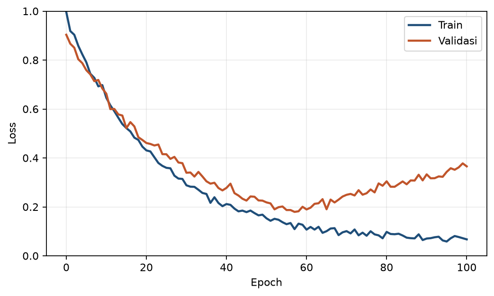

# Bab 4 — Backpropagation, Optimasi dan Pelatihan

> **Prasyarat:** Bab 2 (neuron, regresi, MAE/MSE) dan Bab 3 (klasifikasi, cross-entropy).
> Diperlukan kalkulus dasar: turunan (derivatif) — diingatkan ulang di §4.1.

## Tujuan Pembelajaran

Setelah menyelesaikan bab ini, Anda diharapkan mampu:

1. **Menjelaskan** mekanisme gradient descent dan backpropagation (aturan rantai) secara
   intuitif.
2. **Menganalisis** peran fungsi aktivasi dari sisi gradien (ReLU vs sigmoid/tanh) dan
   mengenali vanishing gradient.
3. **Menerapkan** tuning hyperparameter (learning rate, batch size, epochs) dan callback
   (early stopping, ModelCheckpoint, ReduceLROnPlateau).
4. **Membaca** learning curve untuk mendiagnosa underfit/overfit sebagai transisi ke Bab 5.

## 4.1 Gradien: Kemiringan sebagai Petunjuk

Sebelum masuk backpropagation, kita perlu satu konsep kalkulus: **turunan** (derivatif)
adalah kemiringan (slope) suatu fungsi pada satu titik. Jika kita punya fungsi loss
`L(w)` terhadap bobot `w`, maka:

- Jika `dL/dw` positif → menaikkan `w` akan menaikkan loss → kita harus **menurunkan** `w`.
- Jika `dL/dw` negatif → menaikkan `w` akan menurunkan loss → kita harus **menaikkan** `w`.

Aturan umum: bergerak **berlawanan arah gradien**. Inilah **gradient descent**.

$$ w \leftarrow w - \eta \frac{\partial L}{\partial w} \tag{4.1} $$

Persamaan (4.1) menyatakan: bobot baru = bobot lama dikurangi `η` (learning rate) dikali
gradien. Learning rate `η` mengontrol besar langkah: terlalu besar → melompat melewati
minimum; terlalu kecil → lambat.

### Analogi

Bayangkan Anda berdiri di atas gunung berkabut (ruang bobot) dan ingin turun ke lembah
(loss minimum). Anda tidak bisa melihat jauh; yang Anda rasakan hanya kemiringan di kaki.
Gradient descent: rasakan arah turun paling curam, ambil langkah, ulangi. Semakin dekat
ke lembah, semakin kecil kemiringan, sehingga langkah mengecil — sampai Anda berhenti.

### Tiga varian gradient descent

Berdasarkan berapa banyak data yang dipakai untuk satu langkah update:

- **Batch gradient descent** — gunakan *seluruh* training set per langkah. Akurat, tapi
  sangat lambat untuk data besar.
- **Stochastic gradient descent (SGD)** — gunakan *satu sampel* per langkah. Cepat, tapi
  sangat berisik (tiap sampel bisa "menarik" ke arah berbeda).
- **Mini-batch gradient descent** — gunakan *subkelompok* kecil (misal 32 sampel) per
  langkah. **Kompromi terbaik dan yang standar dipakai** — termasuk oleh Keras.

Istilah "SGD" di Keras/PyTorch sebenarnya merujuk pada varian mini-batch: kerangka yang
sama, batch kecil. Konsistensi di seluruh buku: kita menyebutnya **batch size** untuk
jumlah sampel per langkah.

### Loss landscape: bayangan bentuk "lembah"

Untuk satu bobot, loss `L(w)` berupa kurva; untuk dua bobot, berupa permukaan bergelombang
("loss landscape"). Gradient descent menuruni permukaan ini. Dua sifat yang perlu dikenal:

- **Minimum lokal** — lembah kecil tempat kurva turun lalu naik lagi; gradient descent
  bisa "terjebak" di sana padahal ada lembah lebih dalam di tempat lain.
- **Saddle point** — titik datar yang bukan minimum; di sini gradient ≈ 0 sehingga langkah
  nyaris berhenti.

Kabar baiknya: di ruang berdimensi tinggi (model besar), minimum lokal "tidak selalu
buruk" — banyak yang memberikan error hampir sama baiknya. Untuk masalah praktis di buku
ini (model kecil, data cukup), algoritma di atas hampir selalu menemukan solusi yang
cukup. Yang jauh lebih menentukan adalah **kualitas data & fitur**, bukan terjebak minimum.

## 4.2 Backpropagation: Aturan Rantai untuk Seluruh Jaringan

Jaringan saraf punya banyak lapisan; loss berada di ujung (lapisan keluaran), tetapi
bobot berada di semua lapisan. Bagaimana cara menghitung pengaruh bobot lapisan dalam
terhadap loss? Jawabannya: **aturan rantai** (chain rule).

Untuk jaringan 2 lapisan, pengaruh bobot `w` di lapisan tersembunyi terhadap loss `L`
merantai melalui nilai aktivasi `a`:

$$ \frac{\partial L}{\partial w} = \frac{\partial L}{\partial a} \cdot \frac{\partial a}{\partial z} \cdot \frac{\partial z}{\partial w} \tag{4.2} $$

Persamaan (4.2) adalah inti backpropagation: kesalahan di lapisan keluaran "dipropagasikan
mundur" (backward) melalui turunan berantai, memberitahu tiap lapisan seberapa besar
sumbangannya terhadap kesalahan akhir. Nama *backpropagation* merujuk persis pada alur ini:
hitung error di depan, lalu **kirim mundur** untuk memperbarui bobot.

**Kode 4.1 — Backpropagation is implemented by `model.fit` (end-to-end contoh gradient tape).**

```python
import tensorflow as tf

# contoh langkah pelatihan manual dengan GradientTape (untuk pemahaman)
w = tf.Variable(0.5)
b = tf.Variable(0.1)
opt = tf.keras.optimizers.Adam(learning_rate=0.1)

x = tf.constant([1.0, 2.0, 3.0])
y = tf.constant([2.0, 4.0, 6.0])

for step in range(50):
    with tf.GradientTape() as tape:
        pred = w * x + b
        loss = tf.reduce_mean(tf.square(pred - y))  # MSE
    grads = tape.gradient(loss, [w, b])
    opt.apply_gradients(zip(grads, [w, b]))

print("w:", w.numpy(), "| b:", b.numpy(), "| loss:", loss.numpy())
```

Kode 4.1 memperlihatkan otot-otot backpropagation secara manual: `GradientTape` mencatat
operasi, menghitung gradien ke `[w, b]`, lalu optimizer menggeser nilai. Dalam produk,
`saraf.fit` melakukan semua ini di balik layar — tetapi memahami langkah ini menjelaskan
apa yang sebenarnya terjadi.

### Kenapa "propagasi" penting untuk jaringan dalam

Tanpa aturan rantai, kita harus menghitung turunan numerik brute-force untuk setiap bobot
(ribuan hingga jutaan) — sangat mahal. Backpropagation menghitung semuanya dalam **satu
pass maju + satu pass mundur**, dengan efisiensi yang membuat pelatihan jaringan besar
menjadi mungkin. Kertas asli yang memperkenalkan teknik ini adalah Rumelhart, Hinton, dan
Williams (1986) [1], dan fondasinya diuraikan lebih lengkap dalam [3].

### Perjalanan sinyal dalam backpropagation (ringkasan 2 lapisan)

Untuk memahami alur, ikuti "perjalanan" satu sampel melalui jaringan 2 lapisan:

1. **Forward pass:** `x → z¹ → a¹ (ReLU) → z² → pred → loss`. Nilai disimpan di tiap
   lapisan (dibutuhkan nanti).
2. **Backward pass:** `dLoss/dpred → dz² → da¹ → dz¹ → dw¹`. Kesalahan mengalir mundur,
   dan aturan rantai menggabungkan turunan antar lapisan.
3. **Update:** tiap bobot `w` dikurangi `η × gradien` (Pers. 4.1).

Intuisi penting: lapisan tersembunyi "belajar" bukan dari data langsung, melainkan dari
**sinyal kesalahan yang dikirim mundur** dari lapisan setelahnya. Inilah sebabnya kedalaman
bisa bermakna — setiap lapisan menyesuaikan representasinya agar kesalahan total berkurang.

### Contoh numerik sederhana backpropagation

Bayangkan jaringan dengan satu neuron `y = w·x`, satu sampel `x=2, y_target=4`, dan loss
MSE `L = (wx − y_t)² / 1`. Misal `w = 1`. Maka:

1. **Forward:** `pred = 1·2 = 2`, `L = (2−4)² = 4`.
2. **Turunan:** `dL/dpred = 2(pred − y_t) = 2(2−4) = −4`; `dpred/dw = x = 2`.
3. **Chain rule:** `dL/dw = (−4)·2 = −8`.
4. **Update** (η=0.1): `w ← 1 − 0.1·(−8) = 1 + 0.8 = 1.8`.

Perhatikan: gradien negatif (−8) membuat bobot **naik** ke arah 2 — persis "berlawanan
arah" prinsip §4.1. Setelah beberapa iterasi `w` mendekati 2 (mengingat `y_t = 4/2`).
Inilah inti loop pelatihan, dan `model.fit` mengulanginya jutaan kali dengan
vektor-matriks pada semua bobot sekaligus.

## 4.3 Fungsi Aktivasi dari Sisi Gradien: Vanishing Gradient

Di Bab 2–3 kita memakai ReLU, sigmoid, dan softmax. Sekarang lihat dari sisi **gradien**:
nilai turunan fungsi ini menentukan seberapa cepat bobot di belakangnya berubah.

Untuk sigmoid `σ`, turunannya adalah:

$$ \sigma'(z) = \sigma(z) \cdot (1 - \sigma(z)) \tag{4.3} $$

Persamaan (4.3) punya sifat penting: `σ'(z)` **selalu < 1**, dan mendekati 0 ketika `z`
jauh dari 0. Akibatnya, dalam jaringan yang dalam, perkalian berantai dari gradien kecil
"menguap" — lapisan dekat masukan nyaris tidak belajar. Ini disebut **vanishing gradient**.

Illustrasinya: jika tiap lapisan mengalikan gradien dengan (misal) 0.2, setelah 10 lapisan
faktornya `0.2^10 ≈ 1e-7` — praktis nol.

Perbandingan fungsi aktivasi:

**Tabel 4.1** — Perbandingan fungsi aktivasi dari sisi gradien.

| Aktivasi | Rentang | Turunan | Masalah |
|---|---|---|---|
| `sigmoid(z)` | (0, 1) | ≤ 0.25 | Vanishing gradient |
| `tanh(z)` | (−1, 1) | ≤ 1 | Vanishing tapi lebih baik |
| `ReLU(z)` | [0, ∞) | `1` jika `z>0`, `0` jika `z<0` | *Dying ReLU* (neuron mati) |
| `leaky ReLU` | (−∞, ∞) | kecil tapi tidak 0 | Menghindari dying ReLU |

ReLU unggul karena turunannya `1` untuk `z > 0` — gradien tidak menyusut di bagian
positif, sehingga jaringan dalam dapat belajar. Kelemahannya: untuk `z < 0` turunan 0,
bisa "membunuh" neuron. Leaky ReLU menambal ini.

**Kapan vanishing gradient relevan di buku ini?** Untuk model kecil 1–3 lapisan (Bab 2–3),
jarang fatal. Tetapi ketika kita ke LSTM (Bab 7) dan jaringan yang lebih dalam, pemahaman
ini penting — LSTM dirancang sebagian untuk mengatasi masalah gradien pada data sekuensial.

### Tanh vs sigmoid: mengapa tanh "lebih baik" di lapisan tengah?

Turunan `tanh` maksimal 1 (vs sigmoid 0.25), sehingga gradien tidak menyusut secepat
sigmoid. Namun tetap < 1, sehingga di jaringan yang sangat dalam "penguapan" masih terjadi
— hanya lebih lambat. Inilah mengapa ReLU (turunan 1) menjadi pilihan default untuk
lapisan tersembunyi di jaringan modern. Nilai ini penting saat kita membandingkan
arsitektur & fungsi aktivasi di Bab 7.

### Kenapa sigmoid masih dipakai di keluaran?

Di Bab 3, lapisan keluaran memakai sigmoid (biner) / softmax (multi-kelas). Mengapa tidak
ReLU? Karena kita **ingin** keluaran berupa probabilitas di rentang (0,1), dan
cross-entropy + sigmoid "cocok" dari sisi gradien (lihat Bab 3 §3.4). Kesimpulannya:
ReLU di **lapisan tersembunyi** (biarkan gradien mengalir), sigmoid/softmax di **lapisan
keluaran** (untuk probabilitas). Dua peran berbeda, dan kini Anda paham alasannya.

## 4.4 Optimizer: SGD vs Adam

**SGD** (*stochastic gradient descent*) adalah gradient descent dasar: perbarui bobot
menggunakan gradien dari satu *batch* kecil data (stochastic).

**Adam** (Adaptive Moment Estimation) adalah versi cerdas yang:

- Menghitung rata-rata gradien (momentum) sehingga langkah lebih halus.
- Menyesuaikan learning rate per-parameter berdasarkan riwayat gradien.

Adam diperkenalkan oleh Kingma & Ba (2015) [2]. Praktik umum: **start dengan Adam**,
karena bekerja baik pada banyak masalah tanpa tuning banyak. SGD kadang memberi hasil
sedikit lebih baik akhirnya jika di-tune dengan hati-hati, tetapi butuh lebih banyak
usaha. Untuk buku ini, Adam adalah default (seperti yang sudah dipakai di Bab 2–3).

**Tabel 4.2** — Perbandingan SGD dan Adam untuk pemula.

| Aspek | SGD | Adam |
|---|---|---|
| Learning rate | Perlu di-tuning hati-hati | Lebih toleran (default ~0.001) |
| Momentum | Tidak otomatis (varian SGD+Momentum) | Otomatis |
| Kecepatan konvergensi | Lambat | Cepat |
| Kapan dipakai | Sesudah berpengalaman / model sederhana | Default semua bab |

## 4.5 Hyperparameter Pelatihan

Tiga hyperparameter utama yang menentukan perilaku pelatihan:

- **Learning rate (`η`)** — besar langkah. Terlalu besar: loss melonjak / tidak konvergen.
  Terlalu kecil: berjalan sangat lambat, mungkin terjebak.
- **Batch size** — jumlah sampel per langkah update. Kecil (mis. 16–32): update sering,
  lebih "berisik". Besar (mis. 256+): update halus tetapi butuh memori. Untuk dataset
  stasiun, batch 32–128 umum.
- **Epoch** — berapa kali model melihat seluruh data latih. Terlalu banyak epochs + model
  besar = overfit (Bab 5); terlalu sedikit = underfit.

### Bagaimana ketiganya berinteraksi?

Learning rate dan batch size saling memengaruhi. Batch besar memberi gradien "lebih
tenang" sehingga LR lebih besar bisa dipakai; batch kecil lebih berisik sehingga LR kecil
lebih aman. Epoch yang "cukup" tidak bisa diketahui langsung — dipantau lewat learning
curve (val loss), bukan dipatok angka. Inilah mengapa **callback early stopping** hampir
selalu direkomendasikan: ia menjawab "berapa epochs?" dengan melihat data, bukan tebakan.

### Aturan jempol untuk memulai

| Param | Nilai awal | Kapan naik | Kapan turun |
|---|---|---|---|
| Learning rate | 0.001 (Adam) | Underfit & mulus | Loss melonjak/fluktuasi keras |
| Batch size | 32 | Data sangat besar, mau cepat | Memori kurang / mau stabilitas |
| Epochs | 100 + EarlyStopping | Kurva masih turun tajam | Val naik (overfit) |

### Efisiensi: kapan mempertimbangkan GPU vs CPU

Di Colab, GPU mempercepat terutama untuk **matriks besar** (model besar, batch besar,
banyak data). Untuk masalah kecil di Bab 2–4, selisihnya kecil. Anda tidak perlu
berinvestasi pada GPU untuk mengikuti buku ini — Colab menyediakannya gratis (Bab 1).
Tips praktis:

- Mulai di **CPU** untuk prototipe cepat & kecil; pindah **GPU** untuk eksperimen
  panjang (Bab 8–9).
- Kurangi waktu eksperimen: latih di subset kecil dulu, baru full data setelah yakin.
- Pantau waktu per epoch (`model.fit(..., verbose=1)`) untuk memperkirakan total waktu.

### Contoh tuning singkat (kasus Bab 2)

Bayangkan model regresi pasang surut Bab 2 underfit (train & val MAE tinggi). Langkah
sesuai panduan: pindah dari LR 0.001 ke 0.01 → amati kurva; tambah neuron 8→32 → amati;
aktifkan ReduceLROnPlateau agar LR menurun otomatis. Tiap perubahan **satu-satu** agar
Anda tahu apa yang bekerja.

**Kode 4.2 — Mengatur learning rate dan batch size di Keras.**

```python
import tensorflow as tf

model = tf.keras.Sequential([
    tf.keras.layers.Dense(8, activation="relu", input_shape=(2,)),
    tf.keras.layers.Dense(8, activation="relu"),
    tf.keras.layers.Dense(1),
])

model.compile(
    optimizer=tf.keras.optimizers.Adam(learning_rate=0.001),
    loss="mse",
    metrics=["mae"],
)

history = model.fit(
    X_train, y_train,
    validation_data=(X_val, y_val),
    epochs=100, batch_size=32, verbose=0,
)
```

Kode 4.2 memakai `Adam(learning_rate=0.001)` eksplisit — nilai default; Anda bisa bereksperimen
menaikkan/menurunkan untuk melihat efek. Semua contoh di bab ini berjalan di atas
TensorFlow [4].

## 4.6 Callback: Mengotomatiskan Keputusan

Callbacks adalah "fungsi yang dipanggil selama pelatihan" oleh Keras. Tiga yang paling
berguna:

- **EarlyStopping** — hentikan pelatihan jika metrik validasi tidak membaik selama `patience`
  epoch (mencegah overfit & menghemat waktu).
- **ModelCheckpoint** — simpan bobot terbaik (misal berdasarkan `val_loss`) ke file, agar
  tidak kehilangan model terbaik saat overfit.
- **ReduceLROnPlateau** — turunkan learning rate otomatis jika metrik validasi "stuck",
  membantu keluar dari pelatihan yang macet.

Mengapa tiga sekaligus, bukan salah satu? Mereka melengkapi: **EarlyStopping** menentukan
*kapan berhenti*, **Checkpoint** memastikan *bobot mana yang disimpan* (yang terbaik, bukan
yang terakhir), dan **ReduceLROnPlateau** *menggali lebih dalam* saat sudah dekat minimum.
Dipakai bersama, mereka membuat pelatihan hampir "set-and-forget" untuk masalah sederhana.

Satu peringatan: **jangan** memilih arsitektur/hyperparameter terbaik berdasarkan nilai
terbaik yang pernah terjadi di validasi selama pencarian, lalu melaporkannya sebagai hasil
akhir tanpa menguji di test. Melihat validasi berkali-kali membuat validasi "bocor" —
itu sebabnya data test dipakai sekali di akhir (Bab 2 §2.7, diulang di Bab 5).

**Kode 4.3 — Callback untuk pelatihan yang sehat.**

```python
import tensorflow as tf

callbacks = [
    tf.keras.callbacks.EarlyStopping(monitor="val_loss", patience=10, restore_best_weights=True),
    tf.keras.callbacks.ModelCheckpoint("best_weights.keras", monitor="val_loss", save_best_only=True),
    tf.keras.callbacks.ReduceLROnPlateau(monitor="val_loss", factor=0.5, patience=5),
]

history = model.fit(
    X_train, y_train,
    validation_data=(X_val, y_val),
    epochs=200, batch_size=32, callbacks=callbacks, verbose=0,
)
print("Terlatih pada epoch:", len(history.history["loss"]))
```

Kode 4.3: `restore_best_weights=True` memastikan setelah `EarlyStopping`, bobot kembali ke
versi terbaik (bukan yang terakhir yang mungkin sudah overfit).

### Learning rate scheduler

Selain `ReduceLROnPlateau` (otomatis), Keras juga menyediakan scheduler manual:

```python
def lr_schedule(epoch):
    return 0.001 * (0.5 ** (epoch // 30))  # halving tiap 30 epoch

callbacks.append(tf.keras.callbacks.LearningRateScheduler(lr_schedule))
```

Scheduler "keras kepala" seperti ini berguna saat Anda sudah tahu bentuk peluruhan yang
diinginkan; `ReduceLROnPlateau` lebih adaptif ketika tidak tahu. Keduanya wajar dipakai
di dunia nyata.

## 4.7 Membaca Learning Curve

Setelah pelatihan, `history` berisi loss/metrik per epoch untuk train dan validation.
Keduanya di-plot untuk melihat:

- **Train loss turun, val loss juga turun** → model masih belajar (baik).
- **Train loss terus turun, val loss mulai naik** → **overfit**: model menghafal train dan
  kehilangan generalisasi. Titik di mana val loss mulai naik adalah sinyal berhenti.
- **Keduanya datar/tinggi** → **underfit**: model terlalu sederhana / LR terlalu kecil /
  data kurang.



Gambar 4.1 menunjukkan pola overfit khas: train terus menurun, validation membentuk "U"
terbalik. Di sinilah callback (early stopping) berguna — dan Bab 5 memperdalam diagnosis
serta pencegahannya (regularisasi).

### Apa yang harus dilakukan jika learning curve "aneh"?

Empat pola umum dan tindakannya:

1. **Train turun, val naik** → overfit. Coba: early stopping, regularisasi (Bab 5),
   data lebih banyak.
2. **Train & val datar tinggi** → underfit. Coba: learning rate lebih besar, arsitektur
   lebih besar, fitur lebih informatif.
3. **Val berfluktuasi keras** → batch terlalu kecil atau lr terlalu besar. Coba kecilkan
   lr, naikkan batch, atau pastikan data validasi cukup.
4. **Train tinggi, val sangat tinggi** → kemungkinan leakage atau skala salah. Periksa
   preprocessing & split (Bab 2, 5, 6).

Kurva adalah alat diagnosis cepat; Bab 5 memberikan alat untuk mengatasinya.

### Kapan kurva validasi "tidak wajar"?

Selain empat pola umum di atas, dua hal yang sering membingungkan:

- **Val loss NA/NaN di awal** — biasanya learning rate terlalu besar atau skala data rusak
  (nilai sangat besar/`NaN`). Periksa preprocessing.
- **Val loss lebih rendah daripada train** — bisa terjadi karena dropout aktif hanya saat
  pelatihan (Bab 5) atau karena train kita ukur pada kondisi "lebih susah". Umumnya bukan
  masalah serius.

Membaca kurva adalah keterampilan yang tumbuh lewat eksperimen: makin sering Anda melihat
pola, makin cepat Anda tahu perbaikannya.

## 4.8 Panduan Praktis Memilih Hyperparameter

Tidak ada rumus tunggal, tetapi urutan kerja berikut terbukti berjalan:

1. **Mulai dengan default** — Adam LR 0.001, batch 32, ReLU, 1–3 lapisan kecil. Ukur
   baseline (Bab 2) dan kurva awal.
2. **Cek skala data** — pastikan fitur tidak bervariasi liar (normalisasi, Bab 6); skala
   yang buruk membuat pelatihan lambat/macet.
3. **Uji learning rate** — buat *learning rate finder* sederhana: latih 1 epoch per LR,
   plot loss. Pilih LR sekitar titik penurunan paling curam.
4. **Naikkan kapasitas hanya jika perlu** — jika underfit, tambah neuron/lapisan;
   jika overfit, tambah regularisasi (Bab 5) BUKAN sekadar mengecilkan model.
5. **Gunakan callback semua-atau-apa** — EarlyStopping, Checkpoint, ReduceLROnPlateau
   selalu aktif selama mencoba-coba agar fair.
6. **Cepat bereksperimen di sebagian data** — untuk pengembangan, cukup subset data;
   baru full data saat sudah yakin.

Pendekatan "mulai kecil + naikkan bertahap + pantau kurva" jauh lebih efisien daripada
mencoba semua kombinasi acak.

### Siklus pengembangan model (bukan sekali jalan)

Bab 2–4 memberi Anda satu siklus penuh: bentuk data → training → evaluasi. Dalam praktik,
Anda akan mengulang siklus ini berkali-kali:

```
masalah → data → baseline → model → evaluasi → (analisis kesalahan) → perbaikan → ...
```

Analisis kesalahan adalah bagian yang sering dilupakan pemula: setelah model pertama
jalan, lihat **di mana yang salah** — misalnya, apakah error besar terjadi pada hari hujan
ekstrem? Fitur apa yang kurang? Pola apa yang model belum tangkap? Perbaikan bisa datang
dari data (fitur baru, Bab 6), arsitektur (Bab 7), atau metrik/threshold (Bab 5). Modeling
sekarang bukan lagi "menulis model sekali", melainkan iterasi yang cepat dan jujur.

## 4.9 FAQ

**Apakah saya perlu memilih optimizer selain Adam?** Untuk buku ini, tidak. Adam cukup
untuk Bab 2–10. SGD lebih sederhana dan bisa di-tune lebih baik, tetapi itu topik lanjut.

**Mengapa loss kadang "naik turun"?** Karena SGD/Adam memakai batch acak — setiap langkah
sedikit berisik. Tren menurun dalam jangka panjang, bukan kurva mulus.

**Berapa epochs "cukup"?** Gunakan EarlyStopping + patience wajar (10–30). Jangan menebak.

**Apakah mustahil vanishing gradient?** Tidak; pada jaringan sangat dalam atau data
berurutan panjang (Bab 7), tetap bisa muncul. Arsitektur modern menanganinya via
residual/skip connections dan normalisasi — dibahas singkat di Bab 10.

**Apa beda `val_loss` dan `loss`?** `loss` dihitung pada data latih (yang sedang dilihat);
`val_loss` pada data validasi (tidak dilatih). `val_loss` adalah kira-kira generalisasi —
di sinilah overfit terlihat.

**Kapan saya tahu model "cukup dilatih"?** Kombinasi: (1) val loss tidak lagi menurun
secara berarti, (2) train dan val tidak berbeda jauh (overfit kecil), (3) model mengalahkan
baseline Bab 2. Tidak perlu mengejar loss mendekati nol — itu biasanya tanda overfit.

**Apakah backpropagation perlu saya implementasi manual?** Untuk memakai buku ini, tidak;
`model.fit` menanganinya. Memahami mekanismenya (Kode 4.1) membantu saat debugging dan
membaca literatur — misalnya memahami mengapa "gradient flow" penting di Bab 7.

**Yang paling sering salah pemula?** Mengubah banyak hal sekaligus tanpa memantau kurva.
Ubah satu variabel, amati efeknya, catat. Itu disiplin yang akan dipakai ulang di Bab 5
(tuning regularisasi) dan Bab 8–9 (eksperimen kasus).

## 4.10 Latihan

**Soal konsep**

1. Turunkan secara intuitif: mengapa kita bergerak *berlawanan* arah gradien saat gradient
   descent?
2. Apa itu vanishing gradient dan bagaimana ReLU membantu?
3. Apa beda learning rate, batch size, dan epochs — dan bagaimana masing-masing memengaruhi
   pelatihan?
4. Mengapa early stopping tidak bisa menggantikan evaluasi yang jujur di test?

**Latihan praktik (notebook `ch-04-03_optimasi_callbacks.ipynb`)**

5. Pada kasus regresi Bab 2, coba learning rate `[0.01, 0.001, 0.0001]` dan catat kurva
   loss-nya. Yang mana konvergen? Yang mana macet/melonjak?
6. Bandingkan `batch_size` 16 vs 256; amati perbedaan "berisik" kurva train.
7. Terapkan EarlyStopping dan ModelCheckpoint; bandingkan epoch berhenti dengan tanpa
   callback.
8. Plot learning curve train vs val dan tandai titik overfit (jika ada).
9. Ganti aktivasi lapisan tersembunyi menjadi `tanh`; bandingkan convergence dengan ReLU.

## Ringkasan

- Gradient descent memperbarui bobot berlawanan arah gradien (Pers. 4.1).
- Backpropagation memakai aturan rantai (Pers. 4.2) untuk mengirim error mundur.
- Vanishing gradient dihindari dengan ReLU (turunan 1 untuk z>0).
- Adam adalah optimizer default; learning rate, batch size, epochs menentukan keseimbangan.
- Callback (EarlyStopping, Checkpoint, ReduceLROnPlateau) mengotomasi pelatihan.
- Learning curve mendiagnosa underfit/overfit — jembatan ke Bab 5.
- Praktik baik: baseline dulu, ubah satu variabel, pantau kurva, test sekali di akhir.

## References

1. D. E. Rumelhart, G. E. Hinton, and R. J. Williams, "Learning representations by
   back-propagating errors," *Nature*, vol. 323, no. 6088, pp. 533–536, Oct. 1986,
   doi: 10.1038/323533a0.
2. D. P. Kingma and J. Ba, "Adam: A method for stochastic optimization," in *Proc. Int.
   Conf. Learn. Represent. (ICLR)*, 2015. [Online]. Available: https://arxiv.org/abs/1412.6980
3. I. Goodfellow, Y. Bengio, and A. Courville, *Deep Learning*. Cambridge, MA, USA:
   MIT Press, 2016.
4. M. Abadi et al., "TensorFlow: Large-scale machine learning on heterogeneous systems,"
   2016. [Online]. Available: https://arxiv.org/abs/1603.04467