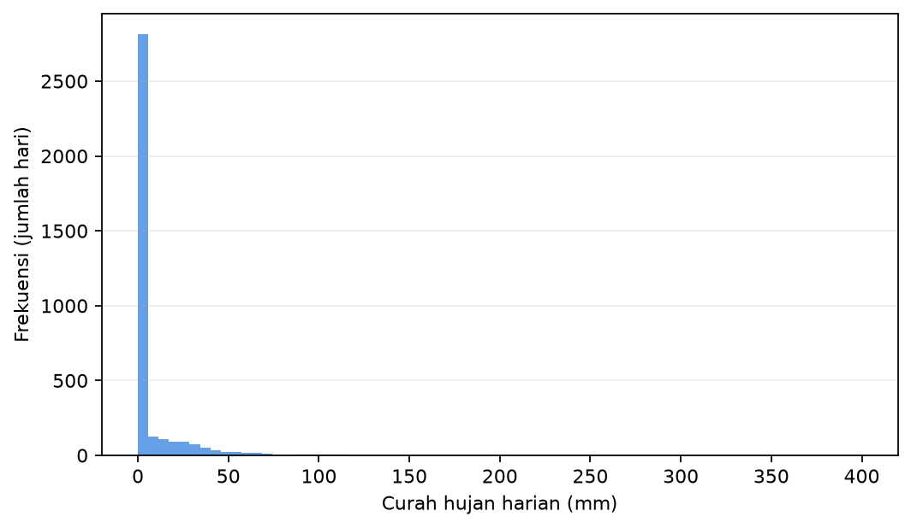

# Bab 6 - Data Meteorologi: Sumber, Kualitas dan Persiapan

> **Prasyarat:** Bab 1 (lingkungan Colab), Bab 2 (split berbasis waktu, MAE/MSE),
> Bab 5 (walk-forward, anti-*leakage*). Bab ini bersifat praktis: banyak kode, sedikit
> teori.

> **Catatan:** Materi bab ini adalah **materi pengenalan**, bukan hasil riset baru. Seluruh isi
> merupakan ringkasan ulang literatur *machine learning*, dengan contoh-contoh yang dekat dengan
> dunia meteorologi Indonesia.

## Tujuan Pembelajaran

Setelah menyelesaikan bab ini, Anda diharapkan mampu:

1. **Mengambil dan menghubungkan** data meteorologi Indonesia (stasiun BMKG, reanalysis
   ERA5, pasang surut, satelit) beserta lisensi dan batasannya.
2. **Membaca** format berkas CSV, NetCDF, dan GRIB; menangani nilai hilang, pencilan, dan
   imputasi dasar.
3. **Melakukan eksplorasi** (dekomposisi musiman, distribusi, korelasi silang) dan
   *feature engineering* (deret tunda, indikator musiman, ENSO/MJO).
4. **Menerapkan** normalisasi (dipasang hanya pada data latih) dan split berbasis waktu
   yang mencegah *leakage*.

## 6.1 Mengapa Data Menentukan Segalanya

Bab 2-5 membangun model; bab ini kembali ke fondasi: **data**. Di dunia meteorologi,
ungkapan *garbage in, garbage out* terasa sangat nyata - model sehebat apa pun tidak
berguna jika masukannya salah. Urutan ini sengaja: menunda bab data sampai setelah
pembaca mengenal konsep *leakage*, split berbasis waktu, dan metrik evaluasi (Bab 2
dan 5) membuat alasan mengapa data harus bersih menjadi konkret, bukan abstrak.
Tiga kenyataan yang perlu dipahami sejak awal:

1. **Data meteorologi tidaklah bersih.** Sensor rusak, nilai hilang, stasiun pindah
   lokasi, dan pencilan (ingat distribusi hujan yang berekor panjang di Bab 2 dan 5)
   adalah hal biasa.
2. **Data adalah deret waktu.** Urutan waktu bermakna; kita tidak boleh mengacak, memotong
   sembarangan, atau membiarkan informasi masa depan "bocor" ke masa lalu (Bab 2 §2.7,
   Bab 5 §5.5).
3. **Sumber data punya aturan.** Lisensi, batasan penggunaan, dan cara kutip berbeda antar
   lembaga. Memahami aturan ini bagian dari etika riset (Kriteria Sitasi, bagian 3).

Bab ini memberi peta sumber data + keterampilan teknis mengubahnya menjadi *dataset*
yang siap dilatih - persis yang akan dipakai di Bab 7-9. Peta alurnya:

```text
[6.1-6.2]            [6.3]               [6.4]
 Berkas mentah        Membaca dan         QC dan imputasi
 CSV, NetCDF, GRIB    menyatukan          - pola gap
 (BMKG, ERA5, pasut,  (Kode 6.1-6.3)      - outlier vs ekstrem sahih
  GSMaP, CHIRPS)      -> tabel            (Kode 6.4)
  (Tabel 6.1)           berindeks waktu   - konsistensi internal,
        |                    |               temporal, spasial
        v                    v                    v
 [6.5 eksplorasi]      [6.6 feature]      [6.7 preprocessing]
 distribusi, musim    lag, sinusoidal,   normalisasi (skala dari
 korelasi silang      ENSO/MJO           data latih), transformasi
 (Gambar 6.1, Kode    (Kode 6.6)         log1p, split kronologis
 6.5)
                                                  |(Kode 6.7)
                                                  |
                                                  v
                      dataset X/y siap + metadata (§6.9)
                                                  |
                                                  v
                      Bab 7-9 memakai dataset ini
```

**Alur 6.1** - Pipeline data dari berkas mentah ke *dataset* siap dilatih (dipakai
kembali di Bab 8-9). Setiap langkah punya "Kode 6.x" dan angka-aturan yang akan
diacu nanti - jika suatu bagian terasa abstrak, loncat duluan ke "Studi mini" di §6.7
yang merangkai semuanya sekaligus.

## 6.2 Sumber Data Meteorologi Indonesia

Berikut sumber yang paling relevan untuk buku ini, diurutkan dari yang paling sering
dipakai.

**Tabel 6.1**: Sumber data utama untuk buku ini.

| Sumber | Jenis data | Resolusi | Akses | Catatan lisensi & kutip |
|---|---|---|---|---|
| Stasiun BMKG | Observasi suhu, hujan, angin, dsb. | Harian/jam-an, per stasiun | `dataonline.bmkg.go.id`, permintaan data | Data publik untuk pendidikan; sebutkan BMKG [1] |
| ERA5 / ERA5-Land (Copernicus) | *Reanalysis* suhu, hujan, angin, dll. | ±0.25° (~31 km) / ±0.1° (~9 km), per jam | Copernicus Climate Data Store [2] | Lisensi CC-BY untuk C3S; kutip Hersbach et al. [3] |
| CMIP6 | Proyeksi iklim (skenario) | Lebih kasar, bulanan-harian | ESGF / Copernicus | Untuk konteks jangka panjang, Bab 10 |
| PSMSL / IOC / BIG | Muka laut / pasang surut | Menit-jam, per stasiun | `psmsl.org` [4], `tides.big.go.id` [5] | Gratis; sertakan rujukan data & bottle/stasiun |
| GSMaP (JAXA) | Hujan satelit+kalibrasi | 0.1°, 3 jam-harian | `sharaku.eorc.jaxa.jp` [11] | Kutip paper pembuat |
| CHIRPS (CHC UCSB) | Hujan satelit+kalibrasi | ±0.05° (~5 km), harian | CHC UCSB [6] | Kutip paper pembuat |

**Catatan penting:** stasiun BMKG [1] adalah sumber "kebenaran lokal" terbaik, tetapi
tidak merata spasial dan kadang bergap. ERA5 [2][3] memberikan cakupan grid lengkap dan
konsisten, tetapi merupakan *model* (taksiran) - bukan observasi murni. Praktik umum:
gabungkan observasi stasiun (untuk akurasi) dengan *reanalysis* (untuk fitur regional
yang lengkap). Cara menggabungkan ini dibahas di §6.3-6.6.

### Memahami *reanalysis* secara singkat

*Reanalysis* adalah hasil *running* model cuaca (misal IFS milik ECMWF) sepanjang sejarah
sambil **menyerap observasi** (stasiun, balon udara, satelit) secara konsisten [3].
Hasilnya: peta cuaca lengkap setiap jam sejak puluhan tahun lalu, meski di tempat tanpa
pengamatan. Ini bukan "ramalan" masa lalu - melainkan perpaduan model + data terbaik yang
tersedia. Untuk *machine learning*, *reanalysis* sering menjadi sumber fitur regional yang
tidak dimiliki stasiun.

### Kapan memakai data satelit hujan?

Untuk wilayah yang minim stasiun (laut, pulau terpencil, Indonesia timur), pengamatan
hujan berbasis satelit merupakan alternatif praktis. **GSMaP** (JAXA) [11] dan **CHIRPS** [6]
menggabungkan sinyal satelit inframerah/pasif-mikro dengan kalibrasi stasiun, menghasilkan
grid hujan yang cukup baik untuk kajian regional.

Catatan penggunaan di buku ini:

- **Kapan dipakai**: sebagai fitur pelengkap atau pengganti saat stasiun bergap panjang.
- **Kapan hati-hati**: estimasi satelit bisa bias di wilayah pantai dan gunung; verifikasi
  terhadap stasiun setempat bila memungkinkan.
- **Jangan dipakai sebagai *target*** jika stasiun observasi tersedia - konsistensi target
  lebih penting (target dari sumber yang sama menjaga makna evaluasi).

Bab 6 memperlakukan satelit sebagai "sumber bonus", bukan pengganti stasiun.

### Catatan praktis akses data

Lima hal yang perlu diketahui sebelum mengunduh (berlaku untuk semua sumber di Tabel
6.1):

1. **ERA5 vs ERA5-Land**: Tabel 6.1 mencantumkan resolusi keduanya. Untuk studi skala
   lokal (pertanian, hidrologi, wilayah kecil), **ERA5-Land (0.1°)** umumnya lebih cocok
   daripada ERA5 (0.25°) - ERA5-Land adalah versi *downscaled* yang didorong ulang oleh
   ERA5 dengan resolusi lebih halus.
2. **Tidak semua data *real-time***: ERA5 versi akhir tersedia dengan **tunda sekitar
   2-3 bulan** (versi sementara *near-real-time* **ERA5T** lebih cepat tetapi belum
   divalidasi penuh). GSMaP juga punya beberapa rilis: versi *near-real-time*
   (**GSMaP_NRT**, tunda sekitar 4 jam) dan versi *reanalysis* (**GSMaP_RI**, tunda jauh
   lebih lama). Untuk pelatihan *offline* latensi ini tidak mengganggu, tetapi penting
   saat data dipakai untuk aplikasi operasional *near-real-time*.
3. **"0.25° ≈ 31 km" hanya berlaku di sekitar khatulistiwa**: di lintang tinggi, jarak
   per derajat bujur menyusut. Karena Indonesia praktis berada di ekuator, angka 31 km
   cukup akurat untuk buku ini - tetapi jangan menganggapnya universal.
4. **BMKG tidak memiliki API publik**: akses umum manual via
   `dataonline.bmkg.go.id`; sebagian data memerlukan permintaan resmi yang mungkin
   berbayar, dan kualitas data **bervariasi antar stasiun** (bergap panjang, sensor
   error, atau pindah lokasi). Selalu baca metadata stasiun dan dokumentasi sebelum
   mengunduh (lihat §6.9).
5. **Kutipkan sumber tepat**: cantumkan nama produk, versi, dan tanggal unduh sesuai
   §6.9 - sebagian data (CDS, JAXA) mewajibkan kredit khusus untuk publikasi.

### Menggabungkan observasi dan *reanalysis* (praktik yang disarankan)

Strategi yang dipakai di Bab 8-9 adalah menerapkan dua peran secara terpisah:

- **Observasi stasiun** → *target* (`y`): yang ingin diprediksi (hujan, pasang surut).
- **Reanalysis ERA5** → *fitur regional* (`X`): suhu, angin, kelembapan, dan variabel
  grid di sekitar stasiun untuk memperkaya konteks atmosfer yang tidak tercatat di
  stasiun.

Alasan pemisahan ini: melatih model untuk mereproduksi observasi langsung (bukan taksiran
model) menjaga makna evaluasi - kita mengukur seberapa baik model menebak kenyataan, bukan
menebak tebakan lain. Fitur regional dari *reanalysis* sah sebagai masukan karena tersedia
secara konsisten dan tidak "mencurangi" target.

## 6.3 Format Berkas: CSV, NetCDF, dan GRIB

Tiga format yang paling sering ditemui:

- **CSV** - tabel teks sederhana; paling mudah dibaca (pandas), cocok untuk data stasiun
  harian.
- **NetCDF** - format biner ilmiah dengan metadata kaya (dimensi, koordinat, atribut);
  standar untuk *reanalysis* (ERA5). Dibaca dengan **xarray**.
- **GRIB** - format biner khas meteorologi operasional (prakiraan model); juga bisa dibaca
  xarray (via `cfgrib`) atau wgrib2.

**Tabel 6.2**: Perbandingan format berkas.

| Format | Baca cepat? | Metadata | Ukuran | Umum dipakai untuk |
|---|---|---|---|---|
| CSV | Mudah (pandas) | Minim | Besar (teks) | Data stasiun harian |
| NetCDF | Ya (xarray/netCDF4) | Kaya | Kompak | ERA5, model |
| GRIB | Ya (cfgrib/wgrib2) | Kaya | Kompak | Prakiraan operasional |

**Kode 6.1 - Membaca NetCDF dengan xarray (contoh ERA5 suhu harian).**

```python
import xarray as xr

ds = xr.open_dataset("era5_suhu_harian.nc")
d = ds["t2m"]                     # variabel suhu 2 m
print(d.shape, d.attrs.get("units"))
```

`xarray` mempertahankan **label koordinat** (waktu, lintang, bujur), sehingga
mengiris wilayah atau periode jauh lebih terbaca daripada array mentah NumPy. Untuk data
stasiun dalam CSV, `pandas.read_csv` dan parse tanggal ke `datetime` adalah langkah
pertama yang biasa.

Untuk GRIB (prakiraan model operasional), dua jalur umum: xarray dengan *engine* `cfgrib`
untuk eksplorasi cepat, atau `wgrib2` untuk ekstraksi presisi pada skala besar. Catatan:
engine `cfgrib` (beserta pustaka `eccodes` di belakangnya) perlu diinstal terpisah dari
xarray - `pip install cfgrib` biasanya mencukupi di Colab, tetapi kegagalan instalasi
pada beberapa sistem sering menjadi titik hambatan pertama pembaca.

**Kode 6.2 - Membaca GRIB dengan xarray + engine cfgrib.**

```python
import xarray as xr

ds = xr.open_dataset("prakiraan.grib", engine="cfgrib")
```

**Konvensi nama variabel:** ERA5 menggunakan nama seperti `t2m` (suhu 2 m), `tp`
(total *precipitation*), `u10`/`v10` (angin 10 m). Selalu cek atribut `units` - mengubah
satuan tanpa sadar adalah sumber kesalahan klasik.

### Menyatukan banyak berkas menjadi satu tabel

Pola yang akan berulang di Bab 8-9: baca banyak berkas → resample ke frekuensi yang sama
→ gabung menjadi satu `DataFrame` berindex waktu.

**Kode 6.3 - Menyatukan ERA5 per jam menjadi tabel harian.**

```python
import xarray as xr
import pandas as pd

# ERA5 per jam -> menjadi harian: hujan (akumulatif) pakai sum()
ds = xr.open_dataset("era5_per_jam.nc")
d_harian = ds["tp"].resample(time="D").sum()
s = d_harian.sel(latitude=-0.01, longitude=109.34, method="nearest").to_pandas()
```

Resample harus disesuaikan dengan sifat variabel: variabel **akumulatif** seperti hujan
(`tp`) memakai `sum()`, sedangkan variabel **instan** seperti suhu/angin (`t2m`, `u10`,
`v10`) memakai `mean()`. Salah memilih agregasi adalah sumber kesalahan data tersembunyi
yang luput dari plot deret.

Menggabungkan stasiun (target) dan *reanalysis* (fitur) lewat indeks tanggal adalah operasi
`merge`/`join` yang harus diperiksa hasilnya agar tidak ada baris yang hilang diam-diam -
periksa ulang jumlah baris dan rentang tanggal sebelum membangun model.

## 6.4 Kualitas Data: Nilai Hilang, Pencilan, dan Imputasi

Setelah data terbaca, langkah berikutnya adalah *quality control* (QC).

### Nilai hilang (*missing values*)

Sensor mati, komunikasi terputus, atau kesalahan logging menghasilkan celah. Cara pertama
bukan menebak, melainkan **memahami polanya**:

- Gap kecil dan acak → imputasi sederhana cukup.
- Gap panjang (berhari-hari) → hati-hati; imputasi bisa menyesatkan; pertimbangkan
  memotong periode tersebut atau memakai model terpisah.
- Gap sistematis (mis. stasiun hanya mencatat pada jam kerja) → perlu penanganan khusus.

**Kode 6.4 - Cek dan isi nilai hilang dasar dengan pandas.**

```python
import pandas as pd

df = pd.read_csv("curah_hujan_stasiun.csv", parse_dates=["tanggal"])
df = df.set_index("tanggal")
print("Nilai hilang:", df.isna().sum())

# Interpolasi linear sederhana untuk gap pendek
df["r_hujan"] = df["r_hujan"].interpolate(method="linear", limit=3)

# Atau isi dengan nilai hari sebelumnya (ffill = forward fill) untuk gap 1 hari
df["suhu"] = df["suhu"].ffill()
```

Catatan: interpolasi linear (Kode 6.4) cocok untuk suhu (mulus) tetapi **kurang pas**
untuk hujan (banyak nol, lonjakan). Untuk hujan, imputasi konservatif (misal isi 0 bila
hari kering di sekitarnya, atau `NaN` tetap dibiarkan untuk model yang tahan) sering lebih
jujur.

Selain interpolasi, ada keluarga metode imputasi yang **belajar dari data lain**:
regresi dengan stasiun tetangga (isi gap suhu memakai korelasi stasiun terdekat), imputer
berbasis tetangga terdekat (KNN), atau *iterative imputation* (MICE). Ini relevan ketika
gap panjang atau banyak variabel saling berkorelasi. Bab 8-9 menggunakan imputasi sederhana
untuk menjaga alur tetap jelas; metode berbasis model (KNN/MICE) bisa menjadi langkah
lanjutan saat data sudah lebih besar dan banyak variabel berkorelasi.

### Pencilan (*outlier*)

Pencilan bisa berupa kesalahan (sensor) atau nilai ekstrem sahih (hujan >200 mm/hari).
Bedakan dengan konteks:

- Suhu 70 °C di Indonesia → hampir pasti salah, bisa diganti `NaN`.
- Hujan 300 mm/hari → mungkin nyata; **jangan** otomatis hapus.

Cara cepat mendeteksi: plot deret, statistik ringkas, dan *rule of thumb* (misal nilai di
luar `median ± 5 × MAD`). Untuk studi kasus Bab 8-9, pendekatan yang dipakai adalah
"jangan menghapus ekstrem sahih; pahami apakah model menyerapnya secara wajar" - ekstrem
itulah yang sering paling penting diprediksi.

### Contoh QC numerik sederhana

Misalkan satu stasiun mencatat `r_hujan = -3.2, 0, 0, 255.0, 2.0, 0` (enam hari).

- `-3.2` → mustahil secara fisik (nilai negatif) → buang/ganti `NaN`.
- `255.0` → mungkin ekstrem sahih di Indonesia (belum tentu salah) → **tahan dulu**,
  verifikasi dengan stasiun tetangga atau catatan klimatologi.
- Interval `0,0` → wajar di musim kering.

Aturan praktis: kesalahan fisik (negatif, suhu >60 °C) dihapus; ekstrem yang masuk akal
secara fisis dipertahankan sampai ada bukti salah. Menghapus ekstrem sahih agar model
"tampak bagus" adalah bentuk kecurangan evaluasi - di dunia nyata ekstrem itu tetap
terjadi dan harus diprediksi.

Cek nilai fisik saja tidak cukup; QC yang baik juga memeriksa **konsistensi**:

- **Internal**: nilai yang saling bertentangan dalam satu stasiun (mis. suhu minimum di
  atas suhu maksimum hari yang sama, atau arah angin 'N' di samping 'S' yang mencerminkan
  sensor rusak).
- **Temporal**: lompatan tak wajar antar waktu yang berurutan (mis. lonjakan suhu 20°C
  dalam satu jam tanpa front udara yang jelas) patut dicurigai.
- **Spasial**: bandingkan dengan stasiun tetangga - satu nilai hujan 300 mm/hari sementara
  lima stasiun sekitarnya kering mungkin salah; tetapi ingat perbedaan lokal tetap bisa
  sahih (badai sel tunggal), jadi verifikasi sebelum membuang [12].

Tujuan QC bukan membersihkan data sembarangan, tetapi **menandai nilai yang tidak bisa
dipercaya** tanpa menghilangkan sinyal ekstrem yang sah.

## 6.5 Eksplorasi: Memahami Pola Sebelum Membangun Model

Eksplorasi yang baik mencegah model yang salah arah. Empat hal yang hampir selalu
dilakukan untuk data deret waktu meteorologi:

### 1. Dekomposisi musiman

Data cuaca punya siklus harian, bulanan, dan musiman (monsun). Memisahkan
*tren + musiman + residu* (misal `seasonal_decompose` di statsmodels) membantu melihat
apakah pola musiman kuat - dan mengingatkan bahwa model perlu fitur musiman (§6.6).

### 2. Distribusi data

Hujan (Gambar 6.1) berbentuk *berat di nol* dengan ekor panjang ke kanan; suhu lebih
mirip lonceng. Distribusi menentukan pilihan *loss* (Bab 2), trasformasi target, dan
metrik yang jujur (Bab 5).



**Gambar 6.1**: Distribusi curah hujan harian khas: banyak hari tanpa hujan dan ekor panjang ke kanan.

### 3. Korelasi silang

Sebelum menambahkan fitur, lihat korelasi (Pearson) maupun korelasi silang dengan deret
tunda. Fitur yang berkorelasi tinggi dengan target lebih menjanjikan; fitur yang saling
berkorelasi kuat (multikolinearitas) kurang bermasalah di neural network daripada di
regresi klasik, tetapi tetap perlu dipahami.

### 4. Stasioneritas & musim

Deret cuaca umumnya **tidak stasioner** (rata-rata dan varians berubah musiman). Model
sekuensial (Bab 7) bisa menangkap pola ini dari data, tetapi membantu jika kita berikan
indikator musiman eksplisit.

### Kode contoh dekomposisi dan korelasi silang

**Kode 6.5 - Dekomposisi musiman dan korelasi silang singkat.**

```python
import pandas as pd
from statsmodels.tsa.seasonal import seasonal_decompose

# 1) dekomposisi hujan bulanan (resample "ME" = akhir bulan)
bulanan = df[["r_hujan", "suhu"]].resample("ME").agg({"r_hujan": "sum", "suhu": "mean"})
hasil = seasonal_decompose(bulanan["r_hujan"], model="additive")
hasil.plot()

# 2) korelasi silang suhu(t-k) vs hujan(t): cari lag terbaik
korelasi = pd.Series(
    {k: bulanan["suhu"].shift(k).corr(bulanan["r_hujan"]) for k in range(0, 150)},
    name="korelasi",
).sort_index()
lag_terbaik = korelasi.abs().idxmax()
print("Lag suhu dengan korelasi tertinggi:", lag_terbaik)
```

Dekomposisi (Kode 6.5) menampilkan komponen musiman; segmen kedua menghitung korelasi
silang suhu tunda `t-k` terhadap hujan `t` untuk memilih deret tunda yang menjanjikan
sebelum memasukkannya ke model (hubungan hujan-suhu di daerah tropis bersifat negatif:
suhu turun saat hujan, sehingga korelasi maksimum akan berharga negatif; yang penting
adalah `lag`-nya). Pada data hujan, `seasonal_decompose` bersifat *additive* dan bisa
kasar jika distribusi masih sangat miring - gunakan transformasi (`log1p`, §6.7) atau
*modeling* multiplikatif bila hasilnya berisik.

## 6.6 Feature Engineering untuk Data Meteorologi

*Feature engineering* adalah keterampilan yang paling cepat mengangkat performa model.
Untuk deret waktu meteorologi, beberapa fitur yang terbukti berguna:

### Deret tunda (*lag*)

Target `y(t)` dijelaskan oleh nilai sebelumnya `y(t-1)`, `y(t-2)`, … (Bab 2 §2.5 sudah
memakai 2 deret tunda). Deret tunda menangkap *persistensi* dan *autokorelasi*.

### Indikator musiman

Nomor hari dalam tahun (`1-366`), bulan, atau fungsi sinus/kosinus dari hari Julian
(misal `sin(2π·doy/365.25)`, `cos(...)`) memberi model tahu "kapan dalam tahun ini".
Fungsi sinus/kosinus dipakai agar siang-malam dan pergantian tahun kontinu, bukan
melompat.

### Indeks iklim: ENSO dan MJO

Fitur **regional** meningkatkan prediksi hujan Indonesia secara signifikan:

- **ENSO** (El Niño-Southern Oscillation): indeks Nino3.4 atau MEI mengukur anomali
  suhu muka laut Pasifik [7]; Indonesia cenderung lebih kering saat El Niño.
- **MJO** (Madden-Julian Oscillation): bit fase & amplitudo MJO (mis. RMM1, RMM2 dari
  Wheeler & Hendon [8]) berhubungan dengan osilasi hujan 30-60 hari di wilayah tropis.

Kedua indeks tersedia gratis (NOAA, BMKG). Memasukkan mereka sebagai fitur adalah contoh
nyata "pengetahuan domain meningkatkan model" - sesuatu yang dimiliki praktisi meteo
tetapi umumnya tidak dimiliki mahasiswa CS.

**Kode 6.6 - Membangun fitur lag, musiman, dan indeks iklim.**

```python
import numpy as np

# 1) deret tunda
for lag in [1, 2, 3, 7, 14]:
    df[f"hujan_t{lag}"] = df["r_hujan"].shift(lag)

# 2) musiman sinusoidal
doy = df.index.dayofyear
df["mus_sin"] = np.sin(2 * np.pi * doy / 365.25)
df["mus_cos"] = np.cos(2 * np.pi * doy / 365.25)

# 3) indeks iklim (contoh: MJO RMM1 & RMM2 digabung dari berkas eksternal)
df = df.join(rmm.set_index("tanggal"), how="left")
```

## 6.7 Normalisasi dan Split Berbasis Waktu

### Normalisasi: pasang hanya pada data latih

Model di Bab 2-5 dilatih dengan `Adam` yang sensitif pada skala. Normalisasi *z-score*
adalah pilihan umum:

$$
x' = \frac{x - \mu_{\text{train}}}{\sigma_{\text{train}}} \tag{6.1}
$$

**Sangat penting:** `μ` dan `σ` dihitung **hanya dari data latih**, lalu diterapkan ke
validasi, *test*, dan data produksi (Persamaan 6.1). Jika dihitung dari seluruh data,
informasi masa depan "bocor" - bentuk *leakage* yang paling sering luput (Bab 5 §5.5).

**Kode 6.7 - Normalisasi dengan skala dari data latih + split berbasis waktu.**

```python
from sklearn.preprocessing import StandardScaler

feat = [c for c in df.columns if c not in ("r_hujan",)]  # jangan sertakan target
scale = StandardScaler().fit(df[feat].iloc[:n_train])

X_train = scale.transform(df[feat].iloc[:n_train])
X_val   = scale.transform(df[feat].iloc[n_train:n_train+n_val])
X_test  = scale.transform(df[feat].iloc[n_train+n_val:])
```

### Transformasi target untuk data miring (hujan)

Distribusi hujan yang berekor panjang (Gambar 6.1) membuat model sulit memprediksi besar
dengan baik: galat pada hari 200 mm "menenggelamkan" galat pada ratusan hari kecil.
Salah satu cara yang umum digunakan praktisi: transformasi monotonic seperti
`log1p(y) = log(y + 1)` pada *target* sebelum dilatih, lalu eksponensialkan kembali saat
melaporkan:

$$
y_{\text{train}} = \log(y + 1) \tag{6.2}
$$

Transformasi (Persamaan 6.2) meredam ekor kanan, membuat distribusi target lebih "kecil"
dan pelatihan lebih stabil. Kehati-hatian yang perlu:

- Transformasi berlaku pada **target** (dan bisa pada fitur positif); harus dibalik
  kembali (`np.expm1`) sebelum menghitung metrik agar MAE/RMSE dalam mm yang sesungguhnya.
- Metrik dihitung pada **skala asli**, bukan pada skala log, supaya dapat dibandingkan
  dengan *baseline* dan dipahami pengguna.
- Tidak semua masalah butuh transformasi: untuk pasang surut (data mulus) tidak perlu.
  Cek distribusi dulu (Gambar 6.1 + §6.5).

Bab 9 akan menerapkan transformasi ini pada prediksi hujan stasiun BMKG.

### Split berbasis waktu

Ulangi aturan Bab 2 & 5: **jangan acak**. Potong deret secara kronologis:

```text
train (2000-2015) | validasi (2016-2018) | test (2019-2021)
```

Untuk evaluasi temporal yang jujur, gunakan *walk-forward* (Bab 5). Pada Bab 8-9, aturan
ini menjadi penentu kredibilitas hasil. Kerangka umum representasi data, *preprocessing*,
dan evaluasi model yang dipakai sepanjang buku dapat dirujuk pada literatur dasar deep
learning [9] dan panduan verifikasi prakiraan [10].

**Catatan split vs transformasi:** urutkan pekerjaan dengan benar - transformasi target
dihitung dengan statistik **dari bagian latih saja** (seperti μ/σ normalisasi), diterapkan
ke validasi/*test* dengan statistik tersebut; lalu lakukan *walk-forward*. Mencampur
statistik seluruh data adalah *leakage*.

### Studi mini: dari berkas mentah ke X/y siap dilatih

Merangkai seluruh bab dalam satu alur yang akan dijadikan *template* (peta visualnya
ada di **Alur 6.1**, §6.1):

1. Baca stasiun (CSV) + *reanalysis* (NetCDF) → gabung per tanggal (Kode 6.1-6.3).
2. QC & imputasi pilihannya (Kode 6.4).
3. Eksplorasi distribusi & musiman (Kode 6.5, Gambar 6.1).
4. *Feature engineering*: lag, musiman, ENSO/MJO (Kode 6.6).
5. Buang baris yang masih bermuatan `NaN` dari lag awal (sebelum fitur pertama tersedia).
6. Normalisasi dengan skala latih + split berbasis waktu (Kode 6.7).
7. Simpan hasil (`np.save` atau parquet) untuk diisi Bab 7-9.

**Kode 6.8 - Menyimpan hasil akhir untuk bab berikutnya.**

```python
import numpy as np

np.savez("dataset_pasang_hujan.npz",
         X_train=X_train, y_train=y_train,
         X_val=X_val, y_val=y_val,
         X_test=X_test, y_test=y_test,
         tanggal=df_ml.index.values)
```

Menyimpan (Kode 6.8) memudahkan memuat ulang di notebook yang berbeda tanpa mengulang
keseluruhan pipeline - penting ketika bab berikutnya fokus pada model, bukan data.

## 6.8 FAQ Singkat

**Apakah saya wajib pakai xarray?** Untuk NetCDF/GRIB, ya, sangat disarankan. Untuk CSV
stasiun, `pandas` cukup.

**Berapa banyak data "cukup" untuk deep learning deret waktu?** Tidak ada angka baku;
untuk stasiun harian, makin lama periode makin baik (1-2 dekade sudah wajar untuk kasus
buku ini). Lebih penting daripada "banyak": data **bersih** dan *split* yang jujur.

**Haruskah indeks iklim (ENSO/MJO) selalu ditambahkan?** Tidak selalu. Uji dulu: tambah,
bandingkan metrik validasi; jika perbaikannya bermakna, pertahankan. Untuk prediksi hujan
Indonesia, dampak ENSO/MJO sering terasa nyata (Bab 9).

**Apa beda *imputation* dan *interpolation*?** *Imputation* = mengisi nilai hilang
dengan metode apa pun (statistik, model); *interpolation* adalah salah satu caranya
(mendasarkan pada tetangga waktu). Istilah sering dipakai bergantian; yang penting pola
gap menentukan pilihan.

## 6.9 Praktik Metadata dan Reproduksibilitas

Setiap *dataset* yang dibangun harus bisa **direproduksi dan dijelaskan** - aturan
Kriteria Sitasi bagian 3 menuntut identifikasi dataset, versi, dan cara akses. Catat
dalam berkas `README_data.md` (atau sel notebook) hal berikut:

1. **Sumber & versi**: berkas BMKG mana, ERA5 level produk (reanalysis, `ERA5-Land`?),
   tanggal unduh.
2. **Lisensi & kutip**: lisensi pihak penyedia + DOI/rujukan paper (misal [3][6]).
3. **Transformasi yang diterapkan**: satuan asli → satuan akhir, resample harian, imputasi,
   transformasi target.
4. **Baris & rentang tanggal** tiap split; seed acak (bila ada).
5. **Hash berkas sumber** (mis. md5) agar perubahan diam-diam terdeteksi.

Praktik ini (jadi "jejak data") bukan birokrasi - ia yang memungkinkan pembaca
memperdebatkan, meniru, dan menilai hasil Anda secara jujur, dan akan dipakai penuh di
Bab 8-9.

## 6.10 Latihan

**Soal konsep**

1. Mengapa menggabungkan observasi stasiun dan *reanalysis* lebih baik daripada hanya
   salah satunya? Apa kelemahan tiap sumber?
2. Jelaskan mengapa imputasi interpolasi linear cocok untuk suhu tetapi tidak untuk hujan.
3. Apa bentuk *leakage* ketika normalisasi dihitung dari seluruh data sebelum split?
4. Mengapa fitur ENSO/MJO bisa relevan untuk prediksi hujan di Indonesia?
5. Mengapa latensi (keterlambatan ketersediaan) sebuah dataset menentukan apakah ia
   cocok untuk aplikasi operasional *near-real-time*? Sebutkan satu contoh dataset
   yang cocok dan satu yang tidak cocok untuk kasus tersebut (§6.2, butir 2).
6. Apa perbedaan kegunaan antara ERA5 dan ERA5-Land untuk studi skala lokal di
   Indonesia? (§6.2, butir 1).

**Latihan praktik (notebook `ch-06-05_persiapan_data.ipynb`)**

7. Ambil data hujan harian stasiun (atau data contoh yang disediakan); lakukan QC dan
   eksplorasi (distribusi, dekomposisi musiman).
8. Bangun fitur: lag 1,2,3,7,14; musiman sinus; gabungkan indeks MJO/ENSO (berkas contoh).
9. Normalisasi dengan skala latih; split berbasis waktu; dokumentasikan jumlah baris dan
   rentang tanggal tiap split. Untuk masing-masing berkas sumber, catat tanggal observasi
   terakhirnya dalam tabel kecil, lalu hitung selisih harinya terhadap tanggal terakhir
   *test*; tuliskan dalam satu kalimat apakah selisih itu membatasi model jika dijalankan
   secara operasional.
10. (Proyek mini) Buat pipeline data reusable (berkas + fungsi) untuk dipakai di Bab 8-9:
    input tanggal & stasiun → output X/y bersih siap dilatih.

## Ringkasan

- Data menentukan hasil: pahami sumber, lisensi, dan cara kutip sebelum membangun model.
- BMKG (observasi), ERA5 (*reanalysis*), CMIP6 (proyeksi), PSMSL (pasang surut), dan
  GSMaP/CHIRPS (hujan satelit) adalah sumber utama buku ini (Tabel 6.1); gunakan observasi
  sebagai *target*, *reanalysis* sebagai fitur regional.
- Format CSV untuk stasiun; NetCDF/GRIB (xarray) untuk grid; selalu cek satuan dan nama
  variabel (Tabel 6.2).
- Sebelum mengunduh, pahami latensi tiap produk (ERA5 vs ERA5T, GSMaP rilis berbeda),
  beda ERA5 vs ERA5-Land, cakupan "km" yang bergantung lintang, serta cara akses BMKG
  yang tanpa API publik (§6.2).
- QC: bedakan nilai hilang (polanya) dan pencilan (salah vs ekstrem sahih) sebelum mengisi;
  hapus kesalahan fisik, pertahankan ekstrem yang masuk akal, dan cek konsistensi
  internal/temporal/spasial (contoh di §6.4).
- Eksplorasi: distribusi (Gambar 6.1), dekomposisi musiman, korelasi silang - dasar
  *feature engineering*.
- Fitur: deret tunda (lag), musiman sinusoidal, dan indeks ENSO/MJO memperkuat model hujan.
- Normalisasi (μ/σ dari data latih saja, Persamaan 6.1) dan transformasi target
  `log1p` untuk data miring (Persamaan 6.2); split berbasis waktu dan *walk-forward*.
- Catat metadata & hash berkas agar *dataset* dapat direproduksi (dipakai ulang Bab 8-9).

## References

1. Badan Meteorologi, Klimatologi, dan Geofisika (BMKG), "Data online: data stasiun
   meteorologi, klimatologi, dan geofisika," [Online]. Available:
   https://dataonline.bmkg.go.id (Accessed: Sep. 2026).
2. Copernicus Climate Change Service (C3S), "ERA5: fifth generation ECMWF atmospheric
   reanalysis of the global climate," Copernicus Climate Data Store, [Online]. Available:
   https://cds.climate.copernicus.eu (Accessed: Sep. 2026).
3. H. Hersbach et al., "The ERA5 global reanalysis," *Quarterly Journal of the Royal
   Meteorological Society*, vol. 146, no. 730, pp. 1999-2049, 2020,
   doi: 10.1002/qj.3803.
4. Permanent Service for Mean Sea Level (PSMSL), "Global sea level data," [Online].
   Available: https://psmsl.org (Accessed: Sep. 2026).
5. Badan Informasi Geospasial (BIG), "Peta pasang surut dan pola pasut perairan
   Indonesia," [Online]. Available: https://tides.big.go.id (Accessed: Sep. 2026).
6. C. Funk et al., "The climate hazards infrared precipitation with stations - a new
   environmental record for monitoring extremes," *Scientific Data*, vol. 2, p. 150066,
   2015, doi: 10.1038/sdata.2015.66.
7. K. Wolter and M. S. Timlin, "Monitoring ENSO in COADS with a seasonally adjusted
   principal component index," in *Proc. 17th Climate Diagnostics Workshop*, 1993,
   pp. 52-57.
8. M. C. Wheeler and H. H. Hendon, "An all-season real-time multivariate MJO index:
   development of an index for monitoring and prediction," *Monthly Weather Review*,
   vol. 132, no. 8, pp. 1917-1932, 2004,
   doi: 10.1175/1520-0493(2004)132<1917:AARMMI>2.0.CO;2.
9. I. Goodfellow, Y. Bengio, and A. Courville, *Deep Learning*. Cambridge, MA, USA:
   MIT Press, 2016.
10. S. Jolliffe and D. B. Stephenson, *Forecast Verification: A Practitioner's Guide in
    Atmospheric Science*, 2nd ed. Chichester, UK: Wiley, 2011, doi: 10.1002/9781119960003.
11. K. Okamoto et al., "The global satellite mapping of precipitation (GSMaP) project,"
    in *Proc. IEEE Int. Geoscience and Remote Sensing Symp. (IGARSS)*, vol. 5, Seoul,
    South Korea, 2005, pp. 3414-3416, doi: 10.1109/IGARSS.2005.1526538.
12. World Meteorological Organization (WMO), *Guide to Instruments and Methods of
    Observation* (WMO-No. 8), 2021 ed., World Meteorological Organization, Geneva,
    Switzerland, 2021. [Online]. Available: https://community.wmo.int/activity-sites/
    meteorological-and-hydrological-service-wmo-8 (Accessed: Sep. 2026).