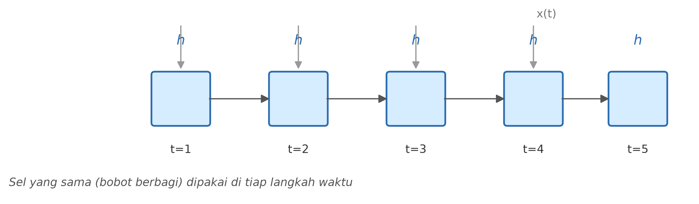

# Bab 7 — Deret Waktu dan Model Sekuensial: RNN, LSTM, GRU

> **Prasyarat:** Bab 2 (regresi, baseline, split waktu), Bab 5 (metrik, walk-forward),
> Bab 6 (data meteorologi, fitur). Bab ini menyiapkan model sekuensial untuk studi kasus
> Bab 8–9.

## Tujuan Pembelajaran

Setelah menyelesaikan bab ini, Anda diharapkan mampu:

1. **Menyusun** deret waktu menjadi contoh-*window* untuk prediksi satu dan beberapa
   langkah ke depan.
2. **Membandingkan** LSTM/GRU dengan *baseline* (persistence, mean, AR) secara jujur.
3. **Menjelaskan** intuisi RNN → LSTM → GRU (pintu ingatan/lupa) beserta keterbatasannya.
4. **Memilih** arsitektur masukan univariate/multivariate dan strategi prediksi
   multi-langkah (recursive/direct/seq2seq).

## 7.1 Mengapa Deret Waktu Istimewa

Bab 2–5 memperlakukan data sebagai deretan contoh yang saling bebas. Data **deret waktu**
berbeda dalam dua hal mendasar:

1. **Urutan bermakna.** Nilai `y(t)` bergantung pada riwayat sebelumnya: `y(t-1)`,
   `y(t-2)`, dst. Membaca bagan hujan hari ini tanpa melihat hari kemarin kehilangan
   informasi penting.
2. **Korelasi temporal.** Data cuaca cenderung mulus dan *autocorrelated*: hari ini mirip
   kemarin. Ini kabar baik untuk model (ada pola), tetapi juga perangkap — *split* acak
   (Bab 2, 5) dan *leakage* harus dihindari ketat.

Sifat khusus lain di meteorologi: deretnya **tidak stasioner** (musim, pola monsun),
menyimpan siklus (pasang surut, siklus harian), dan kadang mengandung *regime* (misal
transisi musim hujan→kering). Model yang baik untuk bab ini harus bisa menangkap
ketiganya — dari data, bukan dari asumsi. Kerangka umum representasi dan pelatihan model
deret waktu dapat dirujuk pada literatur dasar [1].

### Ukur *autokorelasi* dengan mudah

Cara cepat mengenali potensi model sekuensial: hitung **ACF** (autocorrelation function)
melalui `pandas.Series.autocorr(lag)`:

```python
import pandas as pd
for lag in [1, 7, 14, 30]:
    print(lag, sr.autocorr(lag))
```

Nilai tinggi di `lag=1` menandakan *persistence* kuat (bisa jadi pesaing berat LSTM);
nilai tinggi di `lag>1` menunjukkan struktur periodik (siklus) yang bisa dipelajari
model. Hasil ACF inilah yang membantu memilih `w` (window) dan memprediksi seberapa kuat
*baseline* persistence nanti.

## 7.2 Menyusun Deret Waktu Jadi Data *Machine Learning*

Model sekuensial membaca data dalam bentuk **jendela** (*window*): beberapa langkah waktu
masa lalu sebagai masukan, satu (atau beberapa) langkah ke depan sebagai target.

Bayangkan deret harian `y(1), y(2), …, y(N)`. Untuk *window* `w=3` dan *horizon* `h=1`:

**Tabel 7.1** — Contoh windoving deret ke contoh-*window* (w=3, h=1).

| Contoh | Masukan `[t-3, t-2, t-1]` | Target `[t]` |
|---|---|---|
| 1 | `y(1), y(2), y(3)` | `y(4)` |
| 2 | `y(2), y(3), y(4)` | `y(5)` |
| 3 | `y(3), y(4), y(5)` | `y(6)` |

### Contoh numerik windowing

Ambil deret `[10, 12, 14, 13, 11, 9, 10]`, `w=3`, `h=1`. Contoh yang terbentuk:

- `[10, 12, 14] → 13` (pakai 3 hari pertama, target hari ke-4)
- `[12, 14, 13] → 11`
- `[14, 13, 11] → 9`
- `[13, 11, 9] → 10`

Total contoh = `N − w − h + 1 = 7 − 3 − 1 + 1 = 4`. Perhatikan: contoh pertama hanya
berguna setelah 3 hari pertama berlalu — setuju dengan naluri: butuh riwayat untuk
memprediksi.

### Bagaimana overlap antar window memengaruhi keacakan

Window yang "menggeser satu langkah" (seperti contoh di atas) membuat contoh-contoh
berdekatan saling tumpang-tindih dan **sangat mirip** (hampir deterministik). Ini wajar
untuk data cuaca, tetapi berimplikasi: jangan pernah membagi window secara acak —
*standard* memakai *split* berdasarkan waktu (Bab 2/6) agar train tidak "menyimpan"
salinan test.

Konversi ini — *windowing* — identik yang sudah dipakai di Bab 2 (§2.5), hanya kini
masukannya berupa **urutan panjang `w`**, bukan dua fitur terpisah. Bentuk tensor masukan
untuk model sekuensial adalah 3D:

$$ \text{input shape} = (\,\text{batch},\; \text{waktu}\; w,\; \text{fitur}\; f\,) \tag{7.1} $$

Persamaan (7.1): dimensi pertama adalah jumlah sampel per *batch* (otomatis di Keras),
dimensi kedua adalah panjang *window* `w`, dimensi ketiga jumlah fitur `f`. Untuk
univariate `f=1`; untuk multivariate `f>1` (misal hujan + suhu + kelembapan).

**Kode 7.1 — Membuat *window* dari deret dengan TensorFlow.**

```python
import numpy as np
import tensorflow as tf

def buat_window(deret, w=7, h=1):
    X, y = [], []
    for i in range(len(deret) - w - h + 1):
        X.append(deret[i:i+w])
        y.append(deret[i+w:i+w+h])
    return np.array(X), np.array(y)

# contoh: deret suhu harian sintetik
ts = np.sin(np.arange(100) / 5) + np.random.randn(100) * 0.1
X, y = buat_window(ts, w=7, h=1)
print(X.shape, y.shape)   # (93, 7, 1) dan (93, 1)
```

Pilih `w` (berapa hari riwayat) dengan naluri domain + eksperimen: untuk pasang surut,
beberapa siklus (misal `w=72` jam×3 = 216 jam) membantu menangkap periodisitas; untuk
hujan, 7–30 hari lazim menangkap musim pendek.

### Berapa panjang *window* yang baik?

Tidak ada jawaban universal, tetapi tiga pertimbangan membantu:

1. **Siklus alami data** — jika data punya siklus 24 jam, sertakan minimal satu siklus
   (`w` ≥ 24); untuk pasang surut semi-diurnal, `w` setidaknya mencakup satu siklus
   (≈ 24 jam) agar model bisa "melihat" pola naik-turun.
2. **Harga komputasi & data** — `w` besar berarti tensor lebih besar dan jumlah contoh
   (`N − w − h + 1`) lebih sedikit. Untuk stasiun dengan ribuan hari, `w` ratusan jam
   masih wajar.
3. **Eksperimen** — uji `w ∈ {3, 7, 14, 30}` di *walk-forward* dan pilih yang MAE-nya
   terbaik pada validasi, bukan pada *test*.

Contoh: dua opsi window untuk data jam-an pasang surut:

| Nama | `w` (jam) | Makna | Catatan |
|---|---|---|---|
| Pendek | 6 | setengah hari | cepat, tapi tak lihat siklus penuh |
| Standar | 24 | satu siklus penuh | titik awal yang baik |

**Tabel 7.2** — Pilihan panjang window untuk deret jam-an.

### Satu langkah vs beberapa langkah ke depan (*horizon*)

- **Satu langkah (`h=1`)**: target besok. Paling mudah; banyak model unggul di sini.
- **Beberapa langkah (`h>1`)**: target besok+seterusnya, atau *lead time* tertentu (Bab 9
  sering butuh prediksi 1–7 hari). Lebih sulit karena galat menumpuk; §7.6 membahas
  strateginya.

Jangan mencampur: model yang hebat untuk `h=1` belum tentu baik untuk `h=3`. Evaluasi
sesuai *horizon* yang sebenarnya dibutuhkan operasional.

## 7.3 *Baseline* Dulu: Persistence, Mean, dan AR

Sebelum membangun LSTM — ingat aturan Bab 1: **ukuran *baseline* dulu**. Tiga *baseline*
wajib untuk deret waktu meteorologi:

- ***Persistence***: prediksi `y(t+h) = y(t)` (nilai terakhir). Sangat kuat untuk data
  yang mulus/berkorelasi tinggi seperti pasang surut.
- ***Mean/klimatologi***: prediksi rata-rata musiman (mis. rata-rata hujan harian untuk
  bulan yang sama). Mengalahkan *persistence* hanya jika deret tidak berkorelasi kuat.
- ***AR(p)/ARIMA***: regresi terhadap p deret tunda (autoregressive). Menangkap
  *autokorelasi* tanpa arsitektur rumit; sering cukup baik untuk masalah sederhana.
  Pembahasan lengkap *forecasting* klasik ada di literatur analisis deret waktu [2].

**Tabel 7.3** — *Baseline* deret waktu untuk dibandingkan.

| *Baseline* | Ide | Kuat ketika | Lemah ketika |
|---|---|---|---|
| **Persistence** | `ŷ(t+h)=y(t)` | Deret mulus, berkorelasi kuat | Data berisik / musim kuat |
| **Mean/klimatologi** | rata-rata sesua bulan/musim | Musim dominan, korelasi pendek | Variabilitas antar tahun besar |
| **AR(p)** | regresi `p` lag | *Autokorelasi* `p` langkah | Pola non-linear / panjang |

**Kode 7.2 — Menghitung kedua *baseline* pertama.**

```python
# persistence
pred_persist = X_test[-1, :, 0]  # nilai terakhir tiap window (t-1)

# klimatologi sederhana: rata-rata global train
pred_klimat = np.full(len(y_test), float(np.mean(y_train)))
```

Tujuannya bukan agar *baseline* menang — melainkan agar **angka pembanding jujur** ada.
Jika LSTM tidak mengalahkan *persistence* pada pasang surut, sesuatu salah (atau masalah
memang tidak butuh LSTM). Ini juga yang membuat evaluasi Bab 8–9 dapat dipercaya.

## 7.4 RNN: Memahami Jaringan Berulang

**RNN** (recurrent neural network) dirancang untuk data berurutan: pada tiap langkah
waktu, ia mengkombinasikan masukan saat ini `x(t)` dengan **state tersembunyi** dari
langkah sebelumnya `h(t-1)`:

$$ h_t = \tanh(W_x x_t + W_h h_{t-1} + b) \tag{7.2} $$

Persamaan (7.2): `h_t` adalah "ingatan ringkas" sampai langkah `t`; `W` adalah matriks
bobot (dibagikan di semua langkah waktu — parameter sedikit, komputasi efisien). RNN
diperkenalkan oleh Elman (1990) [3].

**Keterbatasan utama RNN: *vanishing gradient* (Bab 4).** Untuk deret panjang (ratusan
langkah), mengalikan gradien berulang membuat informasi awal "terlupakan" — RNN praktis
hanya mengingat beberapa langkah terakhir. Untuk pasang surut dengan siklus 12, 24 jam
atau lebih, ini jadi masalah: model sulit "menyimpan" pola yang jauh di masa lalu.



Gambar 7.1 memperlihatkan sel yang sama "dibuka" (unrolled) sepanjang waktu, membawa
state `h_t`. Semakin panjang deret, semakin rawan *vanishing gradient*.

### Contoh intuisi state tersembunyi

Ambil deret suhu `[30, 31, 30, 29, 28, 27, 26]`. RNN membaca tiap hari dan memutakhirkan
`h_t`:

- `h_1` menangkap "mulai panas" (30);
- `h_2` menangkap "masih panas" (31);
- setelah beberapa hari dingin, `h_7` BISA "lupa" bahwa awalnya panas — itulah kelemahan
  RNN.

LSTM (Bagian 7.5) memperbaiki ini dengan mempertahankan memori jangka panjang dan
memutuskan sendiri kapan melupakan.

## 7.5 LSTM: Memori dengan Pintu (*Gates*)

**LSTM** (long short-term memory) menjawab keterbatasan RNN dengan menambahkan **pintu**
(gates) yang mengatur update memori secara selektif — diperkenalkan oleh Hochreiter &
Schmidhuber (1997) [4]. Intuisi populer: bayangkan "kotak memori" yang bisa diisi,
dipertahankan, atau dikosongkan, dengan tiga pintu:

1. **Pintu lupa** (`f_t`): seberapa banyak memori lama yang *dibuang*.
2. **Pintu masukan** (`i_t`): seberapa banyak informasi baru yang *ditulis* ke memori.
3. **Pintu keluaran** (`o_t`): seberapa banyak memori yang *dipancarkan* ke output.

Tiga pintu inilah yang membuat LSTM mampu mengingat pola jauh (misal siklus pasang surut
yang lalu) sambil melupakan yang tidak relevan — tanpa meledakkan gradien.

$$ f_t = \sigma(W_f x_t + U_f h_{t-1} + b_f) \tag{7.3} $$
$$ i_t = \sigma(W_i x_t + U_i h_{t-1} + b_i) \tag{7.4} $$
$$ o_t = \sigma(W_o x_t + U_o h_{t-1} + b_o) \tag{7.5} $$

Persamaan (7.3)–(7.5): tiap pintu memakai sigmoid (nilai 0–1) sehingga "terbuka atau
tertutup" secara mulus, dan dihubungkan dengan `tanh` untuk penulis memori kandidat.
Anda tidak perlu menghafal rumus — yang penting: **LSTM = RNN + memori berpintu**, dan ini
yang membuatnya bekerja di deret panjang yang deret cuaca punya.

### Analogi pintu dengan proses keputusan peramal

Bayangkan seorang peramal yang memakai catatan lama:

- **Pintu lupa**: "seberapa banyak catatan minggu lalu yang sudah tidak relevan karena
  musim berubah?" → dibuang.
- **Pintu masukan**: "catatan suhu hari ini layak dicatat (misal ada pola hujan baru)?"
  → ditulis ke memori.
- **Pintu keluaran**: "dari memori yang saya pegang, berapa yang saya pakai untuk
  membuat prakiraan hari ini?" → dipancarkan.

LSTM mempelajari kapan membuka/menutup tiap pintu **dari data** selama pelatihan — bukan
diprogram manual. Inilah mengapa ia bisa menyesuaikan diri dengan pola musim yang
berbeda-beda di tiap wilayah.

## 7.6 GRU: Pilihan Ringkas

**GRU** (gated recurrent unit) menyederhanakan LSTM: hanya **dua pintu** (*update* dan
*reset*) dan tanpa "sel memori" terpisah — diperkenalkan oleh Cho et al. (2014) [5].
Hasilnya: parameter lebih sedikit (lebih cepat, lebih hemat memori), performa serupa untuk
banyak masalah.

**Tabel 7.4** — Perbandingan LSTM vs GRU.

| Aspek | LSTM | GRU |
|---|---|---|
| Pintu | 3 (lupa, masukan, keluaran) | 2 (update, reset) |
| Sel memori terpisah | Ya | Tidak |
| Parameter | Lebih banyak | Lebih sedikit |
| Performa umum | Unggul di deret sangat panjang | Sebanding, sering lebih cepat |
| Kapan pilih | Data panjang & butuh memori lama | Trade-off kecepatan & kesederhanaan |

Tidak ada "selalu menang"; di Bab 8–9 kedua-duanya diuji dan dibandingkan dengan
*baseline*. Untuk buku ini, **GRU adalah titik awal yang baik** — sedikit parameter,
cepat dicoba, hasilnya sering cukup.

### Ketika LSTM lebih dipilih

Ada beberapa situasi di mana LSTM sering unggul:

- Deret yang **sangat panjang** (puluhan ribu langkah) dengan ketergantungan yang benar
  jauh ke belakang — sel memori terpisah membuat informasi lebih "awet".
- Tugas yang butuh membedakan dua memori yang kontradiktif dalam satu waktu (misal
  mengingat pola pasang surut dua siklus lalu, sambil melupakan satu siklus tertentu).
- Saat parameter ekstra tidak jadi masalah (GPU cukup).

GRU dipilih ketika kecepatan eksperimen dan kesederhanaan lebih penting, atau data tidak
cukup besar untuk memanfaatkan parameter LSTM. Dalam bab ini keduanya digunakan secara
bergantian; pembaca diajak menguji keduanya di *walk-forward*.

## 7.7 Arsitektur Praktis di Keras

### Univariate LSTM

**Kode 7.3 — Model LSTM univariate untuk prediksi h=1.**

```python
import tensorflow as tf

model = tf.keras.Sequential([
    tf.keras.layers.LSTM(32, return_sequences=False, input_shape=(w, 1)),
    tf.keras.layers.Dense(1),
])
model.compile(optimizer="adam", loss="mse", metrics=["mae"])
```

`input_shape=(w, 1)` menandakan window `w` dan 1 fitur; `return_sequences=False` melepas
hanya output terakhir (untuk prediksi satu langkah).

### Multivariate LSTM

Saat `f > 1` (misal hujan, suhu, kelembapan), ubah jumlah fitur di `input_shape`; target
tetap satu (hujan):

**Kode 7.4 — Model LSTM multivariate (3 fitur, prediksi hujan besok).**

```python
model = tf.keras.Sequential([
    tf.keras.layers.LSTM(32, return_sequences=False, input_shape=(w, X.shape[2])),
    tf.keras.layers.Dense(1),
])
model.compile(optimizer="adam", loss="mse", metrics=["mae"])
```

### Multi-langkah: model per *horizon* (direct) vs rekursif (recursive)

Untuk `h>1`, tiga strategi:

- **Recursive**: gunakan prediksi `ŷ(t+1)` sebagai bagian masukan untuk `ŷ(t+2)`, dst.
  Sederhana, tetapi galat menumpuk.
- **Direct**: latih **satu model per horizon** (`model_h1`, `model_h2`, …). Tiap model
  memprediksi horizon-nya sendiri; mencegah akumulasi galat, tetapi biaya latih lebih
  besar.
- **Seq2seq** (sequence-to-sequence): encoder-decoder — encoder meringkas window, decoder
  menghasilkan seluruh jajaran prediksi. Paling ekspresif; dibahas singkat karena butuh
  arsitektur lebih rumit (Sutskever et al., 2014 [6]).

Untuk Bab 8–9, *direct* (model per lead time) adalah titik awal yang jujur dan mudah
dievaluasi.

### Contoh memilih strategi multi-langkah

Jika target operasional adalah prediksi hujan 1–7 hari ke depan, bandingkan di
*walk-forward*:

| Strategi | Kelebihan | Kekurangan | Kapan dipakai |
|---|---|---|---|
| **Recursive** | 1 model saja | galat menumpuk cepat | lead time pendek (1–3 hari) |
| **Direct** | tiap horizon independen | perlu banyak model | lead time bervariasi & panjang |
| **Seq2seq** | satu model, semua horizon | lebih rumit, data banyak | pola antar horizon kompleks |

**Tabel 7.5** — Perbandingan strategi prediksi multi-langkah.

Untuk pasang surut (periodik, deterministic), *direct* h=1–7 sering memberi hasil
terbaik-ke-biaya terbaik; untuk hujan (berisik), *direct* juga pilihan yang jujur.

## 7.8 Evaluasi dan Membaca Prediksi

Evaluasi mengikuti aturan Bab 5: *walk-forward*, metrik sesuai tujuan, bandingkan dengan
*baseline*. Yang khas bab ini: **memplot *forecast* vs aktual** sepanjang waktu uji.

- **Plot deret penuh** → lihat apakah model mengikuti musim/trend, bukan hanya "mengikuti"
  nilai kemarin (jika prediksi tertinggal 1 langkah dari aktual, model mirip persistence).
- **Plot per horizon** → melihat degradasi seiring lead time (recursive sering menurun
  cepat, direct lebih stabil).
- **Scatter aktual vs prediksi** → selain kurva, titik di dekat garis `y=x` berarti
  akurat; pencilan ke arah ekstrem menunjukkan kelemahan pada kejadian besar.

**Kode 7.5 — Plot forecast vs aktual sederhana.**

```python
import matplotlib.pyplot as plt
plt.figure(figsize=(9, 3))
plt.plot(y_test, label="aktual", lw=1.5)
plt.plot(pred, label="prediksi LSTM", lw=1.2, alpha=0.8)
plt.legend(); plt.tight_layout(); plt.show()
```

### Mengukur interpolasi dan "meniru" *baseline*

Dua angka tambahan membantu menilai seberapa "fantastis" LSTM itu:

- **Perbedaan MAE(LSTM) − MAE(persistence)**: jika negatif dan bermakna, LSTM menang.
  Jika hampir nol atau positif, LSTM tidak memberi nilai lebih.
- **Uji cepat**: bandingkan MAE model dengan MAE *mean/klimatologi* pada periode yang
  sama; model yang kalah dari klimatologi layak dibuang.

Praktik ini mengembalikan kesimpulan "LSTM keren!" menjadi klaim yang terukur.

### Evaluasi multi-horizon dengan skill score

Untuk melaporkan perbaikan relatif terhadap *baseline*, gunakan kesamaan *skill score*:

$$ \text{SS} = 1 - \frac{\text{MAE}_{\text{model}}}{\text{MAE}_{\text{baseline}}} \tag{7.6} $$

Persamaan (7.6): `SS > 0` artinya model lebih baik daripada *baseline*; `SS = 0` setara;
`SS < 0` lebih buruk. Skill score sangat mudah diapresiasi — nilai 0.30 berarti model
menurunkan galat 30% dibanding *baseline*, tanpa perlu membandingkan satuan. Baik
*persistence* maupun *mean/klimatologi* bisa jadi *baseline*, dan keduanya dilaporkan
agar pembaca tahu seberapa besar keunggulan LSTM (atau tidak ada keunggulan sama sekali).

### Membaca pola error untuk memperbaiki data

Dua plot tambahan yang jarang dilaporkan tapi sering menentukan perbaikan:

1. **Error per bulan/musim** — jika model buruk hanya di musim hujan puncak, fitur
   regional (Bab 6) atau transformasi target (log1p) bisa membantu.
2. **Error per jendela peristiwa** — misal error membesar saat transisi musim; coba
   tambah fitur musiman atau indeks iklim.

Analisis error inilah yang membedakan model "jadi" dengan model yang siap produksi — dan
akan sangat dimanfaatkan di Bab 8–9.

## 7.9 Catatan Pelatihan Model Sekuensial

Seluruh contoh di bab ini berjalan di atas TensorFlow [7]. Beberapa hal praktis yang
sering membedakan konvergensi LSTM/GRU:

1. **Normalisasi** (Bab 6) wajib — LSTM sangat sensitif skala.
2. **Mulai window kecil**; naikkan hanya jika perlu (window besar = data lebih sedikit dan
   biaya lebih besar).
3. **Tanpa *shuffle*** saat training model sekuensial — Keras tidak mengacak *window*
   secara acak bila data diurutkan benar; pastikan setiap *batch* tidak mencampur masa
   depan.
4. **Stateful LSTM** (mempertahankan state antar *batch*) jarang diperlukan di buku ini;
   pakai versi biasa.
5. **Regularisasi** (Bab 5): tambah `Dropout`/`recurrent_dropout` bila overfit; kurangi
   bila underfit.
6. **Pertimbangkan GRU dulu** untuk eksperimen pertama — lebih cepat, parameter lebih
   sedikit (Tabel 7.4).

### Menumpuk lapisan LSTM/GRU (stacked)

Jika satu lapisan kurang, tumpuk dua lapisan — lapisan pertama memakai
`return_sequences=True` agar mengembalikan urutan ke lapisan berikutnya:

```python
model = tf.keras.Sequential([
    tf.keras.layers.LSTM(32, return_sequences=True, input_shape=(w, 1)),
    tf.keras.layers.LSTM(16, return_sequences=False),
    tf.keras.layers.Dense(1),
])
```

Aturan jempol: **mulai dengan satu lapisan**, naikkan menjadi dua hanya jika kurva
validasi menunjukkan *underfit*. Menumpuk terlalu cepat membuat model gemuk tanpa manfaat
— overfit mengintai (Bab 5).

### Memprediksi beberapa horizon dengan *direct*: pola kerja Bab 8–9

Karena Bab 8–9 memakai *direct* (model per horizon), berikut pola yang akan diulang:

```python
def latih_per_horizon(X, y_h, h):
    model = tf.keras.Sequential([
        tf.keras.layers.LSTM(16, input_shape=(X.shape[1], X.shape[2])),
        tf.keras.layers.Dense(1),
    ])
    model.compile(optimizer="adam", loss="mse", metrics=["mae"])
    model.fit(X, y_h, epochs=40, batch_size=32, verbose=0)
    return model

models = {}
for h in range(1, 8):
    yh = buat_target_horizon(y, h)      # target untuk lead time h
    X_tr, X_va, yh_tr, yh_va = split_waktu(X, yh)
    models[h] = latih_per_horizon(X_tr, yh_tr.to_numpy(), h)
```

Setiap `models[h]` adalah prediktor untuk *lead time* `h` hari; evaluasi per `h` dengan
MAE/RMSE lalu plot (Bab 7.8). Ini template yang langsung dipakai di Bab 8–9.

### Kapan arsitektur "tidak perlu dinaikkan"?

Jika *baseline* persistence sudah memberi MAE sangat rendah (misal pasang surut), LSTM
mungkin hanya menambah sedikit. Itu bukan kegagalan LSTM — itu keputusan bisnis: biaya
komputasi & pemeliharaan vs perbaikan kecil. Bab 10 membahas keputusan ini di konteks
produksi.

## 7.10 Studi Mini: Bingkai Pasang Surut (Teaser Bab 8)

Untuk melihat bab ini "bekerja", bayangkan dataset tinggi pasang surut jam-an (Bab 8 akan
memakai data nyata). Langkah yang mengikuti seluruh bab ini:

1. **Windowing**: `w=168` jam (1 minggu) atau skala siklus; `h=1`, lalu `h=1..7` untuk
   prakiraan pekanan.
2. **Baseline**: persistence (kuat untuk pasang surut) vs LSTM/GRU.
3. **Model**: mulai GRU 1 lapisan `units=32`, `input_shape=(w,1)`.
4. **Evaluasi**: *walk-forward* per bulan; MAE/RMSE per `h`; plot prediksi vs aktual.
5. **Kesimpulan jujur**: seberapa jauh LSTM mengalahkan persistence — dan apakah
   menutupinya layak untuk kebutuhan ops.

Menjalankan kerangka ini di Bab 8 membuat studi kasus tidak terasa baru — hanya
mengganti data sintetik dengan data nyata Kapuas.

## 7.11 Menghubungkan ke Bab 8–9

Dua keterampilan yang dibawa ke studi kasus berikutnya:

1. **Pipeline yang reusable** — fungsi `buat_window`, model template, evaluasi MAE/RMSE
   per horizon; simpulkan dalam satu modul agar mudah dipakai ulang (Bab 6 mengajarkan
   menyimpan data; bab ini menambahkan *template* model).
2. **Kerangka berpikir baseline-dulu** — setiap klaim "LSTM hebat" harus selalu menyertakan
   angka *persistence* & skill score (Persamaan 7.6). Disiplin inilah yang membuat laporan
   Bab 8–9 bisa dipercaya.

## 7.12 FAQ

**Apakah LSTM selalu lebih baik daripada MLP untuk deret waktu?** Tidak. Untuk data
mulus/berkorelasi pendek, MLP + lag (Bab 2) bisa setara; untuk deret panjang dengan
pola jauh, LSTM/GRU unggul. Ukur keduanya di *walk-forward*.

**Kenapa hasil LSTM kadang "tertinggal"/mirip persistence?** Karena model belajar bahwa
meniru nilai kemarin adalah tebakan paling aman (*bias*). Kurangi dengan fitur yang lebih
informatif (Bab 6), *window* lebih baik, atau model/granularitas yang sesuai.

**Berapa lama latihan LSTM?** Untuk stasiun harian & GRU, beberapa menit di Colab sudah
lumrah; LSTM sedikit lebih lama. Kalau terlalu lambat, kecilkan `units`, `w`, atau pakai
subset data saat eksperimen.

**Bisakah LSTM dipakai untuk data bulanan/jam-an?** Bisa — selama disusun sebagai
*sequence* dengan frekuensi konsisten. Bedanya hanya skala waktu di `w` dan `h`.

**Apakah saya perlu menstandarisasi window?** Ya, lazimnya normalisasi (Bab 6) diterapkan
sebelum windowing agar skala fitur seragam; pastikan μ/σ dihitung pada data latih, lalu
diterapkan pada validasi/*test*.

**Apakah dropout LSTM berbeda dengan MLP?** Keras mendukung `recurrent_dropout` khusus
state berulang. Gunakan yang kecil (0–0.2) untuk *recurrent*; dropout biasa biasa untuk
layer antar output. Jangan berlebihan di LSTM karena bisa menghambat belajar.

**Bisakah saya menambah fitur yang bukan deret waktu (misal indeks bulan)?** Ya — fitur
eksternal ditambahkan sebagai dimensi fitur per langkah waktu (multivariate); atau
diselipkan lewat lapisan setelah LSTM (concatenate). Detail di Bab 8–9.

**Kenapa model memprediksi "rata-rata" saat data berisik?** Karena meminimalkan loss
kuadrat mendorong prediksi menuju median/rata-rata kondisi — perilaku wajar. Untuk
menggerakkan ke ekstrem, gunakan transformasi target (Bab 6) atau metrik sesuai tujuan.

**Apakah perlu `window` yang mengandung target masa depan?** Tidak! Itu *leakage*:
window hanya berisi data sampai `t`, target mulai `t+1`. Pastikan pergeseran benar.

**Kapan berhenti mencoba arsitektur dan fokus ke data?** Sering kali jawabannya di data:
tambah fitur (Bab 6), perbaiki QC, atau ubah *horizon* sesuai kebutuhan. Jika kurva
validasi macet di banyak konfigurasi, kembali ke *baseline* dan data — bukan menambah
tumpukan lapisan.

## 7.13 Latihan

**Soal konsep**

1. Mengapa *window* yang terlalu besar tidak selalu lebih baik?
2. Jelaskan mengapa *baseline* persistence sangat penting pada data pasang surut.
3. Apa perbedaan utama LSTM dan GRU, dan kapan memilih masing-masing?
4. Mengapa *recursive* multi-step menumpuk galat lebih cepat daripada *direct*?

**Latihan praktik (notebook `ch-07-06_lstm_gru.ipynb`)**

5. Bangun dataset *window* dari data Bab 6; bandingkan LSTM vs GRU vs persistence pada
   data uji (MAE).
6. Uji `w` ∈ `{3, 7, 14, 30}`; buat tabel MAE tiap window.
7. Bandingkan univariate vs multivariate (tambah suhu/kelembapan sebagai fitur) — apakah
   fitur tambahan membantu?
8. Terapkan strategi *direct* untuk `h=1..7`; plot MAE per horizon dan bandingkan dengan
   *recursive*.
9. (Proyek mini) Simpan hasil terbaik sebagai "template model Bab 8–9": function
   `build_lstm(w, f, units)` + function evaluasi MAE/RMSE per horizon.

## Ringkasan

- Deret waktu = urutan bermakna + *autokorelasi*; hindari *leakage* (split waktu).
- *Windowing* (w,h) mengubah deret jadi contoh ML; input shape 3D `(batch, waktu, fitur)`.
- Panjang window mengikuti siklus alami & biaya; diuji pada validasi (Tabel 7.1–7.2).
- *Baseline* wajib: persistence, mean/klimatologi, AR(p) — DL harus mengalahkannya
  (Tabel 7.3).
- RNN menangkap urutan tetapi mati *vanishing gradient* di deret panjang (Gambar 7.1).
- LSTM menambahkan tiga pintu memori (lupa/masukan/keluaran) → tahan deret panjang
  (Persamaan 7.3–7.5).
- GRU dua pintu, lebih ringkas, titik awal yang baik; pilih sesuai kebutuhan (Tabel 7.4).
- Horizons: one-step mudah; multi-step pakai direct (per horizon) atau recursive
  (Tabel 7.5).
- Evaluasi: *walk-forward* + metrik tepat + plot forecast vs aktual + bandingkan selisih
  MAE terhadap *baseline*.
- Pelatihan: normalisasi, window kecil dulu, tanpa shuffle, stacked hanya jika underfit.

## References

1. I. Goodfellow, Y. Bengio, and A. Courville, *Deep Learning*. Cambridge, MA, USA:
   MIT Press, 2016.
2. R. J. Hyndman and G. Athanasopoulos, *Forecasting: Principles and Practice*, 3rd ed.
   Melbourne, Australia: OTexts, 2021. [Online]. Available: https://otexts.com/fpp3/
3. J. L. Elman, "Finding structure in time," *Cognitive Science*, vol. 14, no. 2,
   pp. 179–211, 1990, doi: 10.1207/s15516709cog1402_1.
4. S. Hochreiter and J. Schmidhuber, "Long short-term memory," *Neural Computation*,
   vol. 9, no. 8, pp. 1735–1780, 1997, doi: 10.1162/neco.1997.9.8.1735.
5. K. Cho et al., "Learning phrase representations using RNN encoder-decoder for
   statistical machine translation," 2014. [Online]. Available:
   https://arxiv.org/abs/1406.1078
6. I. Sutskever, O. Vinyals, and Q. V. Le, "Sequence to sequence learning with neural
   networks," in *Advances in Neural Information Processing Systems (NeurIPS)*, 2014,
   pp. 3104–3112. [Online]. Available: https://arxiv.org/abs/1409.3215
7. M. Abadi et al., "TensorFlow: Large-scale machine learning on heterogeneous systems,"
   2016. [Online]. Available: https://arxiv.org/abs/1603.04467