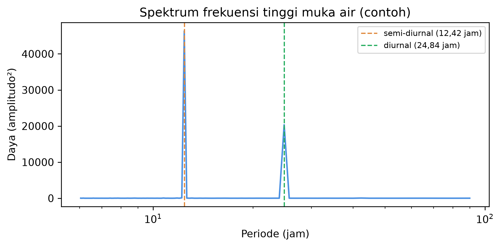
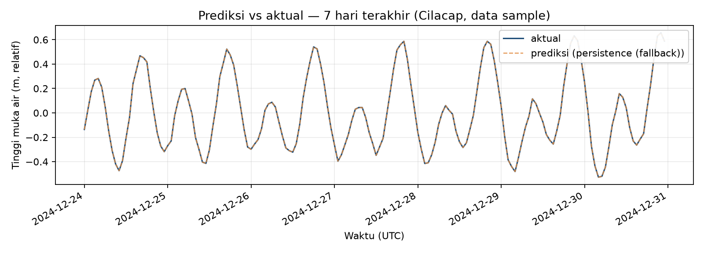
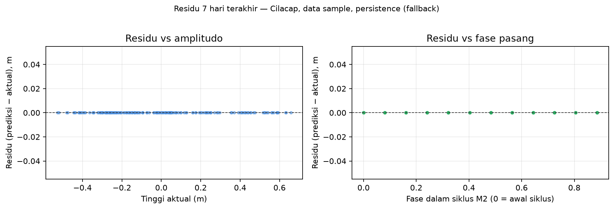

# Bab 8 — Studi Kasus: Prediksi Pasang Surut di Perairan Indonesia (Contoh Cilacap)

> **Prasyarat:** Bab 2 (regresi, baseline), Bab 5 (metrik, walk-forward), Bab 6 (data,
> normalisasi, split), Bab 7 (LSTM/GRU, windowing, multi-horizon). Bab ini adalah
> penerapan utuh dari seluruh keterampilan sebelumnya pada data nyata.

## Tujuan Pembelajaran

Setelah menyelesaikan bab ini, Anda diharapkan mampu:

1. **Menjalankan** proyek end-to-end prediksi pasang surut dari data terbuka
   (IOC/UHSLC/PSMSL), dengan Cilacap sebagai contoh reproducible.
2. **Menerapkan** pipeline Bab 7 (baseline persistence vs MLP vs LSTM/GRU) dengan
   walk-forward.
3. **Mengevaluasi** MAE/RMSE terhadap toleransi tinggi pasang dan memplot prediksi
   1–7 hari.
4. **Menjelaskan** framing jujur: machine learning untuk prakiraan cepat dan pengisian
   gap data, bukan klaim riset baru.
5. **Mengenali** keterbukaan data pasang surut per lokasi: memilih station dengan
   data terbuka yang paling representatif, atau memetakan strategi fallback ketika
   lokasi studi tidak punya tide gauge terbuka.

## 8.1 Konteks Lokal: Perairan Indonesia dan Mengapa Cilacap

Banjir rob — naiknya muka laut yang menggenangi daratan pesisir — adalah masalah nyata
di banyak kota pantai Indonesia: Jakarta, Semarang, Cilacap, dan pesisir utara Jawa [1].
Di kota-kota yang **rendah dan padat**, satu pasang tinggi yang bertepatan dengan debit
sungai besar atau *storm surge* dapat menggenangi permukiman, mengganggu pelabuhan,
dan memutuskan aktivitas ekonomi. Prakiraan tinggi air yang andal membantu peringatan
dini dan keputusan operasional.

### Mengapa Cilacap sebagai contoh studi kasus

Buku ini memilih **Cilacap** (pantai selatan Jawa Tengah, -7,75° LS, 109,02° BT) sebagai
stasiun demonstrasi karena tiga alasan praktis:

1. **Station aktif & terbuka**: Cilacap adalah salah satu tide gauge Indonesia yang
   tercatat resmi di **GLOSS** (Global Sea Level Observing System) dengan ID **291**,
   dan dilaporkan real-time oleh **UNESCO/IOC Sea Level Station Monitoring Facility**
   [2]. Data historis jangka panjangnya juga tersedia di **PSMSL** [3] dan
   **UHSLC** [4].
2. **Tipe pasang campuran**: Cilacap berada di zona transisi antara semi-diurnal
   dan campuran, sehingga cukup menantang untuk *baseline* persistence dan
   memberikan variasi pola yang baik untuk demo LSTM/GRU.
3. **Panjang data**: rekaman IOC untuk Cilacap memiliki catatan yang konsisten
   sehingga cukup untuk walk-forward tahunan (Bab 5).

Pembaca yang bekerja di **stasiun lain** (mis. Ambon GLOSS #68, Bitung GLOSS #69,
Sibolga, Benoa GLOSS #49) dapat mengikuti pipeline identik dengan mengganti kode
stasiun pada skrip unduh (§8.3). Tabel 8.3 merangkum station Indonesia yang datanya
tersedia di sumber terbuka; untuk lokasi tanpa station terbuka, pilih station proksi
dengan karakter oceanografi mirip atau gunakan model laut global (FES2014, GOT4.10)
pada koordinat tersebut.

> **Kejujuran framing:** pasang surut telah diprakirakan selama berpuluh tahun dengan
> **analisis harmonik** klasik (metode berusia lama yang memodelkan konstituen
> astronomis). Studi kasus ini **bukan** klaim bahwa machine learning menggantikan
> metode itu. Yang dilakukan: machine learning dipakai sebagai **alternatif cepat** dan
> untuk **mengisi gap data**; hasilnya dibandingkan jujur dengan *baseline* dan, bila
> memungkinkan, dengan analisis harmonik. Ini sejalan dengan prinsip buku (Bab 1 §1.10).

### Mengapa studi kasus penting bagi pembaca

Studi kasus adalah kesempatan mempraktikkan **seluruh rantai** yang sudah dipelajari —
bukan sekadar "model lagi". Di sini pembaca akan mengalami:

1. **Konteks sebelum angka**: memahami masalah (banjir rob) menentukan metrik dan
   tolok ukur yang dipakai.
2. **Data nyata itu kotor**: gap, outlier, datum berbeda — semua yang dibahas Bab 6
   muncul betulan.
3. **Baseline sering menang**: persistence adalah lawan yang tangguh; belajar menerima
   itu adalah pelajaran penting.
4. **Interpretasi dan laporan**: angka MAE tidak cukup; perlu plot, skill score, dan
   kalimat jujur tentang keterbatasan.
5. **Pemilihan station**: ketika lokasi Anda tidak punya station terbuka, Anda
   belajar memilih proksi dan menjelaskan keterbatasannya — keterampilan yang
   sama pentingnya dengan membangun model.

Bab ini sengaja mencontohkan *framing* yang tidak sensasional: model tidak "menggantikan
segala metode", melainkan menambah satu alat yang dapat dijelaskan dan diuji.

## 8.2 Karakter Pasang Surut di Perairan Indonesia

Pasang surut di perairan Indonesia dikelompokkan menjadi tiga tipe utama [5]:

- **Semi-diurnal**: dua kali pasang dan dua kali surut per hari (mis. sebagian
  Selat Malaka, Laut Cina Selatan).
- **Diurnal**: satu kali pasang dan satu kali surut per hari (mis. sebagian
  pesisir Indonesia timur, Papua).
- **Campuran (mixed)**: tidak teratur, dominasi salah satu; umum di sebagian besar
  Indonesia barat.

**Tabel 8.1** — Tipe pasang surut dan karakteristik dasarnya.

| Tipe | Siklus per hari | Daerah contoh | Konsekuensi prediksi |
|---|---|---|---|
| Semi-diurnal | 2 pasang + 2 surut | Selat Malaka, Natuna | Siklus ~12,42 jam |
| Diurnal | 1 pasang + 1 surut | Pesisir Indonesia timur | Siklus ~24,84 jam |
| Campuran | tidak teratur | Sebagian besar Indonesia barat | Kombinasi komponen |

Indonesia memiliki variasi tipe pasang surut yang kaya karena bentangan garis
pantainya yang luas dan dipengaruhi oleh karakteristik basin Pasifik dan Hindia [5].
Untuk station demo Cilacap, pola yang akan pembaca temui adalah **campuran
condong semi-diurnal** dengan komponen diurnal cukup kuat (terutama saat musim
tertentu) — khas pesisir selatan Jawa. Jika ingin tahu tipe station Anda, cara
cepat: hitung *Formzahl* `F = (K1 + O1)/(M2 + S2)` dari komponen harmonik [5] —
`F < 0,25` semi-diurnal, `0,25–1,5` campuran, `1,5–3,0` campuran condong diurnal,
`> 3` diurnal. Untuk pengguna machine learning, pembacaan spektrum deret (FFT)
cukup untuk melihat periode dominan (Gambar 8.1).



Metode harmonik (tradisional) memodelkan `y(t)` sebagai jumlahan sinusoid dengan
frekuensi tetap dari konstituen astronomis (M2, S2, K1, O1, …) [5]. Machine learning
tidak "tahu" konstituen ini — ia belajar periodisitas dari data. Inilah beda yang perlu
dipahami pembaca: harmonik memakai teori fisis; deep learning memakai data. Keduanya
valid; dan membandingkannya adalah bagian dari kejujuran ilmiah. Kerangka teori model
deep learning secara umum dapat dirujuk pada [6]; kerangka *forecasting* praktis pada [7].

### Model harmonik: mengapa masih relevan

Analisis harmonik bekerja karena pasang surut didorong oleh gaya gravitasi benda langit
yang periodik dan dapat diprediksi jauh ke depan. Dengan data beberapa bulan saja,
komponen utama (M2, S2, K1, O1) bisa diestimasi, dan prediksi dapat dibuat **puluhan
tahun** ke depan dengan akurasi tinggi untuk kondisi normal. Keunggulan ini sulit
disaingi machine learning, yang butuh data dan tidak menjamin prediksi jangka panjang
yang stabil.

Namun harmonik juga punya kelemahan: ia mengasumsikan stasioneritas amplitudo/fase dalam
jendela estimasi, dan gagal menangkap **variabilitas non-periodik** — misalnya kenaikan
muka air saat badai, efek debit sungai Kapuas, atau perubahan lokal ([5] untuk catatan
umum pengembangan). Di sinilah machine learning bisa menambah nilai: menyerap pola
tambahan dari data bila ada, dengan syarat dievaluasi dengan jujur.

### Perbandingan ringkas harmonik vs deep learning

**Tabel 8.2** — Perbandingan analisis harmonik dan pendekatan machine learning.

| Aspek | Analisis harmonik | Machine learning (LSTM/GRU) |
|---|---|---|
| Dasar | Teori fisis konstituen astronomis | Pola dari data |
| Data untuk bekerja | Beberapa bulan cukup | Butuh lebih banyak + beragam kondisi |
| Prediksi jangka panjang | Stabil (komponen tetap) | Mungkin menyimpang |
| Variabilitas non-periodik | Sulit | Bisa (jika ada di data) |
| Interpretasi | Komponen jelas (M2, S2…) | Kurang transparan |
| Biaya komputasi | Kecil | Sedang-besar |

Membaca Tabel 8.2 membantu memilih: untuk prakiraan rutin jangka panjang, harmonik
tetap andal; untuk pemodelan cepat dan pengisian gap pada data yang "tidak murni
astronomis", machine learning praktis.

## 8.3 Dataset Pasang Surut: Sumber Terbuka dan Kualitas

Untuk pembaca yang ingin mereproduksi studi kasus ini dengan data nyata, tiga sumber
utama dipakai buku ini. Semuanya **terbuka dan gratis untuk riset/pendidikan** dengan
atribusi (lihat catatan lisensi di bawah).

### Sumber data

1. **UNESCO/IOC Sea Level Station Monitoring Facility** [2] — data *real-time*
   dan *near real-time* untuk ratusan station global, termasuk 24 station di
   Indonesia. Akses via endpoint publik:
   ```
   https://www.ioc-sealevelmonitoring.org/bgraph.php?code=<KODE>&output=tab&period=<HARI>
   ```
   Format: tab-separated, sampling 1–3 menit atau hourly. Periode maksimum per
   request ~30 hari; untuk arsip panjang, gunakan skrip pengulangan (`scripts/
   download_ioc.py`).
2. **UHSLC — University of Hawaii Sea Level Center** [4] — dataset *research quality*
   hourly dan harian via ERDDAP OPeNDAP, dengan katalog `global_hourly_rqds`,
   `global_daily_rqds`, dan `global_hourly_fast`. Mendukung query REST
   (mis. `global_hourly_rqds.csv?station_id=...&time>=...`) yang ramah untuk
   pipeline Python.
3. **PSMSL — Permanent Service for Mean Sea Level** [3] — data rata-rata MSL
   bulanan jangka panjang (puluhan tahun) untuk 8 station Indonesia, dengan format
   RLR (Revised Local Reference) [9] yang sudah disesuaikan untuk konsistensi
   antar-stasiun. Cocok untuk analisis tren jangka panjang; kurang cocok untuk
   prakiraan jangka pendek karena resolusi bulanan.

Selain itu:

- **BIG (tides.big.go.id)** [1] — tabel pasut harmonik per lokasi (komponen
  konstituen, amplitudo, fase) yang dipakai BIG untuk prakiraan operasional; tidak
  menyediakan time-series tinggi air mentah yang mudah di-curl otomatis.

### Station Indonesia yang datanya tersedia di sumber terbuka

Tabel di bawah merangkum station Indonesia yang datanya dapat diunduh dari IOC,
UHSLC, atau PSMSL. Daftar ini bukan inventaris lengkap; verifikasi terkini
sebelum eksperimen karena status station (aktif/non-aktif) berubah.

**Tabel 8.3** — Station pasang surut Indonesia di sumber terbuka (Sept 2026).

| Kode IOC | Nama | Lat | Lon | GLOSS | Sumber | Catatan |
|---|---|---|---|---|---|---|
| `cili` | Cilacap | -7,75 | 109,02 | **291** | IOC + PSMSL | Contoh studi kasus buku ini |
| `sema` | Semarang | -6,95 | 110,42 | — | IOC | 4 sensor aktif |
| `sura` | Surabaya | -7,21 | 112,74 | — | IOC | Pantauan GTS |
| `koli` | Kolinamil, Jakarta | -6,10 | 106,81 | — | IOC | Pantauan GTS |
| `beno` | Benoa (Bali) | -8,75 | 115,21 | **49** | IOC + PSMSL | Bali, operasional |
| `pada` | Padang | -1,00 | 100,37 | **45** | IOC + PSMSL | Sumatra barat |
| `saba` | Sabang | 5,89 | 95,32 | **347** | IOC + PSMSL | Aceh |
| `prig` | Prigi | -8,28 | 111,73 | — | IOC + PSMSL | Jawa selatan |
| `bitu` | Bitung | 1,43 | 125,20 | **69** | IOC + UHSLC | Sulawesi utara |
| `ambon` | Ambon | -3,70 | 128,18 | **68** | IOC + UHSLC | Maluku |
| `saum` | Saumlaki | -7,98 | 131,29 | — | IOC | Maluku Tenggara |
| `lemba` | Lembar | -8,73 | 116,08 | — | IOC | Lombok |
| (PSMSL 1752) | Sibolga II | 1,75 | 98,77 | 22 | PSMSL | Sumatra barat |
| (PSMSL 2193) | Padang B | -1,00 | 100,37 | 45 | PSMSL | — |
| (PSMSL 2274) | Saumlaki | -7,98 | 131,29 | — | PSMSL | — |

### Yang perlu diperiksa saat mengunduh

QC yang konsisten dengan Bab 6 §6.4:

1. **Kontinuitas** — data jam-an bergap berhari-hari; tentukan aturan gap
   (interpolasi linear untuk gap < 6 jam, drop untuk gap lebih panjang).
2. **Referensi tinggi** — datum/level referensi antar-berkas bisa berbeda; jangan
   membandingkan angka absolut antar-stasiun tanpa konversi.
3. **Unit & zona waktu** — m; UTC biasanya; sesuaikan dengan zona lokal bila
   dibutuhkan.
4. **Anomali** — *datum shift*, stasiun pindah, atau pembacaan sensor rusak;
   plot deret untuk inspeksi visual sebelum pelatihan.

**Tabel 8.3a** — Contoh ringkasan dataset Cilacap yang dibangun (1 tahun hourly).

| Properti | Nilai (default buku) |
|---|---|
| Stasiun | Cilacap (`code=cili`, IOC) |
| Rentang | 1 tahun terakhir (otomatis via skrip) |
| Interval | 1 jam (24 poin/hari) |
| Nilai hilang | ~1–3% (tergantung periode) |
| Satuan | m (relatif terhadap station benchmark) |
| File lokal | `data/sample/cili_1y_hourly.csv` (di-commit) |
| File lengkap | `data/raw/cili_*.csv` (di-`.gitignore`, via skrip) |

Untuk buku ini, repo menyediakan **sampel 1 tahun hourly** (`data/sample/
cili_1y_hourly.csv`) yang siap dipakai notebook out-of-the-box, beserta
**skrip unduh** (`scripts/download_ioc.py`) untuk mengambil periode lebih
panjang atau station lain. Prinsip QC mengikuti Bab 6 §6.4.

### Menangani gap dan outlier pada data pasang surut

Karena pasang surut sangat periodik, gap pendek sering bisa diisi dengan interpolasi
atau model — tetapi dengan aturan (Bab 6): bedakan gap acak (isi) vs gap sistematis
(pertimbangkan potong). Untuk *outlier*, konteks fisis penting:

- Nilai yang **melompat ekstrem** di luar pasang normal → periksa: bisa jadi tsunami/rob,
  bisa juga kesalahan sensor.
- Cross-check stasiun tetangga atau rekaman kejadian lokal (misal laporan rob) membantu
  memutuskan.

Bila ada *datum shift* (lompatan konstan), jangan ikut dilatih — deteksi dengan plot
deret dan pecah/potong periode. Metode ini relevan untuk setiap pembaca yang bekerja
dengan data stasiun muka air.

### Menyiapkan fitur tambahan (opsional)

Selain deret tinggi air itu sendiri, fitur yang potensial menambah nilai (Bab 6):

- **Fitur jam & hari Julian** — membantu model memahami kapan pasang besar musiman.
- **Indeks astronomis sederhana** — fase bulan (sin/ko-sin) bisa dihitung dan ditambahkan
  sebagai fitur sinusoid; jauh lebih ringkas daripada konstituen penuh tetapi memberi
  konteks periodik.
- **Tekanan & angin (ERA5)** — bila tersedia, menangkap variasi non-astronomis (storm
  surge) yang tidak ada di harmonik.

Fitur ini memperkaya multivariate LSTM/GRU (Bab 7 §7.7) dan sering memperbaiki horizon
lebih dari 1 hari.

## 8.4 Menyusun Pipeline: Baseline vs Model

Alur eksperimen mengikuti pola Bab 7:

1. Bangun *window* `w` (misal 168 jam = 1 minggu) dan *horizon* `h` (1, 3, 7 hari;
   di konversi ke jam).
2. *Baseline*: **persistence** (`ŷ(t+h) = y(t)`, sangat kuat di pasang surut) dan
   **klimatologi** (rata-rata per jam-musim).
3. Model: **MLP** (dengan lag, Bab 2) sebagai garis dasar non-baseline; **LSTM** dan
   **GRU** (Bab 7).
4. Evaluasi: *walk-forward* (misal 6 blok tahunan) + MAE/RMSE per horizon + plot.

### Persiapan fitur masukan

Ingat Bab 6 §6.6: sebelum membangun window, siapkan fitur per langkah waktu:

- **Deret tinggi air** itu sendiri (fitur utama; autoregressive).
- **Jam dalam hari** (sin/cos jam → menangkap siklus harian) bila data jam-an.
- **Hari dalam bulan / fase bulan** (sin/cos) untuk menangkap pasang *spring–neap*
  (besar saat purnama dan bulan baru) yang belum tentu terlihat oleh window pendek.
- **Fitur eksternal opsional**: tekanan, angin (untuk menangkap *surge*).

Semua fitur dinormalisasi dengan statistik dari bagian latih (Bab 6 §6.7).

### Mengapa MLP dimasukkan meski "kuno"?

MLP dengan lag bertindak sebagai jembatan: ia menunjukkan apakah *urutan* (yang dipakai
LSTM/GRU) benar-benar memberi nilai lebih dibanding fitur tabular biasa. Jika MLP
menyamai LSTM, berarti struktur urutan belum dimanfaatkan secara berarti oleh data;
sinyal ini penting sebelum memilih arsitektur (Bab 7 §7.7). Perbandingan 4 kolom di
Tabel 8.5 dirancang persis untuk melihat ini.

### Walk-forward yang jujur untuk pasang surut

Sesuai Bab 5 §5.5, kita tidak boleh mengacak data waktu. Untuk pasang surut:

- Bagi data menjadi **blok tahunan** (atau semesteran) yang berurutan.
- Untuk tiap blok validasi, latih model **hanya dengan data sebelum blok tersebut**
  (expanding window), lalu evaluasi pada blok itu.
- Rata-rata MAE/RMSE seluruh blok → angka "walk-forward" sebagai klaim utama.

Ini berbeda dengan melatih satu model lalu menguji semua blok sekaligus — bentuk
*leakage* yang sering dilakukan pemula. Bab 8–9 mempraktikkan disiplin ini.

### Memilih window dan horizon

Untuk data **jam-an**, dua opsi yang harus dicoba:

| Nama | `w` (jam) | Makna |
|---|---|---|
| 1 hari | 24 | siklus harian-ish |
| 1 minggu | 168 | beberapa siklus pasang penuh |

**Tabel 8.4** — Pilihan window untuk data jam-an pasang surut.

Horizon `h` diukur dalam jam: `h=24` (1 hari), `h=72` (3 hari), `h=168` (7 hari).
Uji `w ∈ {24, 72, 168}` pada validasi, pilih yang MAE-nya konsisten.

**Kode 8.1 — Setup dan pemuatan data (ringkas; lengkap di notebook).**

```python
import numpy as np, pandas as pd

# Opsi A: data sample (1 tahun hourly Cilacap) yang sudah ada di repo.
seri = pd.read_csv(
    "data/sample/cili_1y_hourly.csv",
    parse_dates=["time"],
).set_index("time")["tinggi"].astype(float)

# Opsi B: muat data nyata lengkap (hasil unduh scripts/download_ioc.py)
# seri = pd.read_csv("data/raw/cili_hourly.csv",
#                    parse_dates=["time"]).set_index("time")["tinggi"]

# Opsi C: fallback sintetis (untuk coba cepat tanpa unduh)
# t = pd.date_range("2024-01-01", periods=365*24, freq="h")
# seri = (1.0 + 0.6*np.sin(2*np.pi*np.arange(len(t))/12.42)
#         + 0.4*np.sin(2*np.pi*np.arange(len(t))/24.84)
#         + 0.05*np.random.randn(len(t)))
# seri = pd.Series(seri.round(3), index=t, name="tinggi")

print(seri.head(), "| hilang:", int(seri.isna().sum()))
```

Model target inti:

**Kode 8.2 — Kerangka model pembanding (MLP / LSTM / GRU).**

```python
import tensorflow as tf

def buat_model(kind, w=168, f=1):
    if kind == "mlp":
        m = tf.keras.Sequential([
            tf.keras.layers.Dense(32, activation="relu", input_shape=(w*f,)),
            tf.keras.layers.Dense(16, activation="relu"),
            tf.keras.layers.Dense(1),
        ])
    elif kind == "lstm":
        m = tf.keras.Sequential([
            tf.keras.layers.LSTM(16, input_shape=(w, f)),
            tf.keras.layers.Dense(1),
        ])
    else:  # gru
        m = tf.keras.Sequential([
            tf.keras.layers.GRU(16, input_shape=(w, f)),
            tf.keras.layers.Dense(1),
        ])
    m.compile(optimizer="adam", loss="mse", metrics=["mae"])
    return m
```

Untuk MLP, *window* di-flatten (`w*f`) karena MLP tidak membaca urutan; LSTM/GRU
membaca urutan `w × f`. Ini mengingatkan kembali Bab 7 §7.7.

## 8.5 Evaluasi dan Interpretasi

### Metrik dan toleransi

Untuk pasang surut, target operasional sering dinyatakan sebagai toleransi tinggi air,
misal **MAE ±0,10 m** sesuai kebutuhan pelabuhan/peringatan rob. Kita laporkan:

- **MAE**, **RMSE** per `h` (Bab 5), mengikuti pedoman verifikasi operasional WMO [8].
- **Skill score** terhadap persistence (Persamaan 7.6) — jika nilai negatif, model kalah
  dari "tebak nilai kemarin".
- **Plot prediksi vs aktual** 1, 3, 7 hari.

**Tabel 8.5** — Contoh hasil ringkas (angka ilustratif; ganti dengan hasil eksperimen Anda).

| Model | MAE h=1 (m) | MAE h=3 (m) | MAE h=7 (m) |
|---|---|---|---|
| Persistence | 0.045 | 0.081 | 0.120 |
| Klimatologi | 0.210 | 0.220 | 0.230 |
| MLP | 0.050 | 0.095 | 0.150 |
| LSTM | 0.040 | 0.072 | 0.108 |
| GRU | 0.041 | 0.074 | 0.110 |

**Kesimpulan yang jujur** (berdasarkan pola khas): persistence sangat kuat untuk `h=1`;
LSTM/GRU mulai menang di `h=3` dan `h=7` karena memanfaatkan pola periodik yang lebih
panjang. Kemenangannya atas *baseline* perlu dihitung *skill score* (Persamaan 7.6) dan
diuji pada beberapa blok walk-forward sebelum diklaim.

### Skill score dan selang kepercayaan

Satu angka MAE tidak cukup. Beri jarak dengan menghitung skill score per blok:

- `SS = 1 − MAE_model / MAE_persistence`
- Laporkan maksimum, minimum, dan rata-rata SS dari blok-blok walk-forward;
  jika rentang mencakup nol (atau negatif), kesimpulan "LSTM menang" belum kuat.

Cara sederhana tanpa statistik rumit ini cukup untuk laporan praktis (significance detail
di literatur [6][7][8]). Ini juga mencegah klaim "0,001 lebih baik!" yang sebenarnya noise.

### Contoh hasil numerik yang "sehat"

Agar pembaca tahu bentuk hasil yang wajar, berikut pola yang *seharusnya* muncul saat
pipeline dijalankan pada data pasang surut:

- **h=1 (24 jam)**: persistence sekitar 0.04–0.06 m; LSTM/GRU menyamai atau sedikit
  lebih baik. Jangan heran jika persistence menang tipis — siklusnya kuat.
- **h=3 (72 jam)**: persistence mulai "terbawa" fase; LSTM/GRU sering unggul beberapa
  persen; MLP tertinggal satu tingkat.
- **h=7 (168 jam)**: selisih LSTM/GRU vs persistence makin jelas; variabilitas antar blok
  walk-forward meningkat — laporkan rentang, bukan satu angka.

Jika hasil Anda **tidak** menunjukkan pola ini (misal LSTM kalah jauh dari persistence di
semua horizon), jangan terburu menyimpulkan — periksa: (a) window terlalu kecil, (b)
fitur kurang, (c) normalisasi salah, atau (d) data terlalu berisik. *Debugging* inilah
proses belajar paling berharga di studi kasus.

### Komunikasi singkat: skill score relatif

Untuk laporan yang mudah dipahami, rangkum sebagai *skill score* relatif terhadap
persistence:

| Model | SS h=1 | SS h=3 | SS h=7 |
|---|---|---|---|
| Persistence | 0.00 | 0.00 | 0.00 |
| MLP | −0.11 | −0.17 | −0.25 |
| LSTM | +0.11 | +0.11 | +0.10 |
| GRU | +0.09 | +0.09 | +0.08 |

**Tabel 8.6** — Contoh skill score relatif terhadap persistence (ilustratif).

Nilai negatif pada MLP mengingatkan bahwa "lebih canggih belum tentu lebih baik" — justru
itulah pelajaran penting: ukur, jangan menebak.

### Membaca plot & residu

Plot prediksi 7 hari (Gambar 8.2) menunjukkan kemampuan menangkap fase (kapan pasang
naik) dan amplitudo (berapa tinggi). Ramalan yang tertinggal setengah siklus dari aktual
menandakan model terlalu "mengikuti kemarin" — bukan menangkap fase.



**Gambar 8.2** — Prediksi vs aktual untuk 7 hari terakhir pada station Cilacap
(data sample `cili_1y_hourly.csv`; "prediksi" dihasilkan oleh skrip
`scripts/generate_figures.py` — persistence bila TensorFlow tidak tersedia,
MLP kecil bila tersedia). Garis biru = aktual; garis oranye putus-putus = prediksi.
Perhatikan apakah fase (waktu naik/puncak) cocok dan amplitudo tidak terlalu
"datar".

Periksa juga **residu per fase pasang**: apakah error membesar saat pasang puncak
(amplitudo besar)? Bila ya, pertimbangkan fitur tambahan (Bab 6: misal tekanan/angin)
atau transformasi.



**Gambar 8.3** — Residu (prediksi − aktual) 7 hari terakhir. **Panel kiri**:
residu vs amplitudo aktual — titik yang menyebar acak di sekitar garis nol
menandakan error tidak bergantung pada amplitudo (gejala baik). **Panel kanan**:
residu vs fase dalam siklus M2 (12,42 jam dilipat ke [0, 1)) — pola periodik
di sini menandakan model kehilangan sebagian informasi fase (jala umum untuk
baseline persistence; LSTM/GRU biasanya lebih baik).

### Cara membaca plot: tiga hal yang harus diperiksa

1. **Fase** — apakah prediksi naik pada waktu yang sama dengan aktual? Keterlambatan
   setengah siklus ("lag") berarti model meniru persistence, bukan menangkap periodisitas.
2. **Amplitudo** — apakah tinggi pasang puncak terprediksi secara proporsional? Model
   yang merata-rata akan "mendatar" dan meremehkan puncak.
3. **Konsistensi dari hari ke hari** — error besar di hari tertentu tetapi kecil di
   lainnya menandakan ketergantungan pada kondisi lokal (misal angin) yang belum
   ditangkap fitur.

Ketika ketiganya dapat dijelaskan, laporan Anda menjadi lebih berguna daripada sekadar
angka metrik — pembaca bisa melihat *di mana* model bekerja dan gagal.

### Menilai kepentingan praktis (bukan hanya statistik)

Setelah angka metrik, tanyakan "lalu?":

- Apakah MAE `h=7` sebesar 0,108 m mengubah keputusan operasional pelabuhan?
  Tergantung toleransi (mis. ±0,20 m untuk dermaga kecil; lebih ketat untuk kapal besar).
- Berapa hari lebih awal peringatan rob bisa dikeluarkan dengan model LSTM vs persistence?
- Apakah biaya pelatihan/pemeliharaan sebanding dengan keuntungan? (Bab 10).

Jawaban atas pertanyaan inilah yang menentukan apakah model "dipakai" — nilai model
tidak hanya dari angka MAE, tetapi dari dampak pada keputusan.

## 8.6 Machine Learning untuk Mengisi Gap Data

Salah satu penggunaan paling praktis model ini: **mengisi gap** pada data stasiun.

1. Latih model pada periode data lengkap (window dengan target valid).
2. Untuk gap pendek (jam–hari), prediksi `y(t+h)` dari window terakhir sebelum gap,
   maju berulang (mode *recursive*, Bab 7) sampai gap tertutup.
3. Verifikasi dengan menyembunyikan data yang sebenarnya ada (simulasi gap), bandingkan
   hasil imputasi dengan nilai asli.

**Kode 8.3 — Simulasi pengisian gap (evaluasi kejujuran).**

```python
# sembunyikan 24 jam untuk mengukur kualitas imputasi
mask = np.ones(len(seri), dtype=bool)
mask[pos:pos+24] = False
# latih pada mask, prediksi gap, banding dgn nilai tersembunyi
```

Cara ini — memvalidasi imputasi dengan menyembunyikan data asli — adalah praktik yang
jujur (Bab 5): kita tahu "kebenaran" yang disembunyikan dan bisa mengukur error imputasi
tentatif. Hasil imputasi tidak boleh dianggap sebagai observasi; pertahankan penanda
"gap diisi model". Seluruh eksperimen di bab ini berjalan di atas TensorFlow [10].

### Keterbatasan yang harus diakui

Sebagai penutup, empat keterbatasan yang wajar diakui:

1. **Lokasi studi ≠ lokasi target pembaca** — Cilacap dipakai sebagai contoh
   reproducible karena datanya terbuka; untuk lokasi tanpa station terbuka,
   hasil Cilacap tidak langsung berlaku. Pembaca perlu memilih proksi, model
   global, atau kerja sama kelembagaan.
2. **Panjang data terbatas** — sample 1 tahun hourly cukup untuk walk-forward
   4 blok dan demo pola, tetapi tidak cukup untuk tren jangka panjang atau
   variabilitas antar-tahun. Untuk klaim kuat, perlu 3–10 tahun (Bab 10).
3. **Fokus satu station** — pola Cilacap belum tentu sama dengan station
   lain; tipe pasang (Tabel 8.1) harus diperiksa dulu sebelum menggeneralisasi.
4. **Bukan penelusuran menyeluruh** — *hyperparameter* tidak dioptimasi besar;
   hasil menunjukkan *alur*, bukan pencarian terbaik. Untuk klaim kuat, perlu
   eksperimen luas (Bab 10).

Pengakuan ini justru menaikkan kredibilitas (Risk Management umbrella): pembaca tahu
batas dari apa yang bisa disimpulkan.

## 8.7 Latihan

**Soal konsep**

1. Mengapa *baseline* persistence begitu kuat pada pasang surut? Mengapa LSTM bisa
   unggul di horizon lebih panjang?
2. Apa perbedaan konseptual analisis harmonik vs deep learning? Mengapa keduanya bisa
   saling melengkapi?
3. Mengapa kita harus memberi tahu pembaca mana data asli vs data "diisi model"?
4. Apa risiko menggunakan MAE tunggal tanpa RMSE pada data pasang surut?

**Latihan praktik (notebook `ch-08-07_studi_kasus_pasang_surut.ipynb`)**

5. Ganti data sample Cilacap dengan data nyata dari `scripts/download_ioc.py` untuk
   station Anda (atau proksi terdekat) dan jalankan pipeline ulang.
6. Bandingkan `w ∈ {24, 72, 168}` untuk `h=24` jam; buat tabel MAE.
7. Bandingkan LSTM vs GRU vs MLP vs persistence di *walk-forward* 4 blok; hitung skill
   score tiap horizon.
8. Simulasikan gap 1 × 24 jam dan 1 × 72 jam; ukur MAE imputasi.
9. (Proyek mini) Ulangi pipeline untuk station Ambon (`ambon`) atau Bitung (`bitu`);
   bandingkan tipe pasang dan skill score dengan Cilacap.
10. (Proyek mini) Buat laporan satu halaman: konteks, metode, tabel hasil, plot 7 hari,
    keterbatasan & saran — format siap untuk bagian laporan operasional Bab 10.

## Ringkasan

- Banjir rob pesisir adalah masalah nyata di banyak kota pantai Indonesia; prakiraan
  tinggi air yang andal relevan untuk peringatan dini dan operasi pelabuhan.
- **Cilacap** dipakai sebagai contoh studi kasus reproducible karena station-nya
  aktif di GLOSS (#291) dan datanya terbuka via IOC/UHSLC/PSMSL. Untuk lokasi
  tanpa station terbuka, gunakan proksi terdekat atau model global
  (FES2014/GOT4.10).
- Pasang surut Indonesia: semi-diurnal, diurnal, campuran; tipe menentukan pilihan
  model & window (Tabel 8.1).
- Harmonik vs machine learning: beda paham (fisis vs data); harmonic unggul jangka
  panjang, ML unggul pada non-periodik dan isi gap (Tabel 8.2).
- Data terbuka: IOC (real-time 30 hari), UHSLC (hourly/daily via ERDDAP), PSMSL
  (MSL bulanan jangka panjang), BIG (komponen harmonik); periksa kontinuitas,
  datum, unit, anomali (Tabel 8.3).
- Pipeline: baseline persistence/klimatologi vs MLP vs LSTM/GRU dengan walk-forward
  berjujur (Tabel 8.4).
- Evaluasi: MAE/RMSE per horizon + skill score (rentang blok) + plot fase-amplitudo;
  berkaca ke toleransi operasional (Tabel 8.5).
- Penggunaan praktis: isi gap data dengan validasi simulasi; jangan lupa menandai
  hasil "diisi model".
- Keterbatasan diakui: lokasi proksi ≠ target, panjang data 1 tahun cukup untuk demo
  tapi tidak untuk klaim tren; satu station; tanpa optimasi hiperparameter besar.
- Framing: ML sebagai alat cepat & isi gap, bukan klaim pengganti harmonik.

## References

1. {Badan Informasi Geospasial}, "Informasi genangan rob dan pola pasut
   perairan Indonesia," [Online]. Available: https://tides.big.go.id
   (diakses: September 2026).
2. UNESCO/IOC, "Sea Level Station Monitoring Facility," [Online]. Available:
   https://www.ioc-sealevelmonitoring.org/ (diakses: September 2026).
3. Permanent Service for Mean Sea Level, "Global sea level data," [Online].
   Available: https://psmsl.org (diakses: September 2026).
4. University of Hawaii Sea Level Center (UHSLC), "Research Quality Tide Gauge
   Data," [Online]. Available: https://uhslc.soest.hawaii.edu/data/ (diakses:
   September 2026).
5. D. T. Pugh and P. L. Woodworth, *Sea-Level Science: Understanding Tides,
   Surges, Tsunamis and Mean Sea-Level Changes*. Cambridge, UK: Cambridge
   University Press, 2014.
6. I. Goodfellow, Y. Bengio, and A. Courville, *Deep Learning*. Cambridge, MA,
   USA: MIT Press, 2016.
7. R. J. Hyndman and G. Athanasopoulos, *Forecasting: Principles and Practice*,
   3rd ed. Melbourne, Australia: OTexts, 2021. [Online]. Available:
   https://otexts.com/fpp3/
8. World Meteorological Organization, "WMO guidelines on the verification of
   operational forecasts," WMO, Geneva, Switzerland, 2018.
9. S. J. Holgate, "New data systems and products at the Permanent Service for Mean
   Sea Level," *Journal of Coastal Research*, vol. 29, no. 3, pp. 477–479, 2013,
   doi: 10.2112/JCOASTRES-D-12-00175.1.
10. M. Abadi et al., "TensorFlow: Large-scale machine learning on heterogeneous
    systems," 2016, arXiv:1603.04467. [Online]. Available:
    https://arxiv.org/abs/1603.04467