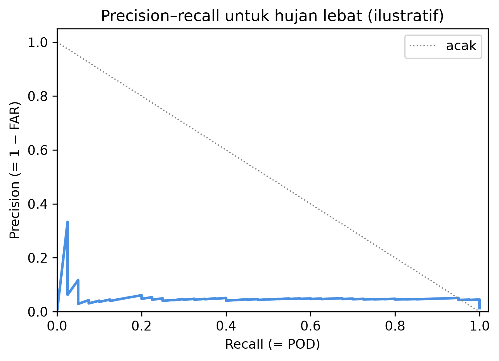
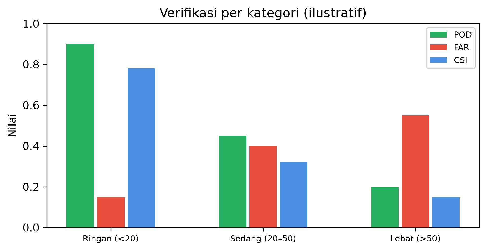

# Bab 9 — Studi Kasus: Prediksi Curah Hujan Stasiun BMKG

> **Prasyarat:** Bab 2–7 (regresi, klasifikasi, evaluasi, data, LSTM/GRU) dan Bab 8
> (alur studi kasus end-to-end). Bab 9 menggabungkan dua lintasan — regresi dan
> klasifikasi — pada satu target operasional.

## Tujuan Pembelajaran

Setelah menyelesaikan bab ini, Anda diharapkan mampu:

1. **Membangun** prediktor hujan stasiun BMKG (regresi jumlah hujan + klasifikasi
   intensitas) dengan fitur observasi, ERA5, dan indeks iklim.
2. **Menerapkan** verifikasi operasional dengan CSI/POD/FAR dan trade-off threshold.
3. **Membandingkan** *walk-forward* vs baseline (persistence, klimatologi, ARIMA singkat).
4. **Melakukan** interpretasi awal (SHAP) dan menyusun tabel verifikasi per kategori
   intensitas.

## 9.1 Konteks Pelayanan dan Kejujuran Framing

Prediksi curah hujan adalah **layanan inti** BMKG: dari peringatan dini hujan lebat,
banjir, hingga informasi untuk pertanian, transportasi, dan kebencanaan [1]. Karena
dampaknya langsung menyentuh masyarakat, **kehati-hatian** dan **kejujuran** dalam klaim
menjadi keharusan — bukan sekadar etika, tetapi juga pelindung kredibilitas institusi.

Tiga hal yang harus ditegaskan sejak awal (sejalan dengan Risk Management umbrella):

1. **Materi pengenalan, bukan hasil riset resmi.** Studi kasus ini adalah latihan
   end-to-end yang dapat diulang pembaca, bukan klaim sebagai sistem operasional terbaru
   BMKG.
2. **Hujan sulit diprediksi.** Nilai harian bersifat berisik dan banyak nol; ekspektasi
   harus realistis. Skill score (Bab 7 Persamaan 7.6) terhadap *baseline* adalah cara
   jujur untuk melaporkan.
3. **Data yang dipakai harus disebutkan.** Sumber stasiun, rentang, lisensi, dan versi
   dicatat (Bab 6 §6.9) agar hasil dapat diperiksa klas.

Seperti Bab 8, framing "alat bantu yang dapat dijelaskan" lebih tepat daripada
"menggantikan peramal". Nilai utama studi kasus: menunjukkan alur dan metrik yang benar,
bukan meyakinkan bahwa deep learning selalu unggul.

## 9.2 Data: Stasiun BMKG + Fitur Regional

Untuk model hujan, strategi data (Bab 6) berbentuk:

- **Target**: curah hujan harian stasiun BMKG [1] (misal salah satu stasiun di wilayah
  barat dan timur Indonesia untuk perbandingan pola).
- **Fitur stasiun**: hujan kemarin (lag), suhu, kelembapan, angin (bila tersedia).
- **Fitur regional (ERA5)** [2][3]: suhu, angin, kelembapan, `total precipitation` pada
  grid terdekat — memberi konteks atmosfer yang tidak tercatat stasiun.
- **Indeks iklim**: ENSO (Nino3.4/MEI) dan MJO (RMM1, RMM2) [4][5] — berpengaruh pada
  hujan Indonesia.

**Tabel 9.1** — Ringkasan fitur yang dibangun untuk satu stasiun.

| Kelompok | Contoh fitur | Sumber |
|---|---|---|
| Deret tunda | `hujan_t1`, `hujan_t2`, `hujan_t3`, `hujan_t7` | Stasiun BMKG |
| Observasi lokal | suhu, kelembapan (lag 0–1) | Stasiun BMKG / ERA5 |
| Regional grid | `era5_tp`, `era5_u10`, `era5_v10`, `era5_t2m` | ERA5 [2][3] |
| Musiman | `mus_sin`, `mus_cos` | dihitung |
| Indeks iklim | `rmm1`, `rmm2`, `nino34` | NOAA/BMKG [4][5] |

Semua fitur dinormalisasi dengan statistik dari bagian latih saja (Bab 6 §6.7); target
regresi di-transform `log1p` bila dipakai (Bab 6 §6.7).

### Data multi-stasiun: barat vs timur Indonesia

Pola hujan Indonesia sangat bergantung pada geografi: wilayah barat (Sumatera,
Kalimantan, Jawa) dipengaruhi kuat oleh monsun Asia-Australia dan MJO; wilayah timur
(Papua, Maluku, Nusa Tenggara Timur) lebih dipengaruhi oleh monsun Australia dan
variabilitas ENSO [4]. Untuk studi kasus yang lebih lengkap, bandingkan **dua stasiun
berbeda pola**:

- **Stasiun barat** (misal Kalimantan atau Sumatera): hujan sepanjang tahun dengan
  puncak musiman; variabilitas hari-ke-hari tinggi.
- **Stasiun timur** (misal Papua): musim kering lebih tegas saat monsun Australia;
  dampak El Niño jauh terasa [5].

Dengan dua stasiun ini, pembaca bisa melihat bahwa:

1. Fitur yang relevan berbeda antar wilayah (MJO penting di barat; Nino3.4 lebih
   menonjol di timur).
2. Model yang sama tidak otomatis transfer antar wilayah — perlu dilatih ulang.
3. Evaluasi harus dilakukan per stasiun; rata-rata antar stasiun bisa menyembunyikan
   kegagalan lokal.

Notebook menyediakan dua rangkaian data contoh (sintetik dengan pola berbeda) dan
meminta Anda mengganti dengan data nyata stasiun pilihan.

### Frekuensi dan resolusi data

Data harian stasiun BMKG umumnya tersedia sebagai **kumulatif 24 jam** (misal 07.00–07.00
WIB) — pastikan Anda konsisten dengan definisi "hari" pada target dan fitur. Bila data
jam-an tersedia, Anda bisa agregasi ke harian (sum/resample) atau justru membangun
prediksi sub-harian (di luar lingkup buku ini). Konsistensi definisi waktu mencegah
*leakage* halus: jangan mencampur jam-an dan harian tanpa transformasi yang jelas.

## 9.3 Dua Lintasan: Regresi dan Klasifikasi

Bab 2–3 mengajarkan keduanya; di sini kita terapkan pada masalah yang sama, karena
kebutuhan operasionalnya keduanya ada.

- **Lintasan regresi**: prediksi **jumlah mm** hujan besok. Metrik: MAE, RMSE (Bab 5);
  transformasi `log1p` membantu (Bab 6).
- **Lintasan klasifikasi**: prediksi **kategori intensitas** hujan harian. Mengikuti
  ambang umum intensitas BMKG [1]:

**Tabel 9.2** — Kategori intensitas hujan harian (mm/24 jam) yang dipakai.

| Kategori | Rentang (mm) | Label |
|---|---|---|
| Ringan | < 20 | 0 |
| Sedang | 20 – 50 | 1 |
| Lebat | > 50 | 2 |

Untuk klasifikasi biner "hujan lebat vs tidak" (untuk peringatan dini), gunakan ambang
`> 50` sebagai kelas positif; evaluasi dengan metrik fenomena langka (Bab 5): **CSI,
POD, FAR** dan trade-off threshold (Bab 3).

**Model yang dipakai:** GRU multivariate (Bab 7) sebagai pilihan utama; MLP + lag sebagai
pembanding; LSTM bila perlu. Seluruh model dilatih dengan *window* `w` (misal 7–30 hari)
tanpa *shuffle*.

### Mengapa dua lintasan, bukan satu?

Regresi dan klasifikasi menjawab pertanyaan operasional yang berbeda:

- **Regresi** menjawab "berapa mm?" — berguna untuk pengelola lahan, drainase, studi
  hidrologi.
- **Klasifikasi** menjawab "hujan lebat atau tidak?" — berguna untuk peringatan dini
  dan keselamatan.

Mereka juga **berperilaku berbeda**: regresi sering "mendatar" pada nilai tengah (keras
memprediksi angka besar), sedangkan klasifikasi memberi kebebasan threshold
(POD/FAR tunable). Mengerjakan keduanya sekaligus menunjukkan bahwa satu masalah
operasional bisa dipotong menjadi beberapa masalah machine learning yang berbeda —
keterampilan perancangan yang penting (Bab 1 §1.8 melatih ini).

### Menangani data tak seimbang pada klasifikasi hujan lebat

Hujan lebat (>50 mm) hanya terjadi beberapa hari dalam setahun di sebagian besar stasiun.
Strategi yang dipakai (Bab 3 §3.6):

1. Metrik yang tepat (CSI/POD/FAR, bukan akurasi).
2. `class_weight` pada training (Kode 3.3) — penalti lebih besar untuk kesalahan pada
   kelas lebat.
3. Threshold digeser saat inferensi (Bab 9.4) — tuning "sisi keputusan" tanpa melatih
   ulang.

Catatan: `class_weight` mengubah distribusi yang "dilihat" model, jadi angka POD/FAR
harus dievaluasi dengan data asli (tidak seimbang) — jangan mengevaluasi pada data yang
sudah di-resample.

## 9.4 Verifikasi Operasional: CSI/POD/FAR dan Threshold

Inilah bagian yang membedakan bab ini dengan tutorial ML umum. Setelah probabilitas
(dari sigmoid/softmax) didapat, kita tidak otomatis memakai threshold 0,5 — kita
**menggesernya** sesuai prioritas operasional (Bab 3 §3.7).

**Kode 9.1 — Verifikasi CSI/POD/FAR di banyak threshold.**

```python
def verifikasi(y_true, prob, thresholds):
    baris = []
    for t in thresholds:
        y_pred = (prob >= t).astype(int)
        tp = int(((y_pred==1) & (y_true==1)).sum())
        fp = int(((y_pred==1) & (y_true==0)).sum())
        fn = int(((y_pred==0) & (y_true==1)).sum())
        pod = tp/(tp+fn) if (tp+fn) else 0
        far = fp/(tp+fp) if (tp+fp) else 1
        csi = tp/(tp+fp+fn) if (tp+fp+fn) else 0
        baris.append((t, pod, far, csi))
    return baris
```

### Memilih threshold secara sistematis

Ada beberapa cara memiliki titik kerja yang bisa dijelaskan:

1. **Cost matrix** — tetapkan *harga* miss vs false alarm (misal 5:1 untuk peringatan
   dini), lalu pilih threshold yang meminimalkan total biaya pada *validasi*.
2. **Target keberhasilan** — misal "POD ≥ 0,7 dengan FAR ≤ 0,5"; pilih threshold
   terkecil yang memenuhi keduanya.
3. **Jawab pertanyaan pemangku** — tanyakan "lebih buruk mana: peringatan keliru atau
   kejadian terlewat?" dan biarkan jawaban menentukan titik kerja.

Ketiga pendekatan lebih baik daripada "ambil CSI maksimal" karena mengikutsertakan
konteks operasional — bukan hanya statistik. Laporkan threshold yang dipilih dan alasan
pemilihannya di laporan.

### Kurva precision-recall untuk hujan lebat

Untuk data sangat tidak seimbang, ROC/AUC bisa "manis" namun menyesatkan (Bab 3 §3.9).
Pilih **precision-recall curve**:

- Sumbu x: recall (= POD); sumbu y: precision (= 1 − FAR).
- Model ideal: kurva mendekati pojok kanan-atas (recall tinggi, precision tinggi).
- Luas di bawah (AUPRC) lebih informatif daripada AUC untuk kelas langka.



Visualisasi pada Gambar 9.1 (dibuat di notebook) melengkapi Tabel 9.3 dan menjadi
argument visual mengapa threshold tertentu dipilih.

Persamaan yang dipakai (dari Tabel 5.3 Bab 5, pedoman WMO [6]):

$$ \text{POD} = \frac{TP}{TP+FN}, \quad \text{FAR} = \frac{FP}{TP+FP}, \quad \text{CSI} = \frac{TP}{TP+FP+FN} \tag{9.1} $$

Persamaan (9.1) memberi tiga sudut pandang yang saling melengkapi. Contoh membaca hasil:

**Tabel 9.3** — Contoh verifikasi threshold untuk menjelaskan trade-off (ilustratif).

| Threshold | POD | FAR | CSI |
|---|---|---|---|
| 0,2 | 0.82 | 0.55 | 0.40 |
| 0,5 | 0.58 | 0.34 | 0.43 |
| 0,8 | 0.31 | 0.20 | 0.27 |

Membaca Tabel 9.3: threshold rendah (0,2) menangkap banyak kejadian (POD 0,82) tetapi
banyak alarm palsu (FAR 0,55); threshold tinggi (0,8) sebaliknya. **Titik terbaik
bukanlah "yang CSI tertinggi" semata** — melainkan yang paling sesuai konsekuensi:
untuk peringatan dini, POD tinggi (dengan FAR wajar) sering dipilih; untuk kebijakan
evakuasi yang mahal, FAR rendah lebih penting.

## 9.5 Baseline, Walk-Forward, dan Arsitektur

### Baseline yang diuji

- ***Persistence***: hujan besok = hujan hari ini. Lemah untuk hujan (banyak nol,
  berisik) — kalah dari klimatologi pada banyak musim.
- ***Klimatologi***: rata-rata hujan untuk kalender yang sama. Baseline yang *kuat*
  untuk hujan harian.
- ***ARIMA singkat***: autoregressive `p,q` kecil; memberi patokan linier [7].

Pilihan ini mengingatkan Bab 7: deep learning harus **mengalahkan baseline yang paling
kuat** (sering klimatologi untuk hujan), bukan sekadar "bekerja".

### Membangun baseline klimatologi yang benar

Klimatologi "cerdas" untuk hujan tidak cukup dengan rata-rata global; gunakan rata-rata
**per kalender** (misal rata-rata hujan tanggal 5 Januari selama semua tahun latih, atau
rata-rata per bulan). Dengan begitu baseline sudah menangkap musim. Contoh perhitungan
sederhana:

```python
# rata-rata harian per his hari (1..365) dari data latih, lalu ulangi ke test
klim = df_train.groupby(df_train.index.dayofyear)["r_hujan"].mean()
baseline = klim.reindex(df_test.index.dayofyear).values
```

Jika model GRU Anda **tidak mengalahkan** climatology-smart ini pada metrik utama,
perbaiki fitur atau ganti pendekatan — jangan dibiarkan dan "dilaporkan sebagai selesai".

### Walk-forward

Seperti Bab 8: bagi beberapa tahun menjadi blok tahunan; untuk tiap blok latih hanya
data sebelumnya, evaluasi pada blok itu; laporkan rata-rata + rentang. Hujan punya
variabilitas antar tahun besar (El Niño/La Niña), jadi rentang antar blok harus
dilaporkan — satu angka rata-rata bisa menyesatkan.

### Menyusun "kalender eksperimen"

Untuk menghindari hasil yang membingungkan, susun eksperimen secara teratur, misalnya
tabel berikut:

| Eksperimen | Fitur | Model | Baseline terbaik | Catatan |
|---|---|---|---|---|
| E1 | lag saja | GRU | klimatologi | dasar |
| E2 | + musiman | GRU | — | lihat dampak musiman |
| E3 | + ENSO/MJO | GRU | — | lihat dampak indeks iklim |
| E4 | E3 + MLP | MLP | — | pembanding non-sekuensial |

**Tabel 9.4** — Rancangan eksperimen (template yang dipakai di notebook).

Disiplin "satu perubahan per eksperimen" (Bab 5 §5.6) menjaga agar Anda tahu persis
apa yang menyebabkan perbedaan POD/CSI, bukan hanya "model jadi lebih baik".

### Arsitektur jaringan

Mengikuti Bab 7–8: GRU multivariate `w` hari dengan fitur per langkah waktu
(`(batch, w, f)`); lapisan `Dense` terakhir; `loss=mse` (regresi) atau
`binary_crossentropy`/`sparse_categorical_crossentropy` (klasifikasi). Untuk klasifikasi
hujan lebat yang jarang terjadi, tambah `class_weight` (Bab 3 §3.5) agar model tidak
meniru mayoritas.

## 9.6 Interpretasi Awal: Mengapa Model Bilang Begitu?

Deep learning "kotak hitam" menjadi masalah untuk kepercayaan operasional. Interpretasi
**global** (fitur apa yang paling berpengaruh) dan **lokal** (mengapa satu prediksi
tertentu) dibahas penuh di Bab 10; di sini kita mulai dengan **permutation importance**
dan **SHAP** sederhana pada model yang sudah dilatih.

**Kode 9.2 — Permutation importance sederhana.**

```python
def permutation_importance(model, X, y, n_repeat=10, metric=mae):
    base = metric(y, model.predict(X, verbose=0).ravel())
    imp = {}
    for j in range(X.shape[1]):
        scores = []
        for _ in range(n_repeat):
            Xp = X.copy()
            np.random.shuffle(Xp[:, j])
            scores.append(metric(y, model.predict(Xp, verbose=0).ravel()))
        imp[j] = float(np.mean(scores) - base)
    return imp
```

Prinsip: jika mengacak satu fitur membuat error naik banyak, fitur itu penting.
Kewaspadaan: untuk fitur yang saling berkorelasi, permutation importance bisa
menyesatkan (mengacak satu membuat yang lain "kehilangan konteks"). Bab 10 memakai
SHAP untuk penjelasan yang lebih stabil dan disertai kewaspadaan penggunaannya.

Hasil yang "masuk akal" untuk hujan Indonesia biasanya:

- `hujan_t1`, `hujan_t2` penting (persistensi kondisi basah).
- Fitur musiman (`mus_sin/cos`) tinggi (pola monsun).
- `rmm1`, `rmm2` membantu di beberapa stasiun (osilasi 30–60 hari).

Jika satu fitur yang secara fisis seharusnya penting ternyata tidak muncul, bisa jadi
data/fitur kurang bersih — bahan perbaikan (Bab 6).

### Kewaspadaan interpretasi

Interpretasi global bersifat **deskriptif, bukan kausal**: fitur "penting" tidak berarti
"penyebab". Contoh: `hujan_t1` penting bukan karena hari hujan *menyebabkan* hari hujan
berikutnya, melainkan karena ia *berkorelasi kuat* dengan kondisi basah yang berlanjut.
Demikian pula untuk ENSO/MJO: pentingnya menunjukkan asosiasi, bukan mekanisme.

Selain itu, model yang dilatih dengan fitur berkorelasi (misal `suhu` dan `mus_sin`)
bisa membagi "kredit" di antara keduanya secara acak; jangan menafsirkan pentingnya
satu-per-satu sebagai pengaruh terisolasi. Untuk klaim kausal, perlakukan dengan sangat
hati-hati (Bab 10 membahas etika & batas interpretasi).

Melakukan interpretasi ini sejak tahap kajian (bukan setelah produksi) membantu menemukan
masalah data lebih awal. Bab 10 memperluas ke interpretasi lokal per prediksi dan
penggunaannya untuk menilai kepercayaan praktisi.

## 9.7 Tabel Verifikasi per Kategori

Bagian laporan yang paling berguna untuk praktisi: **contingency table** dirangkum menjadi
tabel ringkas.

**Kode 9.3 — Tabel ringkas verifikasi per kategori intensitas.**

```python
import pandas as pd

def tabel_kategori(y_true, y_pred):
    return pd.crosstab(pd.Series(y_true, name="aktual"),
                       pd.Series(y_pred, name="prediksi"))
```

Laporkan untuk masing-masing kategori (0, 1, 2) nilai CSI/POD/FAR secara terpisah —
perilaku model pada hujan lebat (langka) sering jauh lebih buruk daripada pada hari
kering, dan ini penting diketahui pengguna (Bab 5). Contoh kerja penuh (termasuk
threshold, probabilitas, dan crosstab) tersedia di notebook `ch-09-08_studi_kasus_curah_hujan_bmkg.ipynb`.

**Tabel 9.5** — Contoh ringkas verifikasi per kategori (ilustratif).

| Kategori | POD | FAR | CSI | Catatan |
|---|---|---|---|---|
| Ringan (< 20) | 0.90 | 0.15 | 0.78 | baik, kelas mayoritas |
| Sedang (20–50) | 0.45 | 0.40 | 0.32 | perlu perbaikan |
| Lebat (> 50) | 0.20 | 0.55 | 0.15 | sulit, kelas langka |



Tabel 9.5 dan Gambar 9.2 menyingkap hal menarik: model "bagus" pada hari kering (POD
tinggi, FAR rendah) justru paling lemah pada kejadian yang paling penting (lebat). Ini
hasil yang layak dilaporkan apa adanya, bukan disembunyikan. Seluruh eksperimen bab ini
berjalan di atas TensorFlow [8].

### Apa yang harus dilaporkan (dan apa yang tidak)

Laporan studi kasus yang jujur biasanya berisi:

1. **Konteks & data** — stasiun, rentang, sumber, lisensi, jumlah contoh.
2. **Metode** — fitur, window, arsitektur, baseline, skema walk-forward.
3. **Hasil** — MAE/RMSE (regresi), CSI/POD/FAR per threshold & kategori, plus rentang
   antar blok.
4. **Threshold yang dipilih & alasannya** — konteks operasional.
5. **Interpretasi** — fitur penting (dengan kewaspadaan), error per musim.
6. **Keterbatasan** — data contoh vs nyata, satu/dua stasiun, tanpa optimasi menyeluruh.

Yang **tidak** perlu dilaporkan: klaim "akurasi 99%" tanpa metrik langka, angka tanpa
baseline, atau kesimpulan kausal dari korelasi. Format ini langsung dipakai kembali di
Bab 10 untuk keputusan produksi.

## 9.8 Latihan

**Soal konsep**

1. Mengapa klimatologi sering menjadi *baseline* yang menantang untuk hujan harian?
   Bagaimana cara menaikkannya?
2. Jelaskan trade-off POD–FAR: untuk mana Anda memilih threshold rendah pada konteks
   peringatan dini, dan untuk mana threshold tinggi pada konteks evakuasi mahal?
3. Mengapa metrik per kategori (Tabel 9.5) lebih informatif daripada satu akurasi global?
4. Apa risiko menafsirkan permutation importance pada fitur berkorelasi?
5. Kapan Anda lebih memercayai klimatologi daripada model GRU yang CSI-nya sedikit
   lebih tinggi?

### Jawaban singkat yang diharapkan (untuk soal konsep)

1. Hujan harian didominasi banyak nol & variabel musim; klimatologi "cerdas" (per
   kalender) sudah menangkap musim — patokan yang sulit dikalahkan model yang hanya
   menebak persisten.
2. Peringatan dini → threshold rendah (POD tinggi, toleransi false alarm); evakuasi
   mahal → threshold tinggi (FAR rendah), meski banyak kejadian terlewat.
3. Hari kering mendominasi; akurasi global hampir 100% tanpa gagal menangkap lebat yang
   justru penting — metrik per kategori mengungkap distribusi kinerja.
4. Fitur berkorelasi membagi "kredit" di antara mereka; mengacak satu mengurangi konteks
   yang lain → angka menyesatkan.
5. Tidak langsung; cek rentang antar blok walk-forward & konteks operasional sebelum
   memutuskan — model harus mengalahkan baseline secara konsisten, bukan sekali.

**Latihan praktik (notebook `ch-09-08_studi_kasus_curah_hujan_bmkg.ipynb`)**

5. Gunakan data contoh harian satu stasiun; bangun fitur (Tabel 9.1). 
6. Regresi: latih GRU dengan transformasi `log1p`; hitung MAE/RMSE; bandingkan dengan
   persistence & klimatologi pada *walk-forward* 3 blok.
7. Klasifikasi biner lebat vs tidak: evaluasi threshold 0,2/0,5/0,8 (Tabel 9.3); tetapkan
   threshold berdasarkan skenario (peringatan dini vs evakuasi) dan jelaskan.
8. Klasifikasi multi-kelas intensitas: buat crosstab (Kode 9.3) dan hitung CSI/POD/FAR
   per kategori (Tabel 9.5).
9. Tambahkan indeks MJO/ENSO; bandingkan CSI lebat dengan dan tanpa fitur tersebut.
10. (Proyek mini) Susun laporan satu halaman seperti Bab 8: konteks, data, metode,
    tabel hasil, threshold terpilih, interpretasi & keterbatasan.

## Ringkasan

- Prediksi hujan = layanan inti BMKG; kejujuran framing & metrik wajib.
- Data: stasiun BMKG (target + lag), ERA5 (regional), ENSO/MJO (indeks iklim); pola
  barat vs timur Indonesia berbeda dan perlu dilatih ulang per stasiun.
- Dua lintasan: regresi (mm, `log1p`, MAE/RMSE) dan klasifikasi (kategori, CSI/POD/FAR);
  menangani imbalance dengan class_weight & threshold.
- Threshold bukan 0,5 tetap — atur sesuai biaya kesalahan; gunakan precision-recall
  untuk data langka (Tabel 9.3).
- Baseline kuat: klimatologi "cerdas" per kalender (juga persistence & ARIMA);
  deep learning harus mengalahkannya secara konsisten (Tabel 9.4).
- Walk-forward multi-blok; laporkan rentang, bukan hanya rata-rata.
- Interpretasi dimulai dari permutation importance (deskriptif, bukan kausal; SHAP di
  Bab 10).
- Laporkan verifikasi per kategori — kejadian langka paling penting & paling sulit
  (Tabel 9.5), lengkap dengan keterbatasan.

## References

1. Badan Meteorologi, Klimatologi, dan Geofisika (BMKG), "Data online: data stasiun
   dan layanan informasi cuaca," [Online]. Available: https://dataonline.bmkg.go.id
   (Accessed: Sep. 2026).
2. Copernicus Climate Change Service (C3S), "ERA5: fifth generation ECMWF atmospheric
   reanalysis of the global climate," Copernicus Climate Data Store, [Online].
   Available: https://cds.climate.copernicus.eu (Accessed: Sep. 2026).
3. H. Hersbach et al., "The ERA5 global reanalysis," *Quarterly Journal of the Royal
   Meteorological Society*, vol. 146, no. 730, pp. 1999–2049, 2020, doi: 10.1002/qj.3803.
4. M. C. Wheeler and H. H. Hendon, "An all-season real-time multivariate MJO index:
   development of an index for monitoring and prediction," *Monthly Weather Review*,
   vol. 132, no. 8, pp. 1917–1932, 2004,
   doi: 10.1175/1520-0493(2004)132<1917:AARMMI>2.0.CO;2.
5. K. Wolter and M. S. Timlin, "Monitoring ENSO in COADS with a seasonally adjusted
   principal component index," in *Proc. 17th Climate Diagnostics Workshop*, 1993,
   pp. 52–57.
6. World Meteorological Organization, "WMO guidelines on the verification of operational
   forecasts," WMO, Geneva, Switzerland, 2018.
7. R. J. Hyndman and G. Athanasopoulos, *Forecasting: Principles and Practice*, 3rd ed.
   Melbourne, Australia: OTexts, 2021. [Online]. Available: https://otexts.com/fpp3/
8. M. Abadi et al., "TensorFlow: Large-scale machine learning on heterogeneous systems,"
   2016. [Online]. Available: https://arxiv.org/abs/1603.04467