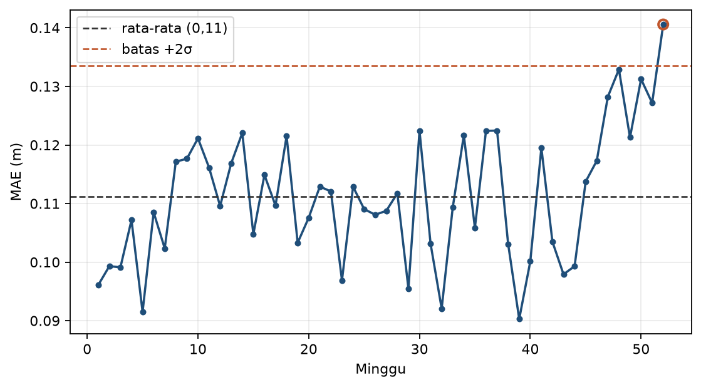

# Bab 10 - Dari Riset ke Praktik: Operasional, Interpretasi, dan Arah ke Depan

> **Prasyarat:** seluruh Bab 1-9. Bab ini adalah penutup: bagaimana model yang sudah
> terbukti bermanfaat di studi kasus dijalankan secara bertanggung jawab dan ke mana
> pembaca bisa melanjutkan belajar.

> **Catatan:** Materi bab ini adalah **materi pengenalan**, bukan hasil riset baru. Seluruh isi
> merupakan ringkasan ulang literatur *machine learning*, dengan contoh-contoh yang dekat dengan
> dunia meteorologi Indonesia.

## Tujuan Pembelajaran

Setelah menyelesaikan bab ini, Anda diharapkan mampu:

1. **Merancang** monitoring *drift* dan strategi retraining/kalibrasi untuk model
   operasional.
2. **Mengkuantifikasi** ketidakpastian prediksi (interval/quantile, ensembel multi-seed).
3. **Menginterpretasi** model (SHAP) dan mengaitkannya dengan pengetahuan atmosfer.
4. **Menjelaskan** keterbatasan dan etika penggunaan deep learning di institusi
   (anti-overhype, disclaimer).
5. **Menyusun** peta jalan belajar lanjut (CNN, nowcasting, downscaling, generative).

## 10.1 Dari Notebook ke Operasional: Jembatan yang Sering Dilupakan

Membangun model yang akurat di notebook adalah bagian kecil dari pekerjaan. Bagian yang
sulit - dan sering luput - adalah **menjaganya tetap berguna** setelah dipakai. Model
operasional hidup dalam lingkungan yang berubah: cuaca tidak stasioner, sensor berubah,
tata cara institusi berubah. Model yang "hebat" tahun lalu bisa salah tahun ini tanpa
ada yang menyadarinya.

Tiga pertanyaan yang harus dijawab sebelum sebuah model disebut "produksi":

1. **Bagaimana model dipanggil?** - REST API, batch harian, notebook terjadwal?
2. **Bagaimana model dipantau?** - pesan ketika metrik menurun?
3. **Siapa yang bertanggung jawab?** - ada penanggung jawab & prosedur saat model gagal?

### Contoh "praktik produksi paling sederhana" untuk buku ini

Anda tidak perlu membangun Kubernetes untuk mengikuti bab ini. Contoh paling sederhana
yang sudah memenuhi kebutuhan institusi kecil:

- **Skrip batch** - satu script dijalankan tiap hari (mis. `cron` atau *scheduled
  notebook*) yang memuat data terbaru, menjalankan model, menulis tabel prediksi.
- **Laporan** - output CSV/Excel di email atau folder bersama.
- **Log** - simpan setiap run (tanggal, input hash, metrik) agar bisa diaudit.

Kerangka ini menjaga prinsip: **model yang berguna adalah model yang dipakai** - dan
dipakai secara terkontrol, bukan hanya sekali di eksperimen.

Buku ini tidak membahas infrastruktur secara mendalam (itu wilayah Bab engineering
khusus), tetapi kerangka kerja di bawah ini memberi jalan yang jelas ke arah sana.
Kerangka umum model deep learning dibahas di literatur dasar [1]; untuk siklus hidup
model operasional dan *technical debt* sistem ML, lihat [2].

## 10.2 Monitoring *Drift*

Atmosfer **tidak stasioner**: distribusi cuaca bergeser seiring musim, tahunan, dan
dekade (perubahan iklim). Karena itu model yang dilatih pada 2010-2020 bisa "usang" pada
2025. Kerangka peramalan dan evaluasi berkala mengikuti prinsip pada literatur
*forecasting* [3] dan pedoman verifikasi WMO [4]. Dua bentuk *drift* yang perlu
diketahui:

- ***Data drift*** - distribusi *masukan* `X` berubah (misal stasiun pindah lokasi,
  kalibrasi sensor berubah, atau pola musim bulanan bergeser).
- ***Concept drift*** - hubungan `X → y` berubah (misal indeks MJO→hujan melemah karena
  perubahan iklim regional; atau relasi suhu-hujan bergeser).

**Cara mendeteksi secara praktis:**

1. **Pantau metrik operasional** - untuk model *regresi* pakai metrik kontinu
   (MAE/RMSE); untuk model *klasifikasi* pakai metrik kategorikal (CSI/POD/FAR). Hitung
   secara *periodik* (mingguan/bulanan) terhadap data terbaru yang sudah diverifikasi.
   Jika metrik menurun melebihi ambang, picu peringatan.
2. **Bandingkan distribusi fitur** - misal histogram `X` bulan ini vs rata-rata
   historis; pergeseran besar menandakan *data drift*.
3. **Grafik kendali sederhana** - gunakan rata-rata bergerak + batas 2σ untuk melacak
   metrik; titik di luar batas = sinyal. Untuk data meteorologi yang autokorelasi dan
   musiman, batas 2σ bisa memicu banyak *false alarm*; metode yang lebih tangguh
   (EWMA/CUSUM, dekomposisi musiman) layak dipertimbangkan setelah tahap awal ini.



**Gambar 10.1**: Grafik kendali metrik operasional: MAE mingguan dengan batas kendali, titik keluar menandakan drift.

### Batas kendali: menetapkan ambang yang masuk akal

Ambang ±2σ pada grafik kendali (Gambar 10.1) hanyalah titik awal. Sesuaikan dengan:

- **Volatilitas alami metrik** - pada hujan, MAE/CSI berfluktuasi antar musim; ambang
  yang terlalu ketat akan sering "berbunyi" tanpa masalah nyata.
- **Biaya kesalahan** - bila false alarm monitoring mahal (mis. menghentikan model
  padahal masih baik), lebih longgarkan; bila risiko nyata, percepat.
- **Periode evaluasi** - mingguan vs bulanan memberikan sensitivitas berbeda; pilih
  sesuai seberapa cepat Anda bisa bereaksi.

Aturan penting: **tetapkan ambang sebelum melihat data berjalan** (bukan setelah).
Ini semacam *pra-registrasi* ambang: menetapkan ambang setelah melihat hasil berarti
menyemai *selection bias* / *overfitting* pada noise monitoring (ingat prinsip evaluasi
jujur di Bab 5) - justru akan melewatkan degradation yang seharusnya terdeteksi.

### Contoh penerapan monitoring pada kasus Bab 9

Bayangkan model hujan stasiun (Bab 9) dipakai secara operasional untuk peringatan dini.
Monitoring praktisnya:

- **Setiap 1 bulan**: hitung CSI/POD/FAR terhadap data yang sudah dikonfirmasi selama
  bulan itu; simpan ke tabel.
- **Setiap bulan**: bandingkan distribusi (histogram) fitur `X` bulan ini vs
  rata-rata historis (mis. `rmm1`, `mus_sin/cos`).
- **Tiap kuartal**: tinjau kurva kendali; bila >1 titik keluar batas, selidiki dan
  nilai apakah perlu kalibrasi/retrain.

Memiliki jadwal dan penanggung jawab sedini mungkin - sebelum model "mulai produksi" -
menghindari kejadian model diam-diam rusak (Bab 10.1 membahas "siapa yang menjawab?").
Contoh produksi paling sederhana di sub-bab ini adalah titik awal minimal: institusi
dengan kebutuhan lebih besar dapat menambah orkestrasi, versi, dan pengujian berjenjang
seiring kebutuhan.


## 10.3 Retraining dan Kalibrasi Ulang

Ketika *drift* terdeteksi, pilihan tindakan (dari yang paling ringan):

1. **Kalibrasi ulang output** - sesuaikan threshold (Bab 9) tanpa melatih ulang;
   cepat dan murah.
2. **Retraining berkala terjadwal** - misal tahunan/musiman; jadwalkan, jangan menunggu
   darurat.
3. **Retraining berbasis sinyal** - pemicu saat metrik turun (Bab 10.2); lebih responsif
   tetapi perlu disiplin evaluasi.
4. **Migrasi model baru** - jika data/fitur berubah besar, kembangkan model baru dengan
   proses studi kasus kembali.

### Aturan retraining yang jujur

- **Jangan mencampur data lama & baru sembarangan** - retraining harus menaikkan metrik
  pada *walk-forward* yang benar, bukan hanya pada training.
- **Simpan versi model** - riwayat rilis dan *baseline* lama (Bab 8-9) untuk
  perbandingan & rollback.
- **Catat muatan latih** - tanggal data, preprocessing, seed, versi (Bab 6 §6.9).

Retraining bukan perbaikan otomatis: ia menjalankan kembali seluruh disiplin evaluasi
buku ini pada data yang lebih baru.

### Contoh alur keputusan retraining

Model **regresi** (mis. tinggi muka air, Bab 8):

| Sinyal terdeteksi | Investigasi | Tindakan |
|---|---|---|
| MAE naik 10% dalam 1 bulan | cek distribusi X, cek data baru | kalibrasi output (interval/kuantil) dulu |
| Fitur `rmm1` bergeser jauh | bandingkan dokumentasi | jadwalkan retrain + cek baseline |
| Metrik turun drastis (>20%) | periksa data & sensor | model baru dengan studi kasus kembali |

Model **klasifikasi** (mis. hujan/level bahaya, Bab 9):

| Sinyal terdeteksi | Investigasi | Tindakan |
|---|---|---|
| CSI turun 10% dalam 1 bulan | cek distribusi X, cek label baru | kalibrasi *threshold* (Bab 9) dulu |
| Distribusi kelas bergeser | bandingkan dokumentasi | jadwalkan retrain + cek baseline |
| POD/FAR berubah drastis | periksa data & sensor | model baru dengan studi kasus kembali |

**Tabel 10.2**: Alur keputusan sederhana saat drift terdeteksi (dipisah untuk model
regresi vs klasifikasi).

Tabel 10.2 menekankan: **investigasi sebelum bertindak**. Tidak semua kenaikan metrik
adalah masalah model; bisa jadi masalah data baru atau definisi yang berubah.

## 10.4 Ketidakpastian Prediksi

Prediksi tunggal (satu angka MAE, satu angka mm) menyesatkan: operasional butuh tahu
**seberapa yakin**. Beberapa pendekatan yang masuk akal untuk buku ini, termasuk gagasan
ketidakpastian Bayesian pada jaringan saraf [5]:

### Ensembel multi-seed

Latih model yang sama dengan beberapa `seed` berbeda; prediksi = rata-rata, sebaran (σ)
antar anggota sebagai indikator kestabilan. Sederhana dan langsung:

**Kode 10.1 - Ensembel multi-seed.**

```python
import numpy as np, tensorflow as tf

preds = []
for seed in [1, 2, 3]:
    tf.random.set_seed(seed)
    m = build_model()          # model yang sama
    m.fit(Xtrain, ytrain, verbose=0)
    preds.append(m.predict(Xtest, verbose=0).ravel())

bayangan = np.stack(preds)                 # (3, n_test)
p_mean = bayangan.mean(axis=0)
p_std = bayangan.std(axis=0)
print("Prediksi rata-rata:", p_mean[:5])
print("Sebaran antar-run (±1σ):", p_std[:5])
```

> **Apa yang diukur σ ini?** Sebaran antar-*seed* terutama menangkap **variasi
> inisialisasi/optimisasi**, bukan ketidakpastian prediktif penuh (aleatorik + epistemik).
> Karena semua anggota berbagi data, arsitektur, dan hyperparameter yang sama, ukuran ini
> bisa **mengecilkan** ketidakpastian sebenarnya. Perlakuan yang lebih bermakna (opsional,
> di luar cakupan buku ini) mencakup MC-dropout, *deep ensembles* dengan variasi
> arsitektur/hyperparameter, regresi kuantil (Kode 10.2), dan *conformal prediction*.

Manfaat tambahan: ensembel juga **menstabilkan angka metrik** - MAE/CSI dari rata-rata
ensembel sering lebih rendah variansnya daripada satu run acak. Ini menjadikan ensembel
alat ganda: lebih "tenang" dalam laporan dan memberi ukuran kestabilan. Biayanya linear
dengan jumlah anggota - untuk 3-5 seed masih sangat wajar di Colab.

### Interval kuantil

Lapisan akhir memprediksi beberapa kuantil sekaligus, misal median (50%) serta kuantil
10% dan 90% - dengan *pinball loss* / quantile regression. Hasilnya: interval `[q10, q90]`
yang memberi rentang "kisaran 80%" prediksi. Ini jauh lebih informatif daripada satu
angka.

**Kode 10.2 - Latih model regresi kuantil sederhana (3 kuantil dengan satu *loss*).**

```python
import tensorflow as tf

quantiles = [0.10, 0.50, 0.90]

def loss_kuantil(qs):
    def _loss(y_true, y_pred):
        y_true = tf.reshape(y_true, (-1, 1))     # (batch, 1)
        err = y_true - y_pred                    # (batch, n_kuantil)
        qs_t = tf.constant(qs, dtype=tf.float32)         # (n_kuantil,)
        return tf.reduce_mean(tf.maximum(qs_t * err, (qs_t - 1) * err))
    return _loss

m = tf.keras.Sequential([
    tf.keras.layers.Dense(32, activation="relu", input_shape=(X_train.shape[1],)),
    tf.keras.layers.Dense(len(quantiles))])               # 3 unit: q10, q50, q90
# satu output layer dengan satu custom loss untuk semua kuantil
m.compile(optimizer="adam", loss=loss_kuantil(quantiles))
m.fit(X_train, y_train, epochs=50, verbose=0)

preds = m.predict(X_test, verbose=0)                      # (n_test, 3): q10, q50, q90
q10, q50, q90 = preds[:, 0], preds[:, 1], preds[:, 2]
```

Perhatikan: karena semua kuantil keluar dari satu *output layer* (`Dense(3)`), cukup satu
*loss* kustom yang menerima `y_pred` berbentuk `(batch, n_kuantil)` dan menghitung
*pinball loss* per kuantil - bukan daftar beberapa *loss* yang hanya berlaku untuk model
dengan beberapa *output layer* terpisah. Baris `tf.reshape(y_true, (-1, 1))` membuat
*loss* kebal terhadap bentuk `y_train`: baik `(n,)` maupun `(n, 1)`.

Catatan penting: ketidakpastian dari model **belum tentu kalibrasi** - interval 80%
bisa benar hanya 50% dari waktu bila model terlalu yakin. Kalibrasi (misal *conformal
prediction*) adalah topik lanjut yang layak dikejar setelah buku ini (lihat FAQ §10.9).

### Kapan melaporkan ketidakpastian?

Tidak semua output harus selengkap itu; atur sesuai dampak:

- **Peringatan dini / keputusan risiko** → sangat dianjurkan menyertakan interval & ensembel.
- **Informasi rutin** → satu angka + toleransi sudah cukup.
- **Publikasi/replikasi** → minimal ensembel multi-seed agar ada ukuran kestabilan.

Kapan pun ketidakpastian dimaknai sebagai "kisaran", nyatakan juga **konteks kalibrasi**
atau akui bahwa itu merupakan sebaran antar-seed (bukan jaminan statistika penuh).

## 10.5 Interpretasi Lanjut dengan SHAP

Bab 9 mulai dengan *permutation importance*. Bab ini melengkapinya dengan **SHAP**
(SHapley Additive exPlanations, [6]) yang memberi:

- **Importance global** - kontribusi rata-rata tiap fitur terhadap prediksi (memberi
  gambaran lebih kaya daripada permutation importance; tetapi pada fitur yang
  berkorelasi kuat, pembagian kredit SHAP juga bisa menyesatkan - bandingkan dengan
  permutation importance dan pengetahuan fisis).
- **Interpretasi lokal** - mengapa *satu* prediksi tertentu bernilai X (misal "hari ini
  diprediksi lebat").

**Kode 10.3 - SHAP pada model Keras (ringkas).**

```python
import shap

explainer = shap.Explainer(m.predict, X_train_sample)
nilai_shap = explainer(X_test_sample)
shap.plots.beeswarm(nilai_shap)
```

Interpretasi SHAP harus selalu ditautkan ke **pengetahuan atmosfer**:

- Fitur yang "penting" tapi secara fisis tidak masuk akal → perlu investigasi: cek
  kebocoran data, fitur proksi, atau interaksi non-linear yang tak terduga (belum tentu
  berarti data "rusak").
- Fitur yang fisis masuk akal dan penting → menaikkan kepercayaan praktisi
  (misal `hujan_t1`, `rmm1` untuk hujan barat).
- Interpretasi lokal membantu menjawab "kenapa peringatan dikeluarkan hari ini?" -
  pertanyaan yang hampir selalu diajukan di ruang operasional.

### Contoh interpretasi lokal sederhana

Misal untuk satu prediksi "hujan lebat" hari ini, SHAP menunjukkan kontribusi terbesar
dari `hujan_t2` (kemarin hujan besar) dan `rmm1` (fase MJO basah). Jawaban yang bisa
disampaikan ke pemangku: "model ini menilai kondisi basah yang berlanjut dan osilasi
musiman sebagai pendorong - silakan periksa juga prakiraan model dinamik BMKG untuk
konfirmasi." Ini mengubah "kotak hitam" menjadi bahan diskusi yang transparan - persis
tujuan interpretasi.

### Kewaspadaan terhadap kausalitas

SHAP menjelaskan **kontribusi dalam model**, bukan penyebab di dunia nyata (ingat
peringatan di Bab 9). Korelasi kuat, bukan sebab-akibat. Untuk klaim kausal, perlakukan
sangat hati-hati (misal dijelaskan terbatas pada "berasosiasi dengan" bukan "menyebabkan").

## 10.6 Keterbatasan dan Etika

Ini penutup penting dan selaras dengan *Risk Management* umbrella. Tiga area:

### 1. Anti-overhype

- Jangan mengklaim "menggantikan peramal BMKG"; klaim yang benar: "memberi probabilitas
  terkalibrasi tambahan (untuk model klasifikasi) atau skor/interval yang diverifikasi
  dengan metrik tertentu".
- Sertakan *baseline* & metrik jujur (skill score, CSI) serta keterbatasan (Bab 8-9).
- Hindari kata "akurasi 99%" tanpa konteks fenomena langka.

### 2. Tanggung jawab & keamanan

- Model tidak berhak mengambil keputusan akhir untuk keselamatan publik; ia alat bantu.
- Pastikan ada manusia yang lalu memverifikasi & bertanggung jawab atas keputusan.
- Data pribadi/lokasi sensitif: patuhi aturan institusi & perundang-undangan.

### 3. Bias data

- Data historis bisa mencerminkan bias (misal stasiun yang terlalu sedikit di wilayah
  timur membuat model kurang mewakili). Akui dalam laporan dan jangan gegabah
  menggeneralisasi ke seluruh Indonesia.

Contoh nyata: model hujan yang dilatih hanya pada stasiun Jawa mungkin "berhasil" di
sana tetapi miskin transfer ke Papua - bukan karena model buruk, tetapi karena
representasi data tidak seimbang. **Jangka waktu & wilayah cakupan harus dinyatakan**
sebagai bagian dari laporan - ini termasuk *bias data*, bukan sekadar catatan kecil.

### 4. Komunikasi kepada publik

Ketika hasil dipublikasikan (artikel, media sosial), aturan praktis:

- Gunakan kalimat yang tenang, berbasis data; hindari kata "menggantikan".
- Lampirkan tautan/metode agar pembaca bisa memeriksa (transparansi).
- Bila media menanyakan "apakah akurat?", jawab dengan metrik & batas, bukan sensasi.

Komunikasi yang hati-hati melindungi kredibilitas institusi sekaligus kepercayaan
publik - bagian dari *risk management* yang dipakai sepanjang buku.

**Tabel 10.3**: Etika penggunaan yang dianjurkan.

| Lakukan | Hindari |
|---|---|
| Laporkan metrik & baseline | Klaim tanpa verifikasi |
| Beri tahu ketidakpastian | Prediksi tunggal "pasti" |
| Manusia memutuskan | Otomatisasi keputusan berisiko |
| Akui keterbatasan data | Menggeneralisasi dari sedikit stasiun |
| Tautkan interpretasi ke fisis | Klaim kausal dari korelasi |

## 10.7 Arah Riset dan Bab Lanjutan

Di sinilah pembaca melebarkan sayapnya. Tiga arah besar yang paling relevan untuk
meteorologi + deep learning:

### 1. CNN dan data spasial

- **Nowcasting** (prakiraan 0-6 jam) - memakai radar/satelit (urutan gambar) dengan
  ConvLSTM atau model *vision*; aplikasi langsung untuk peringatan sangat pendek.
- **Downscaling** - meningkatkan resolusi *reanalysis*/model iklim ke skala lokal dengan
  saraf konvolusi; penting untuk proyeksi iklim di Indonesia.
- **Benchmark** - *dataset* standar seperti WeatherBench [7] (prakiraan global jangka
  menengah) memudahkan membandingkan metode secara adil. Catatan: untuk *nowcasting*
  0-6 jam, gunakan *dataset* radar/satelit (mis. radar lokal, SEVIR, MeteoNet), karena
  WeatherBench tidak dirancang untuk horizon itu.

### 2. Transfer learning & model pra-latih

Pindahkan pengetahuan model yang dilatih pada tugas/domain besar (misal model cuaca
global, *reanalysis*, citra satelit, atau model pra-latih spatiotemporal) untuk masalah
lokal dengan data terbatas. Untuk meteorologi, *pretraining* lintas stasiun bisa menghemat
data.

### 3. *Generative model* untuk pengisian data & skenario

- **Imputasi data hilang** dengan model generatif (di sisi data, lihat Bab 6).
- **Skenario iklim** atau sintesis kondisi ekstrem untuk stress-test sistem.

Pandangan luas tentang deep learning untuk sains kebumian (termasuk arah-arah di atas)
dapat dibaca pada ulasan Reichstein et al. [8]. Seluruh contoh di bab ini dikembangkan
dengan TensorFlow [9].

Sumber belajar lanjut yang direkomendasikan (di luar buku ini):

- Dataset & benchmark publik (misal WeatherBench, dataset radar).
- Literatur per topik (lihat daftar berikut & Bab 6-9 referensi).

## 10.8 Komunitas dan Peta Belajar

Buku ini selesai, tetapi belajar tidak. Rekomendasi berjenjang:

1. **Membaca** - literatur pada Referensi bab ini + bab 6-9.
2. **Berlatih** - kerjakan ulang Bab 8-9 dengan data nyata stasiun sendiri.
3. **Terhubung** - komunitas (misal grup ML Indonesia, komunitas data BMKG/akademik),
   konferensi (misal *IDEA* / *Indonesia AI Day*), dan *open-source* (GitHub proyek
   sejenis).
4. **Publikasikan** - tulis catatan singkat (blog/notebook publik), dapatkan umpan balik
   - persis seperti siklus buku ini (bab per blog, DOI, dll).

### Rencana 30-60-90 hari setelah membaca buku ini

Agar tidak sekadar "selesai dibaca", pakai jadwal sederhana:

- **30 hari**: ulangi Bab 8 dengan data nyata satu stasiun pasang surut; tulis laporan
  satu halaman (konteks, metode, hasil, keterbatasan).
- **60 hari**: ulangi Bab 9 dengan dua stasiun (barat & timur); tambahkan indeks MJO
  nyata; selesaikan tabel verifikasi per kategori.
- **90 hari**: pilih satu arah lanjut (Bab 10.7) - misal CNN untuk nowcasting - dan buat
  prototipe kecil dengan data publik (untuk nowcasting: radar/satelit, mis. SEVIR atau
  dataset radar; untuk prakiraan jangka menengah: WeatherBench [7]).

Jadwal ini memastikan keterampilan tertanam lewat proyek, bukan sekadar dibaca - dan
langkah-langkahnya persis cara penulis membangun buku ini.

## 10.9 FAQ Singkat

**Apakah saya "harus" membuat API?** Tidak selalu. Untuk institusi kecil, model bisa
dijalankan sebagai *batch* terjadwal (notebook/script) yang menghasilkan tabel prediksi.
API diperlukan ketika banyak pengguna memanggil secara interaktif. Mulai dari yang
paling sederhana yang memenuhi kebutuhan.

**Bagaimana saya tahu model "rusak" tanpa menunggu keluhan?** Justru gunakan monitoring
(Bab 10.2): metrik berkala + grafik kendali. Jangan menunggu pengguna menyadari.

**Retraining setiap musim itu melelahkan; adakah cara ringan?** Mulai dari kalibrasi
threshold (murah), lalu retraining hanya bila sinyal menuntut. Jadwalkan juga retraining
tahunan ringan sebagai "asuransi".

**SHAP apakah wajib?** Tidak, tapi sangat membantu di institusi yang menuntut penjelasan.
Mulai dari permutation importance (Bab 9) bila SHAP terasa berat; naikkan ke SHAP untuk
interpretasi lokal.

**Generative model untuk data iklim - apakah sudah siap dipakai?** Beragam. Beberapa
telah dipakai untuk *downscaling* (misal super-resolution), tetapi untuk skenario iklim
masih riset aktif; perlakukan dengan kehati-hatian dan validasi fisik (Bab 10.6).

**Bagaimana jika institusi saya tidak punya GPU?** Untuk model sekecil studi kasus di
buku ini, Colab gratis umumnya cukup dan tidak butuh GPU kuat; namun ketersediaan GPU
di Colab gratis **tidak dijamin** (ada batas waktu dan kuota). Bagi yang membutuhkan
kapasitas lebih, pertimbangkan Colab Pro atau sumber daya institusi - tapi sesuaikan
dengan kebutuhan, bukan gengsi.

**Apa itu *conformal prediction* yang disebut di §10.4?** Ini teknik kalibrasi yang
mengubah skor/interval model menjadi jaminan cakupan dengan asumsi minimum
(pertukaran data), sehingga interval yang dilaporkan bisa dipercaya secara statistika.
Contoh ringkasnya: dari regresi kuantil (Kode 10.2) dihitung residual pada *calibration
set*, lalu batas interval digeser sehingga cakupan empiris mendekati target (mis. 80%).
Pembahasan penuh berada di luar buku ini; cukup ketahui bahwa interval "mentah" dari
model belum tentu terkalibrasi (lihat §10.4).

## 10.10 Penutup: Dari Pembaca Menjadi Praktisi

Sepuluh bab telah membawa Anda dari "apa itu deep learning?" hingga "bagaimana model
dijalankan secara bertanggung jawab". Inti yang ingin ditanamkan bukanlah kumpulan
rumus atau kode, melainkan **sikap praktisi**:

- Mulai dari masalah dan *baseline*, bukan dari keinginan memakai "model keren".
- Selalu ukur dengan metrik yang benar dan konteks operasional.
- Jujur tentang keterbatasan - itu yang membangun kepercayaan.
- Terus belajar dengan data nyata dan berbagi kepada komunitas.

Buku ini adalah permulaan, bukan akhir. Jadikan studi kasus Cilacap dan BMKG sebagai
batu loncatan; jadikan setiap masalah lokal sebagai latihan berikutnya. Selama Anda
memegang disiplin "ukur dulu, klaim kemudian", Anda sudah berada di jalur yang benar.

## 10.11 Latihan

**Soal konsep**

1. Beda *data drift* dan *concept drift* - beri contoh kasus hujan.
2. Kapan retraining berbasis sinyal lebih baik daripada terjadwal? Kapan sebaliknya?
3. Mengapa ketidakpastian penting dalam prakiraan operasional?
4. Bagaimana membedakan "penting secara fisis" dari "penting secara statistik" pada
   interpretasi SHAP?
5. Sebutkan tiga klaim yang *tidak boleh* Anda buat ketika melaporkan model prediksi
   hujan.

**Latihan praktik (notebook `ch-10-09_operasional_arah_riset.ipynb`)**

6. Ambil salah satu model Bab 8/9; hitung grafik kendali sederhana MAE mingguan dan
   tandai titik yang keluar batas (simulasikan satu periode dengan error tinggi).
7. Latih ensembel multi-seed (Kode 10.1); bandingkan MAE rata-rata vs MAE model tunggal;
   laporkan sebaran antar-run (bukan klaim ketidakpastian statistika penuh).
8. Terapkan regresi kuantil sederhana (Kode 10.2) dan hitung cakupan interval 80% pada
   data uji.
9. Jalankan SHAP (Kode 10.3) pada model Bab 9; tampilkan 5 fitur teratas dan kaitkan
   dengan pengetahuan atmosfer.
10. (Proyek) Tulis "rencana operasional singkat" untuk salah satu studi kasus: monitoring,
    retraining, ketidakpastian, interpretasi, batas etika - satu halaman.

## Ringkasan

- Model operasional butuh monitoring drift (data & concept) via metrik & grafik kendali.
- Retraining: kalibrasi → jadwal → sinyal → model baru; simpan versi & muatan latih;
  investigasi sebelum bertindak (Tabel 10.2).
- Ketidakpastian: ensembel multi-seed dan interval kuantil; waspadai kalibrasi.
- Interpretasi: SHAP (global + lokal), selalu ditautkan ke fisis, bukan kausal.
- Etika: anti-overhype, tanggung jawab keputusan pada manusia, akui bias data,
  komunikasi publik yang tenang dan transparan (Tabel 10.3).
- Arah lanjut: CNN (nowcasting, downscaling), transfer learning, generative model,
  didukung benchmark (WeatherBench) dan literatur (Reichstein).
- Belajar berlanjut: baca, praktik data nyata, terhubung komunitas, publikasikan.

## References

1. I. Goodfellow, Y. Bengio, and A. Courville, *Deep Learning*. Cambridge, MA, USA:
   MIT Press, 2016.
2. D. Sculley et al., "Hidden technical debt in machine learning systems," in *Proc.
   Adv. Neural Inf. Process. Syst. (NeurIPS)*, 2015, pp. 2503-2511.
   [Online]. Available: https://papers.nips.cc/paper/5656-hidden-technical-debt-in-machine-learning-systems (Accessed: Sep. 2026)
3. R. J. Hyndman and G. Athanasopoulos, *Forecasting: Principles and Practice*, 3rd ed.
   Melbourne, Australia: OTexts, 2021. [Online]. Available: https://otexts.com/fpp3/
   (Accessed: Sep. 2026)
4. World Meteorological Organization, "WMO guidelines on the verification of operational
   forecasts," WMO-No. 1214, Geneva, Switzerland, 2018.
5. Y. Gal and Z. Ghahramani, "Dropout as a Bayesian approximation: representing model
   uncertainty in deep learning," in *Proc. Int. Conf. Mach. Learn. (ICML)*, 2016.
   [Online]. Available: https://arxiv.org/abs/1506.02142 (Accessed: Sep. 2026)
6. S. M. Lundberg and S.-I. Lee, "A unified approach to interpreting model predictions,"
   in *Proc. Adv. Neural Inf. Process. Syst. (NeurIPS)*, 2017, pp. 4765-4774.
   [Online]. Available: https://arxiv.org/abs/1705.07874 (Accessed: Sep. 2026)
7. S. Rasp et al., "WeatherBench: a benchmark data set for data-driven weather
   forecasting," *Journal of Advances in Modeling Earth Systems*, vol. 12, no. 10,
   2020, doi: 10.1029/2020MS002203.
8. M. Reichstein et al., "Deep learning and process understanding for data-driven Earth
   system science," *Nature*, vol. 566, no. 7743, pp. 195-204, Feb. 2019,
   doi: 10.1038/s41586-019-0912-1.
9. M. Abadi et al., "TensorFlow: Large-scale machine learning on heterogeneous systems,"
   2016. [Online]. Available: https://arxiv.org/abs/1603.04467 (Accessed: Sep. 2026)