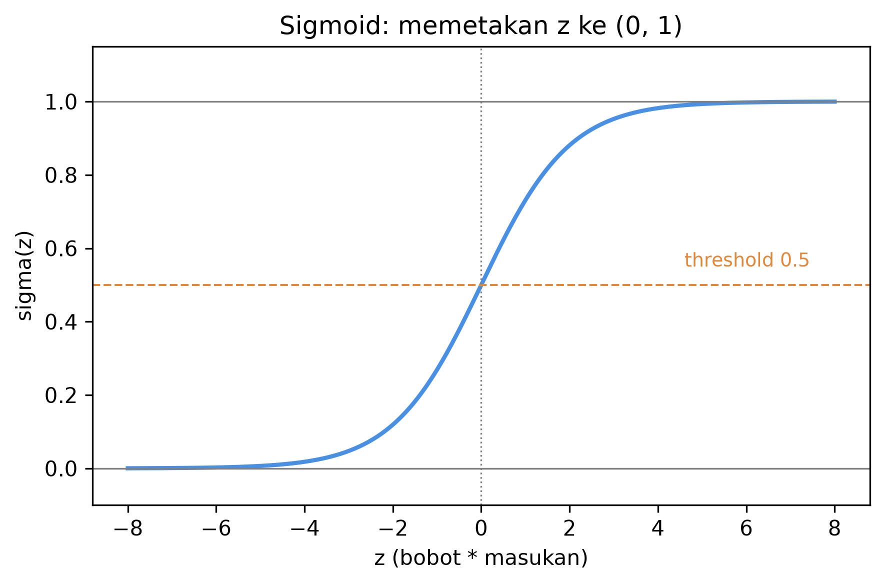
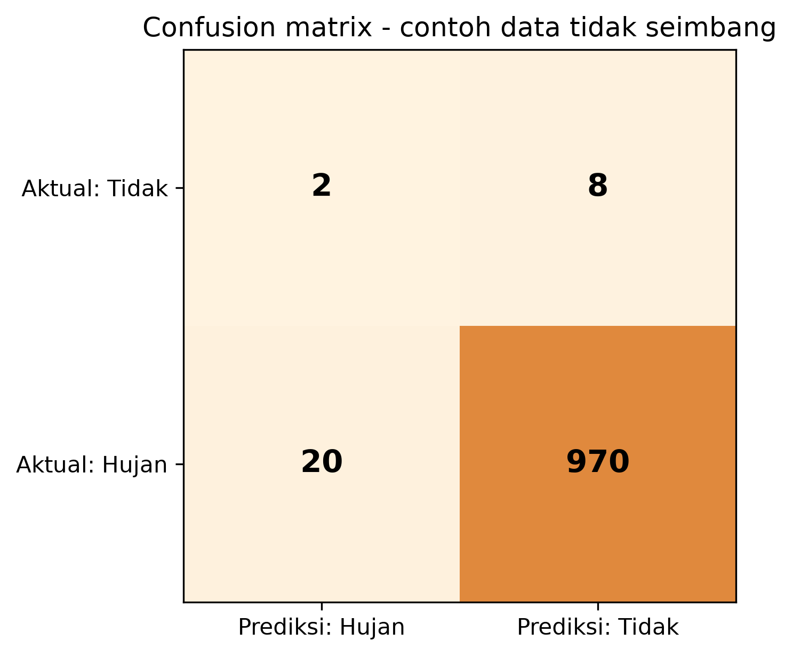

> **Prasyarat:** Bab 1 (konsep ML/DL, lingkungan Colab) dan Bab 2 (neuron, fungsi aktivasi,
> MAE/MSE, split waktu). TensorFlow/Keras siap di lingkungan Anda.

## Tujuan Pembelajaran

Setelah menyelesaikan bab ini, Anda diharapkan mampu:

1. **Membangun** model klasifikasi biner dan multi-kelas (hujan/tidak hujan, level bahaya)
   dengan TensorFlow/Keras.
2. **Menjelaskan** peran sigmoid dan softmax serta binary/categorical cross-entropy.
3. **Mendiagnosis** *class imbalance* dan memilih metrik yang tepat (precision, recall, F1,
   pengenalan CSI/FAR) — bukan hanya akurasi.
4. **Menerapkan** trade-off threshold ala praktisi peramalan untuk fenomena langka.

## 3.1 Dari Angka ke Kategori: Mengapa Klasifikasi Berbeda

Bab 2 membahas *regresi*: memprediksi besaran kontinu (suhu, tinggi pasang). Di dunia nyata,
banyak keputusan meteorologi bukan "berapa?", melainkan **"apa?"**:

- Apakah besok akan hujan atau tidak?
- Apakah intensitas hujan masuk kategori lebat, sedang, atau ringan?
- Apakah perlu peringatan dini banjir untuk level siaga?

Masalah ini disebut **klasifikasi** — memprediksi **kategori** (label) dari fitur. Ada dua
varian utama:

- **Biner (dua kelas):** misal `0 = tidak hujan`, `1 = hujan`.
- **Multi-kelas:** misal `ringan`, `sedang`, `lebat` — atau level bahaya `waspada`, `siaga`,
  `awas`.

Perbedaan inti dari regresi: keluaran bukan bilangan kontinu melainkan **probabilitas atas
kategori**. Di balik layar, kita tetap memakai neuron — tetapi lapisan keluaran memakai
fungsi aktivasi khusus: **sigmoid** untuk biner, **softmax** untuk multi-kelas. Prinsip
umum pelatihan supervised dijelaskan dalam literatur deep learning [1]. Akar historisnya
adalah **perceptron** (Rosenblatt, 1958): neuron tunggal yang mengklasifikasikan input ke
dua kelas berdasarkan ambang [2].

Mengapa kita perlu probabilitas, bukan sekadar label? Karena informasi **seberapa yakin**
model sangat berharga di operasional. Dua model yang sama-sama memprediksi "hujan"
tidaklah setara jika yang satu yakin 90% dan yang lain 51%. Probabilitas memberi kita
ruang untuk menetapkan ambang keputusan yang sesuai risiko — topik §3.7.

### Regresi vs klasifikasi: tabel perbandingan

**Tabel 3.1** — Perbedaan utama regresi dan klasifikasi.

| Aspek | Regresi (Bab 2) | Klasifikasi (bab ini) |
|---|---|---|
| Keluaran | Bilangan kontinu | Kategori/label |
| Aktivasi keluaran | Tanpa aktivasi (linear) | Sigmoid (biner) / softmax (multi-kelas) |
| Loss utama | MAE atau MSE | Binary/categorical cross-entropy |
| Metrik | MAE, RMSE, R² | Akurasi, precision, recall, F1, CSI/FAR |
| Contoh meteo | Suhu besok, tinggi pasang | Hujan/tidak, level bahaya |

Tabel 3.1 merangkum perbedaan yang akan kita bahas satu per satu. Perhatikan: struktur
model (lapisan `Dense` + ReLU di tengah) sama dengan Bab 2 — yang berubah hanyalah ujung
jaringan dan cara mengukurnya.

## 3.2 Sigmoid: Aktivasi Keluaran untuk Dua Kelas

Untuk klasifikasi biner, lapisan terakhir memakai **sigmoid**, yang memampatkan nilai `z`
ke rentang 0–1:

$$ \sigma(z) = \frac{1}{1 + e^{-z}} \tag{3.1} $$

Sigmoid pada Persamaan (3.1) memberi interpretasi probabilistik: keluaran `0.85` berarti
keyakinan 85% bahwa sampel masuk kelas `1` (misal *hujan*). Sifat sigmoid yang penting:

- Nilai sangat positif → mendekati 1.
- Nilai sangat negatif → mendekati 0.
- Nilai nol → tepat 0.5 (titik paling "ragu").



Gambar 3.1 memperlihatkan kurva *S* khas sigmoid: mulus, monoton naik, dan terampatkan.

Aturan ambang (threshold) standar adalah 0.5: jika `σ(z) ≥ 0.5`, prediksi kelas `1`;
selain itu kelas `0`. Namun threshold ini **tidak wajib** — untuk fenomena jarang seperti
hujan lebat, kita sering menaikkan/menurunkan threshold (dibahas §3.7).

### Contoh numerik sigmoid

Misalkan model memberi `z = 1.2`. Maka:

$$ \sigma(1.2) = \frac{1}{1 + e^{-1.2}} = \frac{1}{1 + 0.301} \approx 0.77 $$

Dengan threshold 0.5, sampel masuk kelas `1`. Jika kita menaikkan threshold ke 0.8,
sampel ini menjadi kelas `0` — keputusan berubah hanya karena ambang, bukan model.

## 3.3 Softmax: Aktivasi Keluaran untuk Banyak Kelas

Untuk klasifikasi multi-kelas, kita memakai **softmax**, yang mengubah vektor nilai `z`
menjadi distribusi probabilitas yang **menjumlahkan ke 1**:

$$ \text{softmax}(z)_i = \frac{e^{z_i}}{\sum_{j=1}^{K} e^{z_j}} \tag{3.2} $$

Softmax pada Persamaan (3.2) memberi probabilitas untuk tiap kelas `i` di antara `K` kelas.
Contoh: `[0.70, 0.20, 0.10]` untuk kelas `[ringan, sedang, lebat]` — model paling yakin
"ringan".

**Penting:** softmax bersifat *relatif* — ia membandingkan semua kelas. Jika kita
menambahkan satu kelas lagi, probabilitas semua kelas bisa berubah meski data untuk kelas
lama sama. Ini berbeda dari sigmoid yang "mandiri" per kelas (untuk biner, hanya satu).

### Perbandingan sigmoid vs softmax

**Tabel 3.2** — Perbandingan sigmoid dan softmax.

| | Sigmoid | Softmax |
|---|---|---|
| Jumlah kelas | 1 neuron, 2 kelas (komplementer) | K neuron, K kelas |
| Jumlah probabilitas | Tidak harus 1 | Selalu 1 |
| Fungsi | $\frac{1}{1+e^{-z}}$ | $\frac{e^{z_i}}{\sum_j e^{z_j}}$ |
| Kapan dipakai | Masalah biner | Masalah multi-kelas |

## 3.4 Cross-Entropy: Fungsi Loss Klasifikasi

Seperti MAE/MSE untuk regresi, klasifikasi memakai fungsi loss khusus:

- **Binary cross-entropy** (biner): menghukum kesalahan antara probabilitas sigmoid dan
  label biner.
- **Categorical cross-entropy** (multi-kelas): menghukum kesalahan antara distribusi
  softmax dan label satu-panas (one-hot).

Formula untuk binary cross-entropy (per sampel):

$$ \mathcal{L} = -\left[ y \log(p) + (1 - y) \log(1 - p) \right] \tag{3.3} $$

di mana `y` label (0 atau 1) dan `p` probabilitas prediksi. Intuisi: jika `y=1` dan `p`
mendekati 1, `log(p)` mendekati 0 → loss kecil. Jika `y=1` tetapi `p` mendekati 0, loss
sangat besar — model dihukum karena yakin salah.

Prinsip intuisi: loss **kecil** jika model yakin benar, **besar** jika model yakin salah.
Berbeda dari MSE yang menghukum selisih linier/kuadrat, cross-entropy langsung menargetkan
ketidaktepatan keyakinan — inilah mengapa akurasi bisa tetap tinggi meski keyakinannya
rendah.

### Kenapa bukan MSE untuk klasifikasi?

Ada dua alasan utama:

1. **Interpretasi probabilitas.** MSE dioptimalkan untuk nilai kontinu; ia tidak memberi
   "hukuman" sesuai makna probabilitas. Cross-entropy lahir dari teori informasi dan cocok
   dengan keluaran 0–1.
2. **Pelatihan.** Dengan sigmoid + MSE, gradien bisa sangat kecil ketika kurva sigmoid
   datar (model yakin) — belajar melambat. Cross-entropy + sigmoid/softmax menghasilkan
   gradien yang lebih sehat. Detail di Bab 4.

## 3.5 Kode: Model Klasifikasi Pertama

**Kode 3.1 — Membangun model klasifikasi biner hujan/tidak hujan dengan Keras.**

```python
import tensorflow as tf

model = tf.keras.Sequential([
    tf.keras.layers.Dense(8, activation="relu", input_shape=(n_features,)),
    tf.keras.layers.Dense(8, activation="relu"),
    tf.keras.layers.Dense(1, activation="sigmoid"),  # biner: 1 neuron, sigmoid
])
model.compile(
    optimizer="adam",
    loss="binary_crossentropy",
    metrics=["accuracy", tf.keras.metrics.Precision(), tf.keras.metrics.Recall()],
)
model.summary()
```

Kode 3.1 memakai API Keras di atas TensorFlow [3]. Untuk multi-kelas, ganti lapisan
keluaran menjadi `Dense(K, activation="softmax")` dan loss `categorical_crossentropy`.

### Kode multi-kelas

**Kode 3.2 — Model klasifikasi multi-kelas intensitas hujan dengan Keras.**

```python
import tensorflow as tf

K = 3  # ringan, sedang, lebat

model = tf.keras.Sequential([
    tf.keras.layers.Dense(8, activation="relu", input_shape=(n_features,)),
    tf.keras.layers.Dense(8, activation="relu"),
    tf.keras.layers.Dense(K, activation="softmax"),  # multi-kelas: K neuron, softmax
])
model.compile(
    optimizer="adam",
    loss="sparse_categorical_crossentropy",  # label integer, tanpa one-hot manual
    metrics=["accuracy"],
)
model.summary()
```

Perhatikan Kode 3.2: lapisan keluaran berisi `K` neuron dengan softmax, dan memakai
`sparse_categorical_crossentropy` bila label diberikan sebagai integer (0, 1, 2). Ini
variasi nyaman dari `categorical_crossentropy` yang menuntut one-hot.

### Latihan dengan bobot kelas (imbalance)

Kode 3.2 tidak menangani ketidakseimbangan. Untuk menekankan kelas minoritas, gunakan
`class_weight` saat `fit`:

**Kode 3.3 — Fit dengan bobot kelas untuk menangani imbalance.**

```python
import numpy as np

# contoh: kelas mayoritas (0) berbobot 1, kelas minoritas (1) berbobot lebih besar
class_weight = {0: 1.0, 1: 10.0}

history = model.fit(
    X_train, y_train,
    validation_data=(X_val, y_val),
    class_weight=class_weight,
    epochs=50, batch_size=32, verbose=0,
)
```

Bobot `10.0` pada kelas `1` membuat kesalahan pada kejadian langka dihukum 10× lipat.
Pilih angkanya berdasarkan rasio ketidakseimbangan (mis. bila 5% kejadian, bobot ~19).
Bandingkan hasil Kode 3.3 dengan tanpa bobot di notebook.

### Memahami keluaran satu-panas (one-hot)

Untuk multi-kelas, label biasanya di-encode sebagai **one-hot**: vektor panjang `K` dengan
`satu` pada posisi kelas yang benar.

```
ringan → [1, 0, 0]
sedang → [0, 1, 0]
lebat  → [0, 0, 1]
```

Keras menyediakan `to_categorical` untuk konversi, dan label integer lugas juga bisa dipakai
dengan loss `sparse_categorical_crossentropy` — variasi yang sama, tanpa perlu encode manual.

## 3.6 Class Imbalance: Mengapa Akurasi Menipu

Data meteorologi sering **tidak seimbang**: hujan deras >50 mm mungkin terjadi hanya 2–3
hari dalam setahun. Jika model selalu memprediksi "tidak hujan deras", akurasinya bisa 99%
— tampak hebat, padahal model **gagal total** pada kejadian yang justru paling penting.

Mengapa ini sangat relevan untuk meteorologi? Karena banyak fenomena berisiko justru
langka: hujan ekstrem, angin kencang, banjir rob, atau cuaca buruk penerbangan. Sebagian
besar hari adalah "biasa"; kejadian berbahaya adalah sebagian kecil. Model yang dioptimalkan
hanya untuk akurasi global akan "belajar" memprediksi kelas mayoritas dan praktis buta
terhadap kelas langka — ironisnya, kelas yang paling kita pedulikan.

Tabel berikut menggambarkan jebakan ini:

**Tabel 3.3** — Contoh data tidak seimbang: sebagian besar hari "tidak hujan deras".



Gambar 3.2 memvisualkan Tabel 3.3. Akurasi di sini = `(2+970)/1000 = 97.2%`. Tetapi dari
10 hari hujan deras sungguhan, model hanya menangkap **2** (recall 20%) dan melaporkan
**20** false alarm. Untuk peringatan dini, model seperti ini hampir tidak berguna.

Karena itu, metrik utama yang dipakai:

- **Precision** — dari semua yang diprediksi "hujan deras", berapa yang benar?
  `TP/(TP+FP) = 2/22 ≈ 9%`.
- **Recall** — dari semua yang benar-benar hujan deras, berapa yang tertangkap?
  `TP/(TP+FN) = 2/10 = 20%`.
- **F1** — rata-rata harmonik precision-recall (seimbang):

$$ F_1 = \frac{2 \cdot \text{precision} \cdot \text{recall}}{\text{precision} + \text{recall}} \tag{3.4} $$

Untuk kejadian langka dalam meteorologi operasional, kuartet yang lebih terpercaya adalah
**CSI, POD, FAR, TS** — akan dibahas penuh di Bab 5. Pedoman resmi verifikasi perkiraan
operasional dikeluarkan WMO [4]. Di bab ini kita cukup paham mengapa akurasi tidak cukup.

### Empat cara mengatasi imbalance (pratinjau)

1. **Gunakan metrik yang tepat** — precision/recall/F1, bukan akurasi.
2. **Atur threshold** — turunkan ambang agar kejadian langka lebih sering tertangkap (§3.7).
3. **Pemberian bobot kelas** — `class_weight` di Keras memberi penalti lebih besar untuk
   kesalahan pada kelas minoritas (contoh dalam notebook).
4. **Resampling** — undersampling kelas mayoritas atau oversampling minoritas (konsekuensi:
   mengubah distribusi; diskusi di Bab 5).

### Contoh numerik lengkap precision/recall

Ambil kembali Tabel 3.3: `TP=2, FP=20, FN=8`. Perhitungannya:

- Precision = `2/(2+20) = 2/22 ≈ 0.091` — hanya 9% peringatan yang benar.
- Recall = `2/(2+8) = 2/10 = 0.20` — hanya 20% kejadian tertangkap.
- F1 = `2·0.091·0.20/(0.091+0.20) ≈ 0.125`.

Nilai F1 yang rendah (0.125) menandakan model buruk untuk kejadian langka, meski akurasi
97%. Ini ilustrasi kuat mengapa laporan model untuk meteorologi sebaiknya **selalu
menyertakan confusion matrix dan metrik langka**, bukan hanya akurasi.

## 3.7 Trade-off Threshold untuk Praktisi Peramal

Model memberi probabilitas (kekuatan sigmoid/softmax). Pertanyaan praktisnya: **di ambang
berapakah kita bertindak?**

- Threshold rendah (mis. 0.2) → lebih banyak *hujan deras* terdeteksi (recall naik), tetapi
  juga lebih banyak *false alarm* (precision turun).
- Threshold tinggi (mis. 0.8) → lebih hati-hati; false alarm turun, tetapi banyak kejadian
  terlewat (recall turun).

Tidak ada jawaban universal: tergantung **biaya kesalahan**. Untuk peringatan dini bencana,
false alarm mungkin lebih diterima daripada kejadian terlewat — maka pilih recall tinggi.
Untuk keputusan yang mahal (misal evakuasi), mungkin precision lebih penting.

Kurva **precision-recall** dan **ROC** membantu memilih: kita mengevaluasi model di banyak
threshold sekaligus, bukan hanya 0.5. Di Bab 9, trade-off ini diterapkan pada prediksi
hujan stasiun BMKG.

Bagaimana memilih threshold secara sistematis? Salah satu cara sederhana: hitung precision
dan recall untuk rentang threshold (mis. 0.1, 0.2, ..., 0.9), lalu pilih titik yang paling
sesuai kebutuhan. Cara lain: gunakan *cost matrix* — tetapkan berapa "harga" sebuah miss
vs false alarm (misal 5:1), lalu pilih threshold yang meminimalkan total biaya pada
validasi. Tidak ada jawaban tunggal, tetapi prosesnya **harus eksplisit dan terdokumentasi**.

### Contoh keputusan threshold dalam konteks BMKG

Bayangkan sistem peringatan dini banjir rob. Jika threshold terlalu tinggi (konservatif),
kita jarang mengeluarkan peringatan salah — tetapi ada risiko kejadian terlewat dan warga
tidak sempat bersiap. Jika threshold terlalu rendah, kita sering "menangis serigala";
lama-kelamaan masyarakat mengabaikan peringatan. Pilihan threshold karena itu adalah
**keputusan kebijakan** yang melibatkan biaya sosial, bukan sekadar statistik.

### Threshold mana yang "paling baik"?

Jika tidak ada preferensi biaya eksplisit, praktisi sering memilih threshold yang
memaksimalkan **F1** — karena F1 menyeimbangkan precision dan recall dalam satu angka.
Namun dua model dengan F1 sama bisa memiliki perilaku berbeda di lapangan; karena itu
jangan pernah hanya melihat F1, tapi periksa juga angka precision & recall-nya, dan
— jika memungkinkan — *curve*-nya (ROC/precision-recall).

## 3.8 Confusion Matrix: Membaca yang Terlewat dan Keliru

**Confusion matrix** adalah tabel yang merangkum empat kemungkinan hasil klasifikasi:

- **TP** (true positive): aktual positif, diprediksi positif → benar.
- **FP** (false positive / *false alarm*): aktual negatif, diprediksi positif → peringatan
  yang keliru.
- **FN** (false negative / *miss*): aktual positif, diprediksi negatif → kejadian terlewat.
- **TN** (true negative): aktual negatif, diprediksi negatif → benar.

**Tabel 3.4** — Struktur confusion matrix untuk masalah biner.

| | Prediksi: Positif | Prediksi: Negatif |
|---|---|---|
| Aktual: Positif | TP | FN (miss) |
| Aktual: Negatif | FP (false alarm) | TN |

Di meteorologi operasional, dua sel yang paling diperhatikan adalah **FP (false alarm)**
dan **FN (miss)** — karena membawa konsekuensi langsung: peringatan keliru menggerus
kepercayaan, kejadian terlewat membawa risiko keselamatan.

Dari confusion matrix ini, semua metrik di atas diturunkan:

- Akurasi = `(TP+TN)/(TP+FP+FN+TN)`
- Precision = `TP/(TP+FP)`
- Recall = `TP/(TP+FN)`
- F1 = `2·Precision·Recall/(Precision+Recall)`

## 3.9 ROC dan Precision-Recall Curve

Karena threshold bisa digeser, kinerja model lebih baik dinilai dengan **kurva** daripada
satu titik:

- **ROC curve**: plot *true positive rate* (recall) terhadap *false positive rate*
  (`FP/(FP+TN)`) untuk semua threshold. Luas di bawahnya disebut **AUC** — semakin
  mendekati 1 semakin baik.
- **Precision-recall curve**: plot precision terhadap recall; lebih informatif untuk data
  sangat tidak seimbang, karena tidak terpengaruh oleh TN yang melimpah.

**Kapan pakai yang mana?**

- Jika kelas seimbang, ROC/AUC umum dipakai.
- Jika kelas sangat langka (hujan deras, banjir), **precision-recall curve** lebih jujur —
  ROC bisa tampak "bagus" padahal model praktis tak berguna karena FN/FP penting.

Bab 9 akan memakai precision-recall untuk verifikasi hujan stasiun BMKG.

## 3.10 FAQ Singkat

**Apakah akurasi selalu buruk?** Tidak. Untuk masalah seimbang (misal membedakan dua jenis
awan yang frekuensinya setara), akurasi adalah ringkasan yang masuk akal. Ia menjadi
menyesatkan hanya pada data sangat tidak seimbang.

**Apakah saya perlu menyeimbangkan data dulu?** Tidak selalu. Mengubah distribusi kelas
(undersampling/oversampling) mengubah masalah itu sendiri. Sering lebih baik: gunakan metrik
yang tepat + bobot kelas, lalu evaluasi dengan CSI/FAR. Nanti di Bab 5.

**Mengapa memakai softmax, bukan beberapa sigmoid untuk multi-kelas?** Softmax memaksa
total probabilitas = 1 dan "bersaing" antar kelas — sesuai asumsi label saling eksklusif.
Beberapa sigmoid (multi-label) cocok jika sebuah sampel bisa punya lebih dari satu label
sekaligus (misal "hujan" DAN "angin kencang" bersamaan).

## 3.11 Alur Kerja Model Klasifikasi

Berdasarkan seluruh bab, alur kerja praktis untuk setiap masalah klasifikasi:

1. **Definisikan masalah** — biner atau multi-kelas? Apa "kelas positif" (yang paling
   penting menangkapnya)? Apa biaya FP vs FN?
2. **Bangun baseline** — untuk klasifikasi meteo, baseline yang wajar adalah *klimatologi*
   (selalu prediksi kelas yang paling sering) atau *persistence*. Ukur metrik langka
   (recall, F1) dari baseline dulu.
3. **Siapkan data** — split berbasis waktu (Bab 2), tidak ada leakage.
4. **Bangun model** — MLP + ReLU, keluaran sigmoid/softmax, cross-entropy (Kode 3.1–3.2).
5. **Evaluasi dengan metrik yang tepat** — confusion matrix, precision/recall/F1; untuk
   kejadian langka juga CSI/FAR (Bab 5).
6. **Atur threshold** sesuai biaya (§3.7) dan tampilkan kurva PR/ROC (§3.9).

Baseline *klimatologi* untuk klasifikasi mengingatkan kita pada prinsip Bab 1: jangan
impresif dengan akurasi tinggi jika kelas langka sama sekali tidak tertangkap. Kerangka
di atas akan dipakai berulang di Bab 5 dan Bab 9.

## 3.12 Kesalahan Umum pada Klasifikasi

**1. Melaporkan hanya akurasi.** Pada data tidak seimbang, akurasi hampir tak bermakna.
Selalu sertakan confusion matrix + precision/recall/F1 (dan akhirnya CSI/FAR).

**2. Mengatur threshold tetapi tidak melaporkannya.** Hasil threshold 0.5 tidak otomatis
"standar"; jika Anda menggesernya, tulislah threshold yang dipakai agar dapat ditiru.

**3. Menggunakan akurasi untuk tuning pada data langka.** Optimasi model pada data tidak
seimbang sebaiknya memakai metrik yang sesuai (F1/CSI), bukan akurasi.

**4. Normalisasi/statistik dari seluruh data.** Sama seperti Bab 2 — jangan sampai statistik
test bocor ke train.

**5. Menganggap softmax sebagai "probabilitas sejati".** Softmax hanya peringkat relatif,
bukan kalibrasi probabilistik sesungguhnya (model bisa terlalu yakin). Kalibrasi dibahas
singkat di Bab 10.

Dengan menghindari kesalahan ini, laporan klasifikasi Anda jujur dan berguna — nilai
kepercayaan yang mahal di dunia operasional.

## 3.13 Latihan

**Soal konsep**

1. Jelaskan perbedaan keluaran sigmoid vs softmax, dan kapan masing-masing dipakai.
2. Mengapa cross-entropy lebih cocok untuk klasifikasi daripada MSE (kuadrat)?
3. Data hujan deras hanya 1% dari hari. Mengapa akurasi 99% bisa menyesatkan?
4. Jika biaya false alarm rendah tetapi biaya miss tinggi, ambang threshold apa yang Anda
   pilih? Jelaskan.

**Latihan praktik (notebook `ch-03-02_klasifikasi_hujan.ipynb`)**

5. Bangun model biner hujan/tidak hujan; hitung precision, recall, F1 pada beberapa
   threshold (0.2, 0.5, 0.8) dan buat tabelnya.
6. Latih model multi-kelas intensitas (ringan/sedang/lebat). Catat confusion matrix.
7. Bandingkan akurasi vs F1 pada data tidak seimbang; diskusikan mana yang lebih informatif.
8. (Proyek mini) Gunakan data suhu/kelembapan stasiun lokal untuk prediksi hujan besok;
   laporkan CSI/POD/FAR untuk threshold terbaik Anda.

## Ringkasan

- Klasifikasi = prediksi kategori; biner memakai sigmoid, multi-kelas memakai softmax.
- Cross-entropy adalah loss utama; akurasi menyesatkan pada data tidak seimbang.
- Precision/recall/F1 dan CSI/FAR/POD adalah metrik yang lebih sesuai untuk fenomena langka.
- Threshold bukan selalu 0.5 — atur sesuai biaya kesalahan (false alarm vs miss).
- Confusion matrix adalah titik awal membaca kinerja; ROC/PR membantu memilih threshold.
- Praktik yang benar: baseline dulu, split waktu, metrik langka, threshold terdokumentasi.

## References

1. I. Goodfellow, Y. Bengio, and A. Courville, *Deep Learning*. Cambridge, MA, USA:
   MIT Press, 2016.
2. F. Rosenblatt, "The perceptron: A probabilistic model for information storage and
   organization in the brain," *Psychological Review*, vol. 65, no. 6, pp. 386–408, 1958,
   doi: 10.1037/h0042519.
3. M. Abadi et al., "TensorFlow: Large-scale machine learning on heterogeneous systems,"
   2016. [Online]. Available: https://arxiv.org/abs/1603.04467
4. World Meteorological Organization, "WMO guidelines on the verification of operational
   forecasts," WMO, Geneva, Switzerland, 2018.